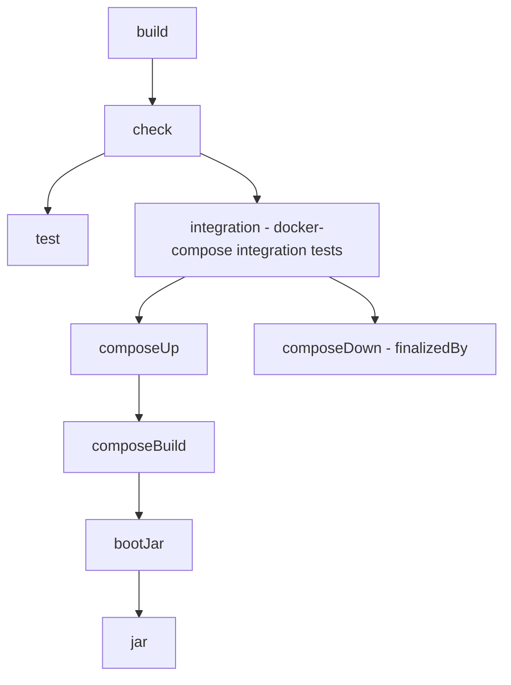

# case-document-knowledge-service

**AI-powered answers for case documents — every response cited and auditable.**  
Spring Boot 4 (Java 21) REST API with OpenAPI docs, PostgreSQL + Flyway, production-ready observability, and CI-friendly **Gradle** build.

---

## Table of contents

- [Features](#features)
- [Tech stack](#tech-stack)
- [Project layout](#project-layout)
- [Prerequisites](#prerequisites)
- [Build & test (Gradle)](#build--test-gradle)
- [Run locally (Gradle)](#run-locally-gradle)
- [Run with Docker Compose](#run-with-docker-compose)
- [Integration tests with Docker Compose](#integration-tests-with-docker-compose)
- [Configuration](#configuration)
- [API & docs](#api--docs)
- [Observability](#observability)
- [SBOM / dependency insights](#sbom--dependency-insights)
- [Troubleshooting](#troubleshooting)
- [License](#license)

---

## Features

- Versioned **REST API** under `/api/v1/**`
- **OpenAPI / Swagger UI**
- **PostgreSQL** persistence with **Flyway** migrations
- **Observability**: Actuator health, Prometheus metrics, OTLP tracing, structured JSON logs
- **Quality gates**: PMD, JaCoCo coverage
- **Gradle 9** build with Docker-Compose-backed **integration tests**

> Note: HTTP security/authorization is intentionally minimal by default. Integrate with your gateway or add your own authorization as needed.

---

## Tech stack

- **Java 21**, **Spring Boot 4.0.0-M2**
- Spring MVC, Spring Data JPA, **PostgreSQL 16**, Flyway
- springdoc-openapi 3.x (Swagger UI)
- Micrometer + **Prometheus**, OpenTelemetry OTLP exporter
- Gradle 9, PMD, JaCoCo
- Docker / Docker Compose v2

---

## Project layout

```
.
├─ src/main/java/...                 # application code
├─ src/main/resources/
│   ├─ application.yml               # prod-ready defaults
│   └─ db/migration/                 # Flyway migrations
├─ src/test/java/...                 # unit tests
├─ src/integrationTest/java/...      # integration tests (Gradle sourceSet)
├─ docker/
│   ├─ Dockerfile
│   └─ docker-compose.integration.yml
└─ build.gradle                      # Gradle build
```

---

## Prerequisites

- Java **21**
- Docker Engine **v27+** and **Docker Compose v2** (`docker compose` CLI)
- Nothing else required — use the Gradle wrapper (`./gradlew`)

---

## Build & test (Gradle)

```bash
# Clean & full build (unit tests)
./gradlew clean build

# Faster local build (skip tests)
./gradlew -x test clean build

# Run only unit tests
./gradlew test

# Run only integration tests
./gradlew integration
# Code quality reports
./gradlew pmdMain pmdTest jacocoTestReport
# Open reports
open build/reports/pmd/main.html
open build/reports/tests/test/index.html
open build/reports/jacoco/test/html/index.html

# Dependency insight (useful for conflicts)
./gradlew dependencyInsight --dependency <group-or-module>
```

---

## Run locally (Gradle)

By default the app starts on **:8082** and looks for Postgres at **localhost:55432** (see [Configuration](#configuration)).

```bash
# Start with your local Java 21
./gradlew bootRun
```

---

## Run with Docker Compose

This brings up **PostgreSQL 16** (exposed as `localhost:55432`) and the **app** (exposed as `localhost:8082`).  
It uses `docker/docker-compose.integration.yml`.

```bash
# Build image & start stack
docker compose -f docker/docker-compose.integration.yml up -d --build

# Tail logs
docker compose -f docker/docker-compose.integration.yml logs -f app

# Stop & remove (keep volumes)
docker compose -f docker/docker-compose.integration.yml down

# Remove everything inc. volumes (⚠️ deletes DB data)
docker compose -f docker/docker-compose.integration.yml down -v
```

---

## Integration tests with Docker Compose

Integration tests automatically **bring up** Postgres + app, **wait** until they’re healthy, run tests, then **tear down** the stack.

```bash
./gradlew clean integration
```

What happens under the hood:

- Gradle task `integration` depends on `composeUp` (from the Compose plugin)
- `composeUp` builds the app image, starts Postgres (host port **55432**) and app (**8082**), and waits for health
- Tests run against `http://localhost:8082`
- `composeDown` is always called to clean up

---

## Configuration

The application is configured via environment variables with sensible defaults. Key settings:

| Property                          | Default                                      | Notes                               |
|----------------------------------|----------------------------------------------|-------------------------------------|
| `server.port`                    | `8082`                                       | API & Actuator port                 |
| `SPRING_DATASOURCE_URL`          | `jdbc:postgresql://localhost:55432/appdb`    | Postgres JDBC URL                   |
| `SPRING_DATASOURCE_USERNAME`     | `app`                                        | DB user                             |
| `SPRING_DATASOURCE_PASSWORD`     | `app`                                        | DB password                         |
| `DB_POOL_SIZE`                   | `10`                                         | Hikari pool size                    |
| `TRACING_SAMPLER_PROBABILITY`    | `1.0`                                        | OTel tracing sample rate            |
| `OTEL_TRACES_URL`                | `http://localhost:4318/v1/traces`            | OTLP traces endpoint                |
| `OTEL_METRICS_ENABLED`           | `false`                                      | Export metrics via OTLP if `true`   |
| `OTEL_METRICS_URL`               | `http://localhost:4318/v1/metrics`           | OTLP metrics endpoint               |

Flyway is enabled and points at `classpath:db/migration`.

---

## API & docs

- Base URL: `http://localhost:8082`
- Swagger UI: `http://localhost:8082/swagger-ui.html`  
  (OpenAPI JSON at `/v3/api-docs`)

Example smoke:

```bash
curl -fsS "http://localhost:8082/actuator/health" | jq
```

---

## Observability

Actuator endpoints (same port as API):

| Endpoint                     | Purpose                         |
|-----------------------------|---------------------------------|
| `/actuator/health`          | Overall health (UP/DOWN)        |
| `/actuator/health/liveness` | Liveness probe                  |
| `/actuator/health/readiness`| Readiness probe                 |
| `/actuator/info`            | App/build info (if configured)  |
| `/actuator/prometheus`      | Prometheus/OpenMetrics scrape   |

The service logs JSON to STDOUT (Logback + logstash-encoder).  
OTel tracing is pre-wired; set the `OTEL_*` env vars above to export.

Quick checks:

```bash
curl -fsS http://localhost:8082/actuator/health
curl -fsS http://localhost:8082/actuator/prometheus | head
```

---

## SBOM / dependency insights

Generate a CycloneDX SBOM:

```bash
./gradlew cyclonedxBom
# Output at: build/reports/bom.json (or .xml depending on configuration)
```

Print dependency trees:

```bash
./gradlew -q dependencies --configuration runtimeClasspath
```

---

## Build Flow

Build tasks and their dependencies:



## Troubleshooting

- **Port in use** — Change ports in `application.yml` or Compose file. DB uses **55432** to avoid conflicts with a local 5432.
- **Compose not found** — You need **Docker Compose v2** (`docker compose`). The Gradle plugin calls the Docker CLI directly.
- **DB auth failures** — Ensure env vars match Postgres service in Compose: `app/app@appdb`.
- **Slow startup in CI** — Increase Compose wait timeouts (plugin `upAdditionalArgs`) if needed.
- **Gradle “buildDir deprecated”** — The build uses `layout.buildDirectory`; avoid legacy `buildDir` in custom tasks.

---

## License

MIT