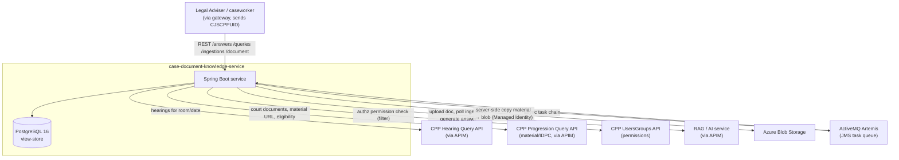
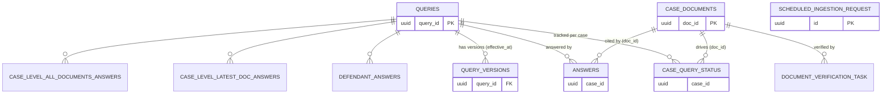
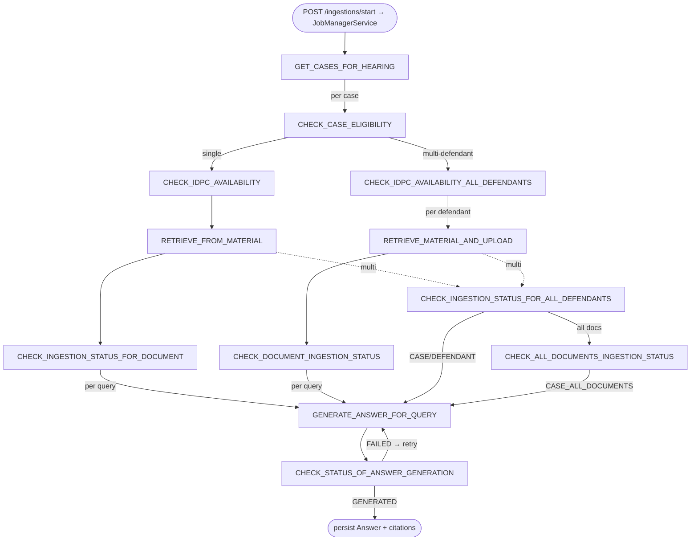
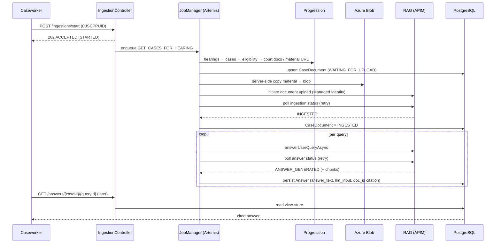

# Architecture Model — case-document-knowledge-service (CSDK)

*Reverse-engineered from source. Authoritative as of the scan date. Base package `uk.gov.hmcts.cp.cdk`.*

> **What this service is:** an HMCTS Crime Common Platform (CPP) service that produces **AI/RAG-generated,
> cited and auditable answers about case documents**. It discovers court material for a hearing, uploads it
> to a RAG service, waits for ingestion, then generates answers to a catalogue of queries — all via an
> asynchronous, queue-driven job pipeline. Reads are served from a PostgreSQL view-store.

---

## 1. Technology stack

| Concern | Choice |
|---|---|
| Language / runtime | **Java 21**, **Spring Boot 4.x** (4.0.5), Spring MVC, Spring Data JPA |
| Persistence | **PostgreSQL 16** + **Flyway** (append-only `V1000–V1007`), HikariCP, Hibernate `ddl-auto=validate`, `open-in-view=false` |
| Async / messaging | **ActiveMQ Artemis** (JMS, TLS) via the CPP **`task-manager-service:1.0.10`** library; Spring Batch metadata present |
| Distributed locking | **ShedLock** 6.6.0 (`shedlock-spring` + `shedlock-provider-jdbc-template`); PROXY_METHOD mode; backed by `shedlock` table (V1010) |
| External calls | Apache HttpClient5 + Spring `RestClient` (pooled: 200 total / 50 per route) |
| Cloud / storage | **Azure Blob Storage** (server-side copy), **Azure Managed Identity**, APIM front door; Azurite locally |
| AI | RAG service (`api-cp-ai-rag:0.0.11`) — sync + async answer, ingestion initiation + status |
| API contract | OpenAPI-first from external artifact `api-cp-crime-caseadmin-case-document-knowledge:0.0.8`; Springdoc UI |
| AuthN/Z | **Drools** rules (`/acl/cdks-rules.drl`) enforced by MOJ **`cp-auth-rules-filter:1.0.7`** (filter, not controllers); user identity via `CJSCPPUID` header |
| Observability | JSON logs (Logstash encoder, stdout), Actuator, Prometheus/Micrometer, OTLP tracing (off by default) |
| Build / quality | **Gradle 8.14**, PMD, JaCoCo, CycloneDX SBOM, Pact; `integrationTest` sourceSet (compose-backed) |
| CI/CD | GitHub Actions (build/publish, CodeQL + DAST/ZAP, Gitleaks secrets, PMD) → triggers ADO pipeline 460 |
| Context path / port | `/casedocumentknowledge-service` on `8082` |

---

## 2. System context (C4 — Level 1)



**External dependencies:** Hearing Query, Progression Query, UsersGroups (authz), RAG/AI, Azure Blob,
Artemis. All HTTP integrations carry the user's `CJSCPPUID`; RAG/Blob authenticate with Managed Identity
(or APIM subscription key / connection-string fallbacks).

---

## 3. Internal structure (C4 — Level 2/3, components)

```mermaid
flowchart LR
    subgraph Web["Web layer (controllers/)"]
      ans[AnswersController]
      doc[DocumentController]
      ing[IngestionController]
      qry[QueriesController]
      cat[QueryCatalogueController]
      gex[Global/IngestionExceptionHandler]
    end
    subgraph Svc["Service layer (services/)"]
      jms[JobManagerService\nimplements IngestionProcessor]
      isvc[IngestionService]
      qres[QueryResolver]
      asvc[Answer services\n(case/defendant/all-docs)]
    end
    subgraph Job["Async orchestration (jobmanager/)"]
      caseflow[caseflow/* tasks]
      hearingt[hearing/GetCasesForHearingTask]
      queryflow[queryflow/* tasks]
    end
    subgraph Clients["Integration (clients/)"]
      hc[HearingClient]
      pc[ProgressionClient]
      rc[RAG clients x4]
      auth[Azure identity + APIM auth]
    end
    subgraph Data["Persistence (repo/ + domain/)"]
      repos[Spring Data + native repos]
      store[(PostgreSQL\ntables + views)]
    end
    sto[storage/AzureBlobStorageService]
    tm[[task-manager-service\n+ Artemis JMS]]

    Web --> Svc
    ing --> jms
    jms --> tm --> Job
    Job --> Clients
    Job --> sto
    Job --> Data
    Web --> Data
    isvc --> Data
    Clients --> auth
    repos --> store
```

**Layering:** thin controllers (implement generated OpenAPI interfaces) → services → an async task graph
driven by Artemis → integration clients + Azure Blob + repositories. Reads bypass the job graph and hit
the view-store directly.

---

## 4. API layer

All 5 controllers implement OpenAPI-generated interfaces (`uk.gov.hmcts.cp.openapi.api.cdk.*`). Endpoints:

| Controller | Endpoint(s) | Notes |
|---|---|---|
| `AnswersController` | `GET /answers/{caseId}/{queryId}`, `…/with-llm`, list variant | temporal params `version`, `at`; returns answers + (optionally) LLM input |
| `DocumentController` | `GET /document/{docId}/content` | returns material content URL; requires `CJSCPPUID` |
| `IngestionController` | `POST /ingestions/start` (202, custom media type `…ingestion-process+json`), `GET /ingestions/status?caseId` | start is fire-and-forget; requires `CJSCPPUID` |
| `QueriesController` | `GET/POST /queries`, `GET /queries/{id}`, `GET /queries/{id}/versions` | upsert returns 202; temporal `at` |
| `QueryCatalogueController` | `GET /query-catalogue`, `GET /query-catalogue/{id}`, `PATCH …/label` | catalogue + label/order management |

**Exception handling:** `GlobalExceptionHandler` (`@RestControllerAdvice`, injects `Tracer`) maps
`ResponseStatusException`, validation, unreadable body, and a 500 fallback into `ErrorResponse`
(error, message, UTC timestamp, traceId). `IngestionExceptionHandler` overrides it for the ingestion
endpoints with the custom media type.

**Access control (Drools, filter-enforced):** authorization is **not** in controllers — the MOJ
`cp-auth-rules-filter` evaluates `/acl/cdks-rules.drl` on each request, checking `hasPermission("AI search","View")`
(some actions also allow the `System Users` group). Permissions are fetched from the UsersGroups API
(`application-other.yml`). `PermissionConstants` defines the permission JSON. Controllers only read
`CJSCPPUID` for downstream calls/audit.

**Cross-cutting web:** `RequestContextFilter` (MDC: correlationId, cluster, region, path) →
`TracingFilter` (traceId/spanId propagation) → CORS (`CorsConfig`) → Springdoc UI (`/swagger-ui.html`).
Outbound calls add correlation via `CorrelationIdInterceptor`; `RestClientFactoryConfig` builds pooled clients.

---

## 5. Domain model & persistence

**Aggregates:** `Query` (+ `QueryVersion`, temporal `effective_at`), `CaseDocument` (ingestion lifecycle),
four `Answer` variants, `CaseQueryStatus` (read-state), `DocumentVerificationTask` (retry/lock queue),
`ScheduledIngestionRequest` (court_centre_id, court_room_id, hearing_date, cppuid — used by the scheduler to re-trigger ingestion on existing rooms).



**Answer granularities (4 tables / `query_level_enum`):** `Answer` (generic), `DefendantAnswer`
(per defendant), `CaseLevelLatestDocumentAnswer` (latest doc), `CaseLevelAllDocumentsAnswer` (all docs).
Every answer carries optional `doc_id` for **citation**, and `answer_text` + `llm_input` for **audit**.

**Enums (PostgreSQL native):** `DocumentIngestionPhase` (NOT_FOUND→WAITING_FOR_UPLOAD→UPLOADING→UPLOADED→
INGESTING→INGESTED/FAILED/EXCEEDED_FILE_SIZE_LIMIT), `QueryLifecycleStatus`, `QueryLevel`,
`DocumentVerificationStatus`.

**Read model / view-store:** DB views `v_query_definitions_latest`, `v_case_ingestion_status`,
`v_latest_answers`; temporal "as-of" reads via `QueriesAsOfRepository` / `QueryVersionRepository`
(LATERAL joins). A DB trigger updates `case_query_status` on answer insert. Version allocation uses
Postgres advisory locks (`next_answer_version`). Entity/repo packages are wired via marker classes
(`CdkEntityMarker`, `CdkPersistenceMarker`) and `@EnableJpaRepositories`.

**Migrations:** V1000 Spring Batch metadata · V1001 core AI schema (queries, documents, answers, views,
functions, trigger) · V1002 display_order · V1003 document_verification_task · V1004 defendant/court doc ·
V1005 created_at + WAITING_FOR_UPLOAD · V1006 query levels + multi-answer tables · V1007 is_active
· V1008 EXCEEDED_FILE_SIZE_LIMIT enum value · V1009 scheduled_ingestion_request table (+ unique constraint uq_sir_business_key, index idx_sir_hearing_date) · V1010 shedlock table.

---

## 6. External integrations & authentication

| Integration | Operations | Auth |
|---|---|---|
| **Hearing** (`HearingClient`) | hearings for court/room/date → case IDs | `CJSCPPUID` header, CQRS RestClient |
| **Progression** (`ProgressionClient`) | court documents, material download URL, prosecution-case eligibility | `CJSCPPUID` header |
| **RAG** (4 clients) | `answer-user-query` (sync), `…-async` + status, ingestion initiation, ingestion status | **AAD bearer (Managed Identity)** or APIM subscription key |
| **Azure Blob** (`AzureBlobStorageService`) | server-side copy material URL → blob, exists/size | **Managed Identity** (or connection-string / Azurite) |

**Auth model:** `AzureIdentityConfig` builds a `TokenCredential` (DefaultAzureCredential or a
user-assigned MI); `AzureTokenService` fetches/caches AAD tokens for a `…/.default` scope;
`ApimAuthHeaderService` applies either `Authorization: Bearer …` (mode `aad`) or
`Ocp-Apim-Subscription-Key` (mode `subscription-key`), plus common headers. No secrets in code —
connection strings/keys only via env for non-prod fallbacks.

---

## 7. Asynchronous orchestration (the core engine)

Tasks are `@Task`-annotated `ExecutableTask` beans. `JobManagerService` (implements `IngestionProcessor`)
submits the first task; each task calls `ExecutionService.executeWith(...)` to enqueue the next, over
**Artemis JMS** (queue-driven, **not** scheduled). State flows via a `jobData` JSON object
(`JobManagerKeys`). Retries are constant-delay per `JobManagerRetryProperties`.



**Scheduler-triggered entry (intraday discovery):**
`IntradayDiscoveryScheduler` runs on cron `0 0/10 7-19 * * MON-FRI` (every 10 min, Mon–Fri, 07:00–19:50 UTC), guarded by ShedLock (`lockAtLeastFor=PT8M`, `lockAtMostFor=PT9M`). It calls `DiscoveryService.runIntradayDiscovery()`, which queries `ScheduledIngestionRequest` for today's hearing date and dispatches the same task chain (starting at `GET_CASES_FOR_HEARING`) for each room. This targets late-arriving IDPCs, schedule changes, and late list additions.

**Retry profiles:** default 3×20s; `verify-document-status` 50×5s (~4 min ingestion polling);
`questions-retry` 100×10s (~16 min answer polling). Terminal failures set phase `FAILED` and stop the branch.

**Two flows:** *caseflow* (hearing → eligibility → IDPC → retrieve/upload → ingestion status) and
*queryflow* (generate answer → poll status → persist). Multi-defendant cases fan out to CASE-,
DEFENDANT-, and CASE_ALL_DOCUMENTS-level answers (feature flag `use-multi-defendant`).

---

## 8. End-to-end runtime sequence



---

## 9. Cross-cutting concerns

- **Logging:** JSON to stdout via Logstash encoder (async appender, queue 8192), no file appenders;
  fields include `app`/`service` and MDC `correlationId`/`traceId`. Cloud-native (12-factor).
- **Correlation & tracing:** inbound `RequestContextFilter` + `TracingFilter`; outbound
  `CorrelationIdInterceptor` (`X-Request-ID`). OTLP tracing present but **disabled by default** (and
  explicitly excluded at container startup).
- **Metrics:** Actuator + Prometheus (`/actuator/prometheus`), tags service/cluster/region.
- **Resilience:** Artemis infinite reconnect; task retries; HikariCP tuned pool; RAG read timeout 180s.
- **Security posture:** Managed Identity, no secrets in code; CodeQL + OWASP ZAP DAST + Gitleaks in CI;
  Drools authorization filter; non-root container; truststore merged for Artemis TLS.

---

## 10. Configuration & deployment

**Profiles** (all `optional:` imports from `application.yml`): `-datasource`, `-artemis-jms`,
`-server-management`, `-clients`, `-cdk`, `-other`. No `dev`/`prod` files — everything is env-var driven.
Key domain config in `application-cdk.yml`: Azure storage mode, ingestion thread pools, `use-multi-defendant`
flag, batch grid sizes, retry policies.

**Containers:** `eclipse-temurin:21-jdk`, non-root `app` user, port 8082, `MaxRAMPercentage=75`, tracing
disabled. `docker-compose.yml` (app + postgres) for local; `docker/docker-compose.integration.yml`
(artemis, postgres, azurite + seed, wiremock, app w/ debug 5005) for integration tests.

**Deployment topology:** the service is **stateless** (state in PostgreSQL + Artemis); horizontally
scalable. The job queue makes work durable and recoverable across instances. Helm/Terraform are **not**
in this repo (infra lives elsewhere).

**CI/CD:** `ci-build-publish.yml` (Gradle build incl. integration tests → publish to GitHub Packages +
Azure Artifacts → trigger ADO pipeline 460); `codeql.yml` (SAST + SBOM + ZAP DAST); `secrets-scanner.yml`
(Gitleaks); `code-analysis.yml` (PMD inline).

---

## 11. Architectural characteristics (summary)

| Quality | How it's achieved |
|---|---|
| **Auditability** | every answer stores `llm_input` + `doc_id` citation; full `jobData` context; JSON logs |
| **Eventual consistency** | async queue-driven pipeline with polling + retries; 202-accept then progress |
| **Temporal correctness** | versioned queries/answers, "as-of" reads, advisory-lock version allocation |
| **Scalability** | stateless app + durable Artemis queue + tuned connection pools |
| **Security** | Managed Identity, Drools authz filter, layered CI scanning, no secrets in code |
| **Observability** | structured JSON logs, correlation/trace propagation, Prometheus metrics |
| **Resilience** | constant-delay retries per stage, infinite broker reconnect, terminal-failure handling |

---

## 12. Component inventory (where to look)

| Area | Package / path |
|---|---|
| REST controllers | `controllers/` (+ `accesscontrol/`, `exception/`) |
| Domain entities & enums | `domain/` |
| Repositories (JPA + native) | `repo/` |
| Services | `services/` (+ `mapper/`) |
| Async tasks | `jobmanager/{caseflow,hearing,queryflow,support}/`, `TaskNames` |
| Scheduled ingestion | `scheduler/IntradayDiscoveryScheduler`, `scheduler/SchedulerProperties`, `services/DiscoveryService`, `repo/ScheduledIngestionRequestRepository`, `domain/ScheduledIngestionRequest` |
| Integration clients | `clients/{hearing,progression,rag,common,config}/` |
| Azure Blob storage | `storage/` |
| HTTP plumbing | `http/`, `filters/tracing/` |
| Configuration | `config/`, `src/main/resources/application*.yml`, `logback-spring.xml` |
| DB schema | `src/main/resources/db/migration/V1000–V1010` |
| Authorization rules | `src/main/resources/acl/cdks-rules.drl` |
| Build / CI | `build.gradle`, `docker/`, `.github/workflows/` |

---

*Generated by scanning the codebase across five subsystems (API, domain/persistence, integrations, job
orchestration, ops/config). Diagrams are Mermaid — render in any Markdown viewer that supports it
(GitHub, VS Code, Confluence with a plugin).*
