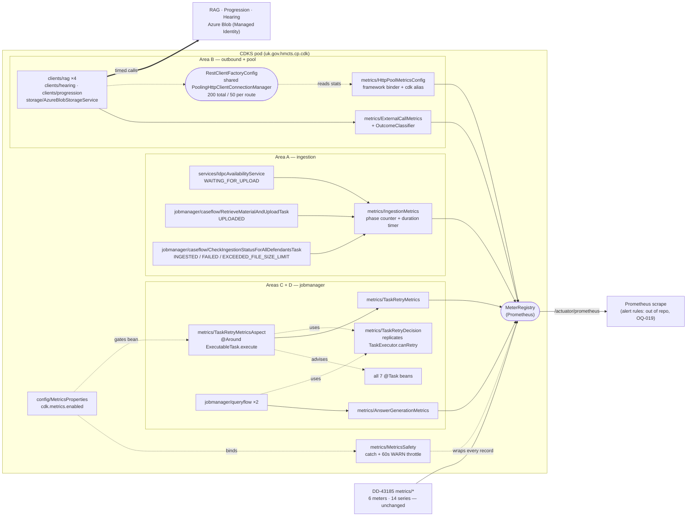
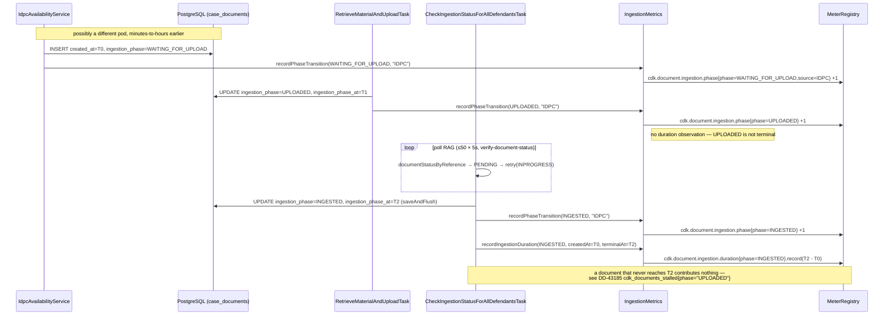
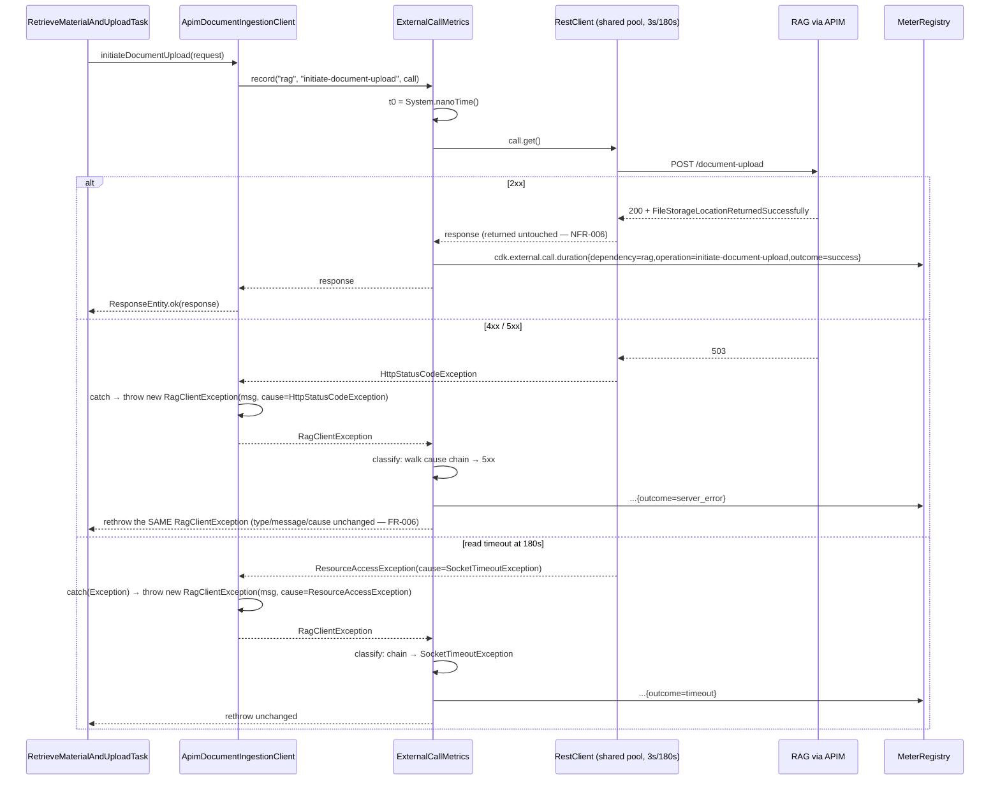

# Design: Operational Metrics Instrumentation (Micrometer)

> **Stage 2 — Architecture & Design** · Service: `cp-case-document-knowledge-service` (CDKS)
> **Jira: DD-43182** · Requirements: [`01-requirements.md`](./01-requirements.md) ·
> ADRs: [`adrs/DD-43182-operational-metrics-instrumentation.md`](../adrs/DD-43182-operational-metrics-instrumentation.md)
>
> **Amended 2026-09-04 at the Stage-4 gate — read this before anything below.** The requester's
> decision on **OQ-022** withdraws two signals this design specified: **`cdk_task_retry_exhausted_total`
> (§7) and `outcome=timed_out` on `cdk_answer_generation_total` (§8, GATE-2)**. Both were gated on a
> state a task execution can never observe. The reasoning, the evidence, the rejected workaround and
> the `task-manager-service` follow-up are in **ADR-011**; §7 and §8 below carry the supersession
> banners, and every count, table and file list in this document has been recomputed. Fourteen
> Stage-4 decisions (OQ-022 – OQ-037) are applied throughout and indexed in **§15**.
>
> Add **rate, latency and failure** signals to CDKS's asynchronous pipeline: an ingestion
> phase-transition counter and an end-to-end ingestion duration histogram (Area A); an outbound
> dependency timer over all eleven live external calls plus HTTP connection-pool visibility
> (Area B); an answer-generation outcome counter (Area C); a JobManager retry counter (Area D — the
> retry-*exhaustion* counter is **withdrawn**, ADR-011); and the cardinality, scrape and
> failure-containment guarantees that make the rest safe to ship (Area E). **Six** new meters (seven
> before ADR-011), one framework `MeterBinder`, **232 series worst case** (243 before ADR-011),
> **no Flyway migration**, no API change, no endpoint, no ACL change, no contract change,
> no new dependency.
>
> DD-43185 answers *"is anything stuck right now?"*. DD-43182 answers *"how fast, how often, and
> how badly is it failing?"*. It **extends** DD-43185's `uk.gov.hmcts.cp.cdk.metrics` package and
> its `CdkMeters` constants class rather than creating anything parallel.
>
> **Sequencing, verified (OQ-018).** DD-43185 is merged on `develop` (`885357e` = `origin/develop`
> head); `origin/main` is still `ae2205e` with **no `metrics` package**. `CdkMeters`,
> `SchedulerMetrics`, `StalledWorkMetrics`, `StalledWorkMetricsRefreshJob` and `V1014` are all
> present on `develop`. **DD-43182 branches from `develop`.**
>
> **Two of the ticket's blocking claims turned out to be solvable, not merely acknowledgeable, and
> both findings came from reading bytecode rather than from reasoning about it:**
>
> - ~~**`cdk_task_retry_exhausted_total` *is* obtainable from CDKS** (OQ-008).~~ **Superseded
>   2026-09-04 — ADR-011.** The mechanism is real and still powers `cdk_task_retry_total`:
>   `ExecutionInfo` has a public `getRetryAttemptsRemaining()`, populated from the `Job` row by
>   `TaskExecutor$1` via `ExecutionInfo.Builder.fromJob(job)` — the **same value**
>   `TaskExecutor.canRetry(...)` then tests, and `CheckIngestionStatusForAllDefendantsTask` already
>   relies on it (line 75). What it cannot do is see **exhaustion**: the last granted retry writes
>   `0`, and `JobsRepository`'s assignment query never selects a row at `0`, so the job is abandoned
>   *between* executions with no task run to observe it. The counter is **not built** (§7, ADR-011).
> - **`RagClientException` *is* classifiable** (OQ-005) without touching the exception hierarchy:
>   both throw sites pass the original exception as the **cause**, so 4xx / 5xx / timeout are
>   distinguishable by walking the cause chain at the recording site. See ADR-003.
>
> **Ten Stage-1 open questions are resolved here; all ten are recorded as ADRs.** All were
> **accepted** at the Stage-2 human gate on 2026-09-03; two of them (OQ-008, OQ-011) are
> **partially superseded** by the Stage-4 decision on OQ-022 — see ADR-011 and §15.
>
> | OQ | Resolution | ADR |
> |---|---|---|
> | OQ-002 `source` tag | Bounded allow-list checked against the entity value; single-valued `IDPC` today; trigger-origin deferred | ADR-009 |
> | OQ-003 phase set | Only the **five reachable** phases registered (deliberately unlike DD-43185 ADR-004 — reasons given) | ADR-009 |
> | OQ-004 duration timer | `Timer.record(Duration)` from `created_at` → terminal `ingestion_phase_at`; **no `Timer.Sample`**; three terminal stops | ADR-002 |
> | OQ-005 RAG outcome | Classify by walking the **cause chain**; `RagClientException` unchanged; fifth `outcome=error` | ADR-003 |
> | OQ-006 `operation` values | 11 CDKS-invented lowercase kebab-case constants, one per call site | ADR-004 |
> | OQ-007 series budget | Buckets on the ingestion timer **only**; `percentiles-histogram` off; **243 series** computed | ADR-005 |
> | OQ-008 retry exhaustion | ~~Replicate `canRetry` from `ExecutionInfo.getRetryAttemptsRemaining()`~~ — **re-opened and descoped, ADR-011.** The aspect and the replicated predicate ship for the retry *grant* counter only | ADR-006, **ADR-011** |
> | OQ-009 budget↔task mapping | Second `retry_policy` tag, at **zero** series cost | ADR-006 |
> | OQ-010 requested vs granted | Counts **granted**; the throw path is covered by the aspect; `GENERATE_ANSWER_FOR_QUERY` documented | ADR-006 |
> | OQ-011 answer terminal states | ~~Six increment points; `timed_out` = abandoned while still `PENDING`~~ — **four increment points; `timed_out` withdrawn, ADR-011**; `query_level="unknown"` stands | ADR-007, **ADR-011** |
> | OQ-012 pool gauge | Framework binder **plus** one `cdk_http_pool_connections_leased` alias | ADR-008 |
> | OQ-013 timing mechanism | Explicit call-site helper (interceptor and `http.client.requests` both rejected, with reasons) | ADR-003, ADR-008 |
> | OQ-014 Azure Blob | Explicit-outcome entry point inside `copyFromUrl`; no pool coverage, stated | ADR-003 |
> | OQ-015 shared-manager defect | **Latent** (both connect timeouts are 3000 ms); separate ticket; the timer is immune either way | ADR-008 |
> | OQ-016 budget enforcement | Merge-blocking `integrationTest` on whole-endpoint series count + a `baseline-series-count.md` artefact | ADR-005 |
> | OQ-017 WARN throttle / docs | In-code `MetricsSafety` throttle; FR-012 docs in `CdkMeters` Javadoc | ADR-010 |
> | OQ-018 sequencing | **Closed by evidence** — branch from `develop`; the SRE `cdk_` prefix half stays open | — |
> | OQ-021 answer duration | Confirmed out of scope; **not** cheap (no persisted start anchor) — §13 | ADR-007 |
> | OQ-001, OQ-019, OQ-020 | Carried forward — §13 | — |
>
> **Six items need an explicit accept-or-reject at the gate, not silent approval.** All six widen
> or redefine something the ticket states literally, and all six are argued from code evidence in
> the ADR file. They are collected in **§14**. All six were accepted on 2026-09-03; **GATE-2 was
> subsequently withdrawn on 2026-09-04 (ADR-011).**

---

## Detailed Design

### 1. Shape of the change

The five areas share only the `MeterRegistry`, the `CdkMeters` constants class and the
`MetricsSafety` helper. They are delivered as independent stories (Stage 3) and, except for
Area E's harness, can ship in any order. **Area B's pool visibility (§6) is one `@Bean` plus one
gauge and could ship first, alone, in an afternoon.**



Everything in `metrics/` is new except `CdkMeters`, which is extended. Everything outside
`metrics/` gains either one constructor parameter and a wrapped call (the seven client/storage
classes), or one method call after an existing `saveAndFlush` (the three phase-write sites), or a
counter next to an existing log line (the two queryflow tasks). **The seven `@Task` beans are not
edited at all** (ADR-006).

### 2. Metric inventory (ADR-001, ADR-005)

> **Regression baseline.** DD-43185 captured
> [`../DD-43185-stalled-work-scheduler-monitoring/baseline-actuator-prometheus.md`](../DD-43185-stalled-work-scheduler-monitoring/baseline-actuator-prometheus.md)
> — the exact 76 metric families `/actuator/prometheus` returned pre-DD-43185. DD-43182 is purely
> additive (NFR-005): every family there, **plus DD-43185's six**, must still be present and
> unchanged, with the eight families below appended. **DD-43182 adds a second baseline artefact,
> `baseline-series-count.md`**, because the families baseline records no *series* count and
> NFR-002/AC-024 are stated in series (§12).

All meters are registered with **lowercase dot-separated** names, no `.total` on counters and no
`.seconds` on timers (ADR-001; DD-43185 ADR-001 for the counter rule).

| # | Micrometer meter name | Prometheus name(s) | Type | Ticket-specific tags | Registered / worst case | Owner class |
|---|---|---|---|---|---|---|
| 1 | `cdk.document.ingestion.phase` | `cdk_document_ingestion_phase_total` | Counter | `phase`, `source` | 5 / 10 | `IngestionMetrics` |
| 2 | `cdk.document.ingestion.duration` | `cdk_document_ingestion_duration_seconds_{bucket,count,sum}`, `…_max` | Timer + 8 SLOs | `phase` | 36 / 36 | `IngestionMetrics` |
| 3 | `cdk.external.call.duration` | `cdk_external_call_duration_seconds_{count,sum}`, `…_max` | Timer, no buckets | `dependency`, `operation`, `outcome` | 33 / 165 | `ExternalCallMetrics` |
| 4 | `httpcomponents.httpclient.pool.*` | `httpcomponents_httpclient_pool_total_max`, `…_total_connections{state}`, `…_total_pending`, `…_route_max_default` | 4 Gauges | `httpclient="cdk"`, `state` | 5 / 5 | `HttpPoolMetricsConfig` (framework binder) |
| 5 | `cdk.http.pool.connections.leased` | `cdk_http_pool_connections_leased` | Gauge | — | 1 / 1 | `HttpPoolMetricsConfig` (alias, **GATE-4**) |
| 6 | `cdk.answer.generation` | `cdk_answer_generation_total` | Counter | `outcome`, `query_level` | 8 / 8 | `AnswerGenerationMetrics` |
| 7 | `cdk.task.retry` | `cdk_task_retry_total` | Counter | `task_name`, `retry_policy` | 7 / 7 | `TaskRetryMetrics` |
| | **Total added** | | | | **95 / 232** | |

> **Amended 2026-09-04 (ADR-011).** Row 8 was `cdk.task.retry.exhausted` /
> `cdk_task_retry_exhausted_total` (7 / 7) and is **withdrawn — the meter is not built**. Row 6 loses
> its `timed_out` `outcome` value, so it registers 8 series rather than 12. DD-43182 therefore adds
> **six meters plus the framework binder** and **95 registered / 232 worst-case** series (was seven
> meters, 106 / 243). Seven rendered Prometheus names, not eight.

DD-43185's 14 series are unchanged (NFR-005). The global `service` / `cluster` / `region` common
tags from `application-server-management.yml` apply on top of every row and add no series (FR-013,
AC-023) — already configured, so this ticket asserts them rather than adding them.

**"Registered" versus "worst case".** Every series in the *Registered* column is created at bean
construction at value `0`, following DD-43185's rule (an un-incremented counter is absent from the
scrape, and `increase(...) == 0` over an absent series returns *no data*, silently defeating the
alert). The *worst case* column adds the series that only materialise on first occurrence: the
four non-`success` `outcome` values on the external-call timer, and `source="unknown"`. Health
alerting must be written against the pre-registered set.

**Tag values — fixed, closed sets. No user-supplied, request-derived, job-data-derived or
free-text-column value appears anywhere** (FR-002, NFR-001, AC-003, AC-011, AC-019, AC-030):

| Tag key | Values | Count | Source of truth |
|---|---|---|---|
| `phase` (counter) | `WAITING_FOR_UPLOAD`, `UPLOADED`, `INGESTED`, `FAILED`, `EXCEEDED_FILE_SIZE_LIMIT` | 5 | `DocumentIngestionPhase` constants, verbatim — the five reachable (ADR-009) |
| `phase` (duration timer) | `INGESTED`, `FAILED`, `EXCEEDED_FILE_SIZE_LIMIT` | 3 | the three terminal phases (ADR-002) |
| `source` | `IDPC`, `unknown` | 2 | allow-list membership check on `CaseDocument.source` (ADR-009) |
| `dependency` | `rag`, `progression`, `hearing`, `azure_blob` | 4 | ticket literals |
| `operation` | 11 kebab-case constants (§5) | 11 | CDKS-invented `CdkMeters` constants (ADR-004) |
| `outcome` (external call) | `success`, `client_error`, `server_error`, `timeout`, `error` | 5 | ticket literals + `error` (ADR-003, **GATE-1**) |
| `outcome` (answer generation) | `succeeded`, `failed` | 2 | ticket literals minus the withdrawn `timed_out` (ADR-007 as amended, ADR-011). **`failed` comes from a new, distinctly-named `CdkMeters` constant (`OUTCOME_FAILED`), never from DD-43185's existing `OUTCOME_FAILURE` (`"failure"`) — OQ-031** |
| `query_level` | `CASE`, `DEFENDANT`, `CASE_ALL_DOCUMENTS`, `unknown` | 4 | `QueryLevel` constants verbatim + `unknown` (ADR-007) |
| `task_name` | the 7 `TaskNames` constants | 7 | `TaskNames`, verbatim, membership-checked (ADR-006) |
| `retry_policy` | `default-retry`, `verify-document-status`, `questions-retry`, `none` | 4 | config keys, kebab-case; determined by `task_name` (ADR-006, **GATE-3**) |
| `httpclient`, `state` | `cdk`; `available`, `leased` | 1, 2 | framework binder (ADR-008) |

`(dependency, operation)` is **11 pairs, not 44** — `dependency` is functionally determined by
`operation`. Likewise `retry_policy` is determined by `task_name`, so it adds a label to seven
series (one counter's worth after ADR-011, two before) and no new series.

**Nothing in this inventory can carry a `case_id`, `doc_id`, `defendant_id`, `material_id`,
`courtdoc_id`, court centre/room id, court reference number, `CJSCPPUID`, RAG transaction id, blob
URI, document name, `llm_input` or answer text.** The two structural guarantees are that
`operation` is a literal argument at the call site (never derived from a URI — ADR-004) and that
`source` is membership-checked rather than read through (ADR-009).

`CdkMeters` gains: **6** meter-name constants (7 before ADR-011 withdrew
`cdk.task.retry.exhausted`), 6 tag-key constants (`TAG_SOURCE`, `TAG_DEPENDENCY`,
`TAG_OPERATION`, `TAG_QUERY_LEVEL`, `TAG_TASK_NAME`, `TAG_RETRY_POLICY` — `TAG_PHASE` and
`TAG_OUTCOME` already exist), ~28 tag-value constants — **including a new `OUTCOME_FAILED`
(`"failed"`) declared adjacent to, and explicitly distinguished from, DD-43185's existing
`OUTCOME_FAILURE` (`"failure"`), per OQ-031** — the eight SLO boundary `Duration`s, and its
Javadoc mapping table extended with the new meters, the Timer naming rule, and FR-012's
task→budget documentation **plus the explicit statement that retry-budget exhaustion is not
detected anywhere in CDKS** (ADR-010 point 5 as amended, ADR-011(6)). `TAG_PHASE` and `TAG_OUTCOME` are **reused**, not
redeclared, and `PHASE_WAITING_FOR_UPLOAD` / `PHASE_UPLOADED` are reused from DD-43185's existing
constants; `PHASE_INGESTED`, `PHASE_FAILED` and `PHASE_EXCEEDED_FILE_SIZE_LIMIT` are new.

### 3. Area A(i) — ingestion phase counter (FR-001, FR-002; ADR-009)

**Mechanism: an explicit call immediately after each existing `saveAndFlush`, at the three — and
only three — sites that persist `CaseDocument.ingestionPhase`.**

```java
// services/IdpcAvailabilityService.persistCaseDocument(...), after caseDocumentRepository.saveAndFlush(entity)
ingestionMetrics.recordPhaseTransition(entity.getIngestionPhase(), entity.getSource());

// jobmanager/caseflow/RetrieveMaterialAndUploadTask.saveDocumentUploaded(...), after saveAndFlush(doc)
ingestionMetrics.recordPhaseTransition(doc.getIngestionPhase(), doc.getSource());

// jobmanager/caseflow/CheckIngestionStatusForAllDefendantsTask.updateIngestionPhase(...), after saveAndFlush(doc)
ingestionMetrics.recordPhaseTransition(phase, doc.getSource());
ingestionMetrics.recordIngestionDuration(phase, doc.getCreatedAt(), doc.getIngestionPhaseAt());   // §4
```

`recordPhaseTransition(DocumentIngestionPhase, String rawSource)` resolves `source` through the
allow-list (ADR-009), looks up the pre-registered `Counter`, and increments — the whole body inside
`MetricsSafety.runSafely(...)` (§9). Placing it **after** the flush is what makes AC-001's "once
per persisted transition" true: no increment happens for a write that failed. Placing it inside the
same method as the write is what makes "not once per read and not once per enclosing task
invocation" true — `CheckIngestionStatusForAllDefendantsTask` polls repeatedly and only calls
`updateIngestionPhase(...)` on a terminal answer.

**Why not a JPA entity listener or a Hibernate `PostUpdateEventListener`** — the mechanism a
reviewer will reasonably ask for, since it would catch *every* phase write structurally. Three
concrete reasons, in order of weight:

1. **A plain JPA `@PostUpdate` listener over-counts.** It fires on *any* update to the entity, and
   it has no access to the previous value, so it cannot tell a phase transition from
   `RetrieveMaterialAndUploadTask` writing `docName`, `blobUri`, `contentType`, `sizeBytes`,
   `uploadedAt` and `ragDocumentReference` in the same `saveAndFlush`. That directly breaks AC-001.
   Getting it right needs Hibernate's `PostUpdateEventListener` with `getOldState()` /
   `getDirtyProperties()` and an `Integrator`/`EventListenerRegistry` hook — a large amount of
   framework machinery for three call sites.
2. **`@PostUpdate` fires post-flush but *pre-commit*.** A transaction that rolls back after the
   flush would still have incremented. Correcting that needs a
   `TransactionSynchronizationManager.registerSynchronization(...)` `afterCommit` callback, which is
   more moving parts again.
3. **It would fire for test fixtures.** Several unit and integration tests write `CaseDocument`
   rows directly; a listener would count them and make the metric's own assertions
   order-dependent.

The accepted cost of the explicit approach is that a future fourth phase-write site could forget
the call. Mitigations: the three sites are named in `CdkMeters`' Javadoc, and §12's unit tests
assert one increment per site. This is judged cheaper and far more predictable than (1)–(3).

`ingestion_phase_at` is not read by this counter — only by §4.

### 4. Area A(ii) — ingestion duration timer (FR-003, FR-004; ADR-002)

**The interval measured, stated once and unambiguously:**
`case_documents.created_at` → the terminal `case_documents.ingestion_phase_at`. That is *from the
moment CDKS first persisted a row for a newly-discovered IDPC document, to the moment CDKS learned
RAG's terminal answer for it* — spanning the Progression material lookup, the blob copy, the RAG
upload initiation, the whole RAG ingestion poll loop, and all JobManager queue-and-retry latency in
between. **It is not RAG's latency and must not be read as an upstream SLO.**

**Why not an in-process `Timer.Sample`, and why this is not a preference.** The start is written
either on an HTTP request thread (`/ingestions/start-by-case` → `IngestionProcessorByCaseService` →
`IdpcAvailabilityService`, inline) or inside `CheckIdpcAvailabilityAllDefendantsTask`; the terminal
write is inside `CheckIngestionStatusForAllDefendantsTask`, **minutes to hours later** (up to 50
retries at 5 s), on whichever pod won the job. There is no shared in-memory state and no affinity,
and a pod restart would lose every open sample. So the duration **must** be computed from two
persisted timestamps and handed to `Timer.record(Duration)`.

`created_at` is the only durable anchor: `ingestion_phase_at` is overwritten on every transition, so
at the terminal write it holds the *`UPLOADED`* instant. `created_at` is written once
(`IdpcAvailabilityService:116`) and — verified by grepping every `setCreatedAt` in `src/main/java` —
never re-stamped for a `CaseDocument`.

```java
// metrics/IngestionMetrics
public void recordIngestionDuration(final DocumentIngestionPhase terminalPhase,
                                    final OffsetDateTime createdAt,
                                    final OffsetDateTime terminalAt) {
    MetricsSafety.runSafely(() -> {
        final Timer timer = durationTimers.get(terminalPhase);   // null for non-terminal phases
        if (timer == null || createdAt == null || terminalAt == null) {
            return;                                              // nothing to record, nothing to fail
        }
        Duration elapsed = Duration.between(createdAt, terminalAt);
        if (elapsed.isNegative()) {
            elapsed = Duration.ZERO;                             // cross-pod clock skew — ADR-002(4)
            MetricsSafety.warnThrottled("ingestion duration clamped to zero (clock skew)");
        }
        timer.record(elapsed);
    });
}
```

- **Three terminal stops** (ADR-002(2)): `INGESTED`, `FAILED`, `EXCEEDED_FILE_SIZE_LIMIT`, tagged
  `phase`. `EXCEEDED_FILE_SIZE_LIMIT` is a real terminal phase the ticket omits; excluding it would
  silently drop oversized documents, whose latency profile is genuinely different.
- **A non-terminal phase records nothing** (AC-007) — the map lookup simply misses, so the two
  non-terminal write sites pass through with no branch of their own.
- **Wall-clock, not `nanoTime`.** Unavoidable here, because the two endpoints are in different
  processes. Every *other* timer in this ticket uses `System.nanoTime()` (§5). The clamp is the
  price, and a clamp firing is itself a signal, hence the throttled WARN.
- **Buckets: eight SLO boundaries `15s, 30s, 1m, 2m, 5m, 10m, 30m, 1h`**, declared in code from
  `CdkMeters` constants via `Timer.Builder.serviceLevelObjectives(...)`, overridable at runtime
  through `management.metrics.distribution.slo.cdk.document.ingestion.duration` (§10, ADR-005(3)).
  Nine `_bucket` series (incl. `le="+Inf"`) + `_count` + `_sum` + `_max` = 12 per phase = 36.
  `publishPercentileHistogram` is **false** and client-side `percentiles` are never configured —
  FR-004 requires server-side, aggregatable percentiles, and pre-computed per-pod percentiles
  cannot be combined by `histogram_quantile`.
- **Systematically success-biased, by construction** (OQ-004(d)). A document that never reaches a
  terminal phase contributes **no observation, ever** — so `_count` is *completed* ingestions, not
  *started* ones, and this timer **cannot detect a stall**. That detector is DD-43185's
  `cdk_documents_stalled{phase="UPLOADED"}`, added by DD-43185 ADR-004 for exactly this failure.
  **The two must be read together and `CdkMeters`' Javadoc says so.**



### 5. Area B(i) — outbound dependency timer (FR-005, FR-006, FR-007; ADR-003, ADR-004)

**Mechanism: explicit instrumentation at each of the eleven production call sites, through one
helper.** The two alternatives were eliminated by verified facts, not preference:

- **A fourth `ClientHttpRequestInterceptor`** cannot produce `operation`.
  `ProgressionClientImpl.getCourtDocuments(...)` and `getCourtDocumentsForAllDefendants(...)` build
  the **identical URI** from the same `courtDocsPath` and the same `caseId` query parameter — they
  are indistinguishable at the HTTP layer. It also cannot see Azure Blob, and
  `PATH_DOCUMENT_STATUS_BY_REFERENCE` / `PATH_ANSWER_USER_QUERY_STATUS` expand to a RAG document
  reference and a RAG transaction id, which is the exact NFR-001 leak the requirements forbid.
- **Spring Boot's `http.client.requests`** is inactive because `RestClientFactory.build(...)` calls
  the **static** `RestClient.builder()` rather than the auto-configured `RestClient.Builder` bean,
  so no `ObservationRegistry` is attached. Adopting it would change the construction path for every
  client (NFR-005), tag on `uri` (same leak), and still give no `operation` and no Azure coverage.
  Deliberately left inactive — ADR-008(4).

```java
// metrics/ExternalCallMetrics — the recording contract, stated structurally (ADR-010(2))
public <T> T record(final String dependency, final String operation,
                    final ThrowingSupplier<T> call) throws Exception {
    final long t0 = System.nanoTime();                                    // monotonic
    try {
        final T result = call.get();                                      // business — never wrapped
        MetricsSafety.runSafely(() -> observe(dependency, operation, t0, OUTCOME_SUCCESS));
        return result;                                                    // pass-through, never inspected
    } catch (final Exception e) {
        MetricsSafety.runSafely(() -> observe(dependency, operation, t0, classify(e)));
        throw e;                                                          // the same instance
    }
}
```

FR-006 and AC-009 are satisfied **structurally**: the exception object is never reconstructed, so
type, message, cause and stack trace are identical by construction. NFR-006 is satisfied
structurally too: `result` is returned untouched — never inspected, copied, or mapped — so no RAG
response field (`doc_id`, `llm_input`, `llmResponse`, `documentChunks`, `transactionId`, status) can
be dropped or transformed. §12 makes the parity test a merge blocker rather than a nice-to-have.

**`outcome` is derived by walking the exception cause chain** (ADR-003(1)), depth-bounded at 5 and
cycle-guarded. This is the finding that unblocks OQ-005: `RagClientException` is a two-argument
`RuntimeException(message, cause)` and **both** throw sites in all four RAG classes pass the
original exception as the cause, so the information the ticket wants is already at the recording
site — it is simply not in the exception's *type*.

| Observed anywhere in the cause chain | `outcome` | Reachable for |
|---|---|---|
| returned normally | `success` | all |
| `HttpStatusCodeException` 4xx | `client_error` | rag (through `RagClientException`), progression, hearing (raw) |
| `HttpStatusCodeException` 5xx | `server_error` | as above |
| `com.azure.core.exception.HttpResponseException` 4xx / 5xx | `client_error` / `server_error` | azure_blob |
| `SocketTimeoutException` (read), `ConnectTimeoutException` (connect), `ConnectionRequestTimeoutException`, `TimeoutException` | `timeout` | rag, progression, hearing (via `ResourceAccessException`) |
| anything else — JSON parse failure, aborted blob copy, mapping bug | `error` (**GATE-1**) | all |

Hearing and Progression need nothing special: `HearingClientImpl` and `ProgressionClientImpl` have
**no try/catch at all**, so `HttpStatusCodeException` and `ResourceAccessException` propagate raw.
The rule applies uniformly to all four RAG classes, including the two the ticket does not name
(`ApimDocumentIngestionStatusClient`, `RagAnswerServiceImpl`) — OQ-005's second question, answered
yes.

**The eleven call sites and their `operation` constants** (ADR-004). The constant is a **literal
argument**, never derived from the method, class, URI or `PATH_*` template — which is how AC-011
and NFR-001 become structural rather than a matter of review vigilance:

| `dependency` | `operation` | Class · method | Effective timeout |
|---|---|---|---|
| `rag` | `initiate-document-upload` | `ApimDocumentIngestionClient.initiateDocumentUpload` | 3 s connect / 180 s read |
| `rag` | `document-status-by-reference` | `ApimDocumentIngestionStatusClient.documentStatusByReference` | 3 s / 180 s |
| `rag` | `answer-user-query-async` | `RagAnswerAsyncServiceImpl.answerUserQueryAsync` | 3 s / 180 s |
| `rag` | `answer-user-query-status` | `RagAnswerAsyncServiceImpl.answerUserQueryStatus` | 3 s / 180 s |
| `rag` | `answer-user-query` | `RagAnswerServiceImpl.answerUserQuery` | 3 s / 180 s |
| `progression` | `get-court-documents` | `ProgressionClientImpl.getCourtDocuments` | 3 s / 15 s |
| `progression` | `get-court-documents-all-defendants` | `ProgressionClientImpl.getCourtDocumentsForAllDefendants` | 3 s / 15 s |
| `progression` | `get-material-download-url` | `ProgressionClientImpl.getMaterialDownloadUrl` | 3 s / 15 s |
| `hearing` | `get-hearings-and-cases` | `HearingClientImpl.getHearingsAndCases` | 3 s / 15 s |
| `hearing` | `get-hearing-cases-for-day` | `HearingClientImpl.getHearingCasesForDay` | 3 s / 15 s |
| `azure_blob` | `copy-from-url` | `AzureBlobStorageService.copyFromUrl` | 120 s poll (not HTTP) |

`StorageService.exists` and `getBlobSize` are **not** instrumented and get no `operation` value —
they have no production call site, and a permanently-zero series would assert a call path that does
not exist (ADR-004(3)).

**FR-007's per-dependency timeouts are documented, not assumed uniform.** `outcome=timeout` fires
at **15 s** for Hearing and Progression, **180 s** for RAG, **3 s** on connect for all three, and
**120 s** for the Azure Blob copy poll — *not* the uniform 3 minutes the ticket's scenario title
implies (OQ-015). Any alert or dashboard annotation assuming 180 s everywhere will be wrong.

**Azure Blob uses the explicit-outcome entry point** (ADR-003(4), OQ-014), because
`AzureBlobStorageService.copyFromUrl` throws `new IllegalStateException(message)` on poll timeout
**with no cause** — the `TimeoutException` that identifies it is discarded at that line, so an
outside classifier cannot distinguish a timeout from an aborted copy. Inside the method the check
`runtimeException.getCause() instanceof TimeoutException` already exists, so the outcome is known
precisely there:

```java
// storage/AzureBlobStorageService.copyFromUrl(...) — timing added around the existing try/catch
final long t0 = System.nanoTime();
try {
    ... existing body ...
    externalCallMetrics.recordOutcome(AZURE_BLOB, COPY_FROM_URL, t0, OUTCOME_SUCCESS);
    return new DocumentBlobMetadata(...);                       // unchanged
} catch (final RuntimeException runtimeException) {
    if (runtimeException.getCause() instanceof TimeoutException) {
        externalCallMetrics.recordOutcome(AZURE_BLOB, COPY_FROM_URL, t0, OUTCOME_TIMEOUT);
        ... existing log + throw new IllegalStateException(message) ...   // contract unchanged
    }
    externalCallMetrics.recordOutcome(AZURE_BLOB, COPY_FROM_URL, t0, classify(runtimeException));
    ... existing log + throw runtimeException ...                          // contract unchanged
}
```

So for `dependency=azure_blob`: `timeout` means "the copy poll exceeded
`cp.cdk.storage.copy-timeout-seconds`, default 120 s"; a copy reporting `ABORTED`/`FAILED` is
`error`; a 4xx/5xx from the Azure SDK's own HTTP stack is classified normally. **Fixing the
discarded cause** (`new IllegalStateException(message, runtimeException)`) would let the generic
classifier handle Azure too and would improve every stack trace in the service — one word — but a
cause is part of an exception's contract, which FR-006 forbids this ticket from altering. Recorded
as a separate one-line tidy-up.



### 6. Area B(ii) — HTTP connection-pool visibility (FR-008; ADR-008)

One new `@Configuration`, `metrics/HttpPoolMetricsConfig`. **The smallest and lowest-risk change in
the ticket** — it could ship first and alone.

```java
@Bean
public PoolingHttpClientConnectionManagerMetricsBinder cdkHttpPoolMetrics(
        final PoolingHttpClientConnectionManager connectionManager) {
    return new PoolingHttpClientConnectionManagerMetricsBinder(connectionManager, "cdk");
}

@Bean
public MeterBinder cdkHttpPoolLeasedAlias(final PoolingHttpClientConnectionManager cm) {   // GATE-4
    return registry -> Gauge.builder(CdkMeters.HTTP_POOL_CONNECTIONS_LEASED,
                    cm, m -> m.getTotalStats().getLeased())
            .description("Leased connections on the shared Apache HttpClient pool "
                       + "(alias of httpcomponents_httpclient_pool_total_connections{state=\"leased\"})")
            .strongReference(true)
            .register(registry);
}
```

Verified by decompiling `micrometer-core-1.16.5`: the binder's `registerTotalMetrics(...)`
registers exactly four meters / **five series**, tagged `httpclient=<name>` — `pool.total.max`,
`pool.total.connections{state="available"|"leased"}`, `pool.total.pending`,
`pool.route.max.default`. That is precisely AC-013: leased **plus** its ceiling **plus** pending.
Boot's `MeterRegistryPostProcessor` binds any `MeterBinder` bean automatically, so nothing else is
wired.

- **AC-014 holds structurally.** `RestClientFactoryConfig.httpClientConnectionManager()` is a
  single shared `@Bean` with `setMaxConnTotal(200)`, `setMaxConnPerRoute(50)` and
  `setConnectionManagerShared(true)`, so one binder covers all Apache-HttpClient outbound traffic
  regardless of which `RestClient` issued the call.
- **The alias exists because the ticket names `cdk_http_pool_connections_leased` specifically**, and
  DD-43185 ADR-001 recorded that renaming a metric once alert rules exist elsewhere is a
  coordinated cross-repository change. One series buys that risk away. It reads the same in-memory
  struct, so the two names cannot disagree. **GATE-4:** either SRE accepts the `httpcomponents_*`
  family (drop the alias, −1 series) or the alias ships. Design recommends shipping it — an unused
  series is free; a missing series is a silent alert.
- **Alert on the ratio, not the alias** — handed to OQ-019's owner and stated in the Javadoc,
  because the alias alone cannot express exhaustion:

  ```promql
  # Pool approaching exhaustion (no hard-coded 200 — AC-013's explicit requirement).
  max by (service, cluster) (httpcomponents_httpclient_pool_total_connections{state="leased"})
    / on (service, cluster)
  max by (service, cluster) (httpcomponents_httpclient_pool_total_max) > 0.8

  # Already queueing for a connection — the sharper signal.
  max by (service, cluster) (httpcomponents_httpclient_pool_total_pending) > 0
  ```

- **`dependency=azure_blob` is explicitly out of scope for these gauges** (AC-014, OQ-014):
  `AzureBlobStorageService` uses the Azure SDK's own HTTP stack, not this pool. Stated in the
  Javadoc, because a reader will otherwise assume "all outbound traffic".
- **Per-route metrics are deliberately not registered.** The binder's route-level variant tags by
  target host; the aggregate is what "exhausted" means for a shared 200-connection pool, and
  `route.max.default` already exposes the per-route ceiling.
- **OQ-015 flagged, not fixed.** `RestClientFactory.build(...)` mutates the **shared**
  connection-manager's default `ConnectionConfig` on every invocation, so the effective *connect*
  timeout is last-build-wins. Verified **latent**: `application-clients.yml` sets
  `CP_CDK_RAG_CONNECTION_TIMEOUT_MS:3000` and `CP_CDK_CQRS_CONNECTION_TIMEOUT_MS:3000` — both
  3000 ms — and the *read* timeouts are per-client on each `CloseableHttpClient`'s own
  `RequestConfig`, so 180 s / 15 s are correct and unaffected. **The timer is immune either way**,
  because `outcome` derives from the observed exception, never from a configured timeout value — so
  if the connect timeouts ever diverge, the metric will *reveal* the defect rather than be corrupted
  by it. Separate defect ticket.

### 7. Area D — JobManager retry counting (FR-010; FR-011/FR-012 partially descoped; ADR-006, ADR-011)

> #### Superseded 2026-09-04: `cdk_task_retry_exhausted_total` is withdrawn (ADR-011)
>
> **What this section got right and keeps:** the retry *grant* is computable inside a task with
> certainty, from `ExecutionInfo.getRetryAttemptsRemaining()` plus the task's own
> `getRetryDurationsInSecs()`. `cdk.task.retry`, `TaskRetryDecision`, `TaskRetryMetricsAspect`, the
> `retry_policy` tag and the `task_name` membership check all ship exactly as described below.
>
> **What it got wrong:** the table below concludes "Exhaustion is terminal and fires exactly once"
> and treats that as making the event *countable*. It is terminal and it does fire once — but it
> fires **between executions, in the scheduler, with no task run at all.** `performRetry(...)` writes
> `remaining - 1`, so the last granted retry writes `0`; `JobsRepository`'s assignment query excludes
> rows at `0`; so no execution ever evaluates `canRetry` against `remaining == 0`. CDKS's own
> `CheckIngestionStatusForAllDefendantsTask.LAST_RETRY_COUNT = 1` already encodes this. The only
> `!canRetry` branches a CDKS execution can reach are `getRetryDurationsInSecs().isEmpty()`
> (`GENERATE_ANSWER_FOR_QUERY` alone) and `remaining == null` — **neither of which is "the budget ran
> out"**. `cdk_task_retry_exhausted_total` would therefore have read permanently `0` for all six
> tasks with a real budget, including the two whose exhaustion FR-011/FR-012 exist to surface.
>
> **Decision: the counter is not built.** FR-011 and FR-012's exhaustion half, and AC-020, are
> **descoped**. The `remaining == 1` "final execution" workaround was considered and rejected
> (ADR-011(5)). The gap is a `task-manager-service` defect and is raised as its own follow-up ticket
> against the library — recommended shape in **ADR-011(4)**: a first-class exhaustion event published
> where `TaskExecutor` decides `!canRetry`, immediately before
> `updateNextTaskDetails(jobId, name, unchanged-start-time, 0)` + `releaseJob(jobId)`, carrying job
> id, task name and the exhausted budget. A ShedLock-guarded gauge over
> `SELECT count(*) FROM jobs WHERE retry_attempts_remaining = 0` remains a separate, complementary
> CDKS follow-up (it measures the accumulated backlog, which no counter can).
>
> **Read the rest of this section with `cdk.task.retry.exhausted` struck out.** Every reference to it
> below is retained for the record and marked; nothing in it is built.

**The finding, first.** Stage 1 concluded exhaustion "is not obtainable from CDKS". Design
decompiled `task-manager-service` 1.0.11 and found that, while there genuinely is no hook, **the
retry-grant predicate is computable from inputs the task already receives** (exhaustion, per the
banner above, is not):

| Fact | Evidence (bytecode, 1.0.11) |
|---|---|
| The task's `ExecutionInfo` is built straight from the `Job` row | `TaskExecutor$1.doInTransactionWithoutResult()` → `ExecutionInfo.executionInfo().fromJob(this.job).build()` |
| `retryAttemptsRemaining` is public on it | `ExecutionInfo.getRetryAttemptsRemaining()` |
| `canRetry` tests **that same value** plus the task's own config | `canRetry(task, info)` = `info.isShouldRetry() && nonNull(job.getRetryAttemptsRemaining()) && > 0 && task.getRetryDurationsInSecs().isPresent()` |
| A new job's budget is the task's own list size | `ExecutionService.executeWith` → `taskRegistry.findRetryAttemptsRemainingFor(name)` = `getRetryDurationsInSecs().map(List::size).orElse(null)` |
| A granted retry decrements it | `performRetry` → `JobService.updateNextTaskRetryDetails(jobId, …, remaining - 1)` |
| **Exhaustion is terminal and fires exactly once** | on `!canRetry` + `INPROGRESS`: `updateNextTaskDetails(jobId, name, unchanged-start-time, 0)` + `releaseJob(jobId)`, **no delete** — and `JobsRepository`'s assignment query is `… WHERE worker_id IS NULL AND (retry_attempts_remaining IS NULL OR retry_attempts_remaining > 0) AND assigned_task_start_time <= :currentTime …`, so a row at `0` is **never selected again** |

~~The last row is the important one: an exhausted job is abandoned **once**, leaving a permanently
orphaned `jobs` row — exactly the "work is being silently abandoned" event FR-012 wants, with no
hot-loop risk.~~ **This inference is the error ADR-011 corrects:** the abandonment is real and
happens once, but it happens *in the scheduler, between executions*, so no CDKS code is invoked and
nothing can count it. The row at `retry_attempts_remaining = 0` is the only trace it leaves — which
is why the follow-up gauge over that column is a genuinely different (and still useful) measurement,
and why the counter is not.

The retry-*grant* mechanism, by contrast, is already load-bearing in this codebase:
`CheckIngestionStatusForAllDefendantsTask` reads
`executionInfo.getRetryAttemptsRemaining()` at line 75 and acts on it at line 213–214.

**One shared predicate — `shouldRetry` is the *caller's* test, not the predicate's (OQ-023,
decided 2026-09-04 in favour of this form; ADR-006(1)'s four-clause wording is corrected to
match):**

```java
// metrics/TaskRetryDecision — replicates TaskExecutor.canRetry's budget clauses (ADR-006(1), amended)
// The full library predicate is `shouldRetry && willBeRetried(info, task)`; the caller supplies
// `shouldRetry`, because TaskRetryMetricsAspect.recordFromReturn already gates on
// `INPROGRESS && isShouldRetry()` before consulting this, and §8's GenerateAnswerForQueryTask site
// calls it where `shouldRetry` is about to be set true and is not yet on any ExecutionInfo it holds.
public static boolean willBeRetried(final ExecutionInfo info, final ExecutableTask task) {
    final Integer remaining = info.getRetryAttemptsRemaining();
    return remaining != null && remaining > 0 && task.getRetryDurationsInSecs().isPresent();
}
```

`willBeRetried` answers exactly one question — *does the library still have budget and configuration
to grant a retry?* — and takes **no** `shouldRetry` input. `TaskRetryDecisionTest`'s truth table
asserts that, so the two documents can no longer disagree about it.

**Applied by one aspect, so no task business logic changes at all:**

```java
@Aspect
@Component
@ConditionalOnProperty(name = "cdk.metrics.enabled", havingValue = "true", matchIfMissing = true)
public class TaskRetryMetricsAspect {

    @Around("execution(* uk.gov.hmcts.cp.cdk.jobmanager..*.execute(uk.gov.hmcts.cp.taskmanager.domain.ExecutionInfo))")
    public Object aroundExecute(final ProceedingJoinPoint pjp) throws Throwable {
        final ExecutionInfo in = (ExecutionInfo) pjp.getArgs()[0];
        try {
            final Object returned = pjp.proceed();
            MetricsSafety.runSafely(() -> recordFromReturn(pjp, in, (ExecutionInfo) returned));
            return returned;                                   // never altered
        } catch (final Exception e) {                          // NOT Throwable — PMD errorprone.AvoidCatchingThrowable
            MetricsSafety.runSafely(() -> recordFromThrow(pjp, in));
            throw e;                                           // the same instance
        }
    }
}
```

- **`recordFromReturn`** acts only when the returned status is `INPROGRESS` **and**
  `isShouldRetry()`: `willBeRetried(returned, targetTask)` → `cdk.task.retry`;
  **otherwise → nothing** (~~`cdk.task.retry.exhausted`~~, withdrawn by ADR-011). `COMPLETED` and
  `STARTED` record nothing.
- **`INPROGRESS` with `shouldRetry=false` records nothing either — OQ-024, decided 2026-09-04.** It
  counts as **neither** retried nor exhausted. No CDKS task produces this shape today (all seven
  build `INPROGRESS` with `shouldRetry=true`), but the boundary is pinned by a test rather than left
  to an implementer's reading of Story 6 AC-002's absolute wording.
- **The `willBeRetried == false` case is now an explicitly *uncounted* outcome.** After ADR-011 the
  two counters no longer "partition the `INPROGRESS` outcome exactly" — that claim is withdrawn
  wherever it appears. This is the honest position: CDKS cannot distinguish "budget exhausted"
  (unobservable) from "no retry configuration" (`GENERATE_ANSWER_FOR_QUERY`) in a way that would make
  a shared counter mean one thing.
- **`recordFromThrow`** covers OQ-010(b). `TaskExecutor.executeTask` catches `Exception`, logs
  `"Error executing the task: …; setting task executionStatus to INPROGRESS"` and synthesises
  `INPROGRESS` with `shouldRetry = nonNull(job.getRetryAttemptsRemaining()) && > 0` — **outside
  CDKS code**, so a task's own `retry(...)` helper never sees this path. It is **live**:
  `CheckAllDocumentsIngestionStatusTask.execute` is **unguarded** (no try/catch), and
  `UUID.fromString(v.toString().replace("\"",""))` on malformed job data, or a throwing
  `documentIdResolver.findIngestionStatusForAllDocs(...)`, propagates straight out. The aspect
  computes the identical predicate from the *incoming* `ExecutionInfo` and records correctly.
- **`task_name` comes from the target class's `@Task` annotation** via
  `AopUtils.getTargetClass(pjp.getTarget()).getAnnotation(Task.class).value()` — a compile-time
  constant — and is membership-checked against the seven `TaskNames` values before use. If it is
  not a member, nothing is recorded. AC-019 is therefore structural, not a matter of care.
- **Counts *granted* retries, not requested** (OQ-010, ADR-006(2)). ~~The two counters partition the
  `INPROGRESS` outcome exactly: every `INPROGRESS`-returning execution increments precisely one.~~
  **Withdrawn with the second counter (ADR-011)** — see the two bullets above. Counting *requests*
  instead would report retries for `GENERATE_ANSWER_FOR_QUERY` that provably never happen, so
  "granted" is still the right choice for the counter that ships.

**Safe against the one thing that would break it.** Introducing the first `@Aspect` turns on
auto-proxying and the seven `@Task` beans become CGLIB proxies. Verified:
**`TaskRegistry.autoRegisterTasks()` already calls
`org.springframework.aop.support.AopUtils.getTargetClass(bean)` before `.getAnnotation(Task.class)`**
— it is already proxy-aware. `spring-aop` 7.0.7 and `aspectjweaver` 1.9.25.1 are already on the
runtime classpath transitively (via `spring-aspects` ← `spring-boot-starter-data-jpa`) and
`AopAutoConfiguration` ships in `spring-boot-autoconfigure` 4.0.6, so **no new dependency**.
`cdk.metrics.enabled=false` removes the aspect bean and therefore the proxying entirely (§10) —
**true only in isolation.** DD-43183 (accepted at its own Stage-2 gate the same day) places a second,
non-optional `@Aspect` (`JobCorrelationAspect`, MDC restoration) on this exact join point. Once both
ship, the seven `@Task` beans stay CGLIB-proxied regardless of `cdk.metrics.enabled`, because
Spring merges same-bean aspects into one proxy. `JobCorrelationAspect` is ordered outermost (so a
task's WARN log from `TaskRetryMetricsAspect` still carries a correlation ID), and disabling
`cdk.metrics.enabled` still stops retry-metric recording — it just no longer removes proxying
itself. Whichever of DD-43182/DD-43183 lands second updates this paragraph and adds the ordering
test (`JobCorrelationProxyingTest` in DD-43183's design already asserts it if DD-43183 lands after
this one).

**`retry_policy`, at zero series cost (GATE-3)** — functionally determined by `task_name`, so it
adds a label to seven series and no new series, and it answers FR-012 *in the metric* rather than in
a table a reader has to find:

| `task_name` | `retry_policy` | Effective budget | Notes |
|---|---|---|---|
| `GET_CASES_FOR_HEARING` | `default-retry` | 3 × 20 s | ⚠ see below |
| `CHECK_IDPC_AVAILABILITY_ALL_DEFENDANTS` | `default-retry` | 3 × 20 s | ⚠ |
| `RETRIEVE_MATERIAL_AND_UPLOAD` | `default-retry` | 3 × 20 s | ⚠ |
| `CHECK_INGESTION_STATUS_FOR_ALL_DEFENDANTS` | `verify-document-status` | 50 × 5 s | `CDK_JOBMANAGER_RETRY_VERIFY_DOC_*` |
| `CHECK_ALL_DOCUMENTS_INGESTION_STATUS` | `verify-document-status` | 50 × 5 s | `CDK_JOBMANAGER_RETRY_VERIFY_DOC_*` |
| `CHECK_STATUS_OF_ANSWER_GENERATION` | `questions-retry` | 100 × 10 s | `CDK_JOBMANAGER_RETRY_QUESTIONS_*` |
| `GENERATE_ANSWER_FOR_QUERY` | `none` | **cannot be retried** | no `getRetryDurationsInSecs()` override |

> ⚠ **New finding, flagged not fixed.** `application-cdk.yml` declares the first budget under the
> key `cdk.jobmanager.retry.default`, but `JobManagerRetryProperties` exposes
> `setDefaultRetry(...)`, i.e. the bindable name `default-retry`. **The `default:` block does not
> bind**, so `defaultRetry` keeps its Java field defaults of **3 attempts / 20 s** — which are the
> identical values the YAML states, so there is **no behavioural difference today**, but
> `CDK_JOBMANAGER_RETRY_DEFAULT_MAX_ATTEMPTS` and `CDK_JOBMANAGER_RETRY_DEFAULT_DELAY_SECONDS` are
> **inert environment variables**. FR-012's documentation must state the *effective* numbers.
> Separate defect ticket.

**`GENERATE_ANSWER_FOR_QUERY` is documented, not fixed** (ticket out-of-scope). ~~The consequence is
a *feature* of this design: it will emit
`cdk_task_retry_exhausted_total{task_name="GENERATE_ANSWER_FOR_QUERY", retry_policy="none"}` on
every failure and **never** `cdk_task_retry_total`.~~ **Amended 2026-09-04 (ADR-011), and the signal
gets weaker — say so rather than restating the old claim.** With no exhaustion counter, this task
now emits **nothing on either counter**, so what surfaces the defect is a *permanently zero*
`cdk_task_retry_total{task_name="GENERATE_ANSWER_FOR_QUERY", retry_policy="none"}` series. That is
why the series is still **pre-registered at `0`** — but zero-against-a-registered-series reads
identically to "this task never failed", so `CdkMeters`' Javadoc must state both that the task can
never be retried *and* that its zero is not evidence of health (FR-012).

```mermaid
sequenceDiagram
    participant TE as TaskExecutor (library)
    participant AS as TaskRetryMetricsAspect
    participant TK as @Task bean (unmodified)
    participant TD as TaskRetryDecision
    participant TM as TaskRetryMetrics
    participant JS as JobService (library)

    TE->>AS: execute(info{retryAttemptsRemaining=N})
    AS->>TK: proceed()
    alt returns INPROGRESS + shouldRetry
        TK-->>AS: ExecutionInfo(INPROGRESS, shouldRetry=true)
        AS->>TD: willBeRetried(returned, task)
        alt N > 0 and getRetryDurationsInSecs().isPresent()
            TD-->>AS: true
            AS->>TM: cdk.task.retry{task_name, retry_policy} +1
        else no retry config (GENERATE_ANSWER_FOR_QUERY), or N == null
            TD-->>AS: false
            Note right of TM: NOTHING recorded — ADR-011 withdrew<br/>cdk.task.retry.exhausted
        end
        AS-->>TE: the same ExecutionInfo, unaltered
        TE->>JS: performRetry (N-1) — or updateNextTaskDetails(…, 0) + releaseJob
        Note right of JS: the last grant writes 0; the assignment query then<br/>never selects the row again. NO execution observes this —<br/>the abandonment is invisible to CDKS (ADR-011)
    else throws (e.g. CheckAllDocumentsIngestionStatusTask, unguarded)
        TK-->>AS: Exception
        AS->>TD: willBeRetried(incoming info, task)
        AS->>TM: cdk.task.retry +1 if true, nothing if false
        AS-->>TE: rethrow the same instance
        TE->>TE: catch → synthesise INPROGRESS + shouldRetry=(N>0)
    else returns COMPLETED, STARTED, or INPROGRESS without shouldRetry
        TK-->>AS: that ExecutionInfo
        AS-->>TE: unaltered — nothing recorded (OQ-024)
    end
```

**Library-drift risk, bounded by a test, not a comment — and it survives ADR-011 unchanged.** CDKS
still holds a *replica* of a library predicate, now for one counter instead of two, so the
mitigation is still required. §12's integration test **seeds a `jobs` row directly via JDBC** with a
small explicit `retry_attempts_remaining` (**OQ-028, decided 2026-09-04**) and asserts that
`cdk_task_retry_total` increased by **exactly the number of retries the library actually granted**
and that the row ends at `retry_attempts_remaining = 0`, is not re-executed and is not deleted —
tying the CDKS-side prediction to the library's actual behaviour, so a `task-manager-service` bump
that changes `canRetry` fails CI instead of silently making the counter wrong. Seeded rows are
deleted in a `finally` block; the compose database is shared.

**The compose-level `CDK_JOBMANAGER_RETRY_*` override this section originally proposed is withdrawn
(OQ-028).** `CDK_JOBMANAGER_RETRY_VERIFY_DOC_MAX_ATTEMPTS` governs **two** tasks for the **whole**
live suite, and `IngestionProcessHttpLiveTest`, `IngestionStatusHttpLiveTest` and
`RetrieveMaterialAndUploadRagDocumentReferenceLiveTest` all depend on polling to completion within
the shipped budget. Per-row `retry_attempts_remaining` seeding is already the house idiom (both
existing job-seeding live tests do exactly that, through
`AbstractHttpLiveTest.openConnection()`), is scoped to one test, and needs no compose change.
This is the one genuine liability in Area D and should be read as such at the gate.

### 8. Area C — answer-generation outcome counter (FR-009; AC-017 descoped; ADR-007, ADR-011)

> #### Superseded 2026-09-04: `outcome=timed_out` is withdrawn, and so is row 4 (ADR-011)
>
> **This was traced at the Stage-4 gate, not assumed, because the question is genuinely open on the
> face of it:** does row 3's `timed_out` depend on the *same* broken
> `getRetryAttemptsRemaining()`-based detection §7 uses, or does
> `CheckStatusOfAnswerGenerationTask` have an independent way to know its polling budget is spent?
> The call sites answer it:
>
> - The `PENDING` / null / non-2xx branch (lines 82–86) does exactly one thing:
>   `return retry(executionInfo)` (line 85), whose helper (line 205) builds `INPROGRESS` +
>   `shouldRetry=true` and **keeps no count of its own**. The polling budget is entirely the
>   library's `questions-retry` budget, reachable only through
>   `ExecutionInfo.getRetryAttemptsRemaining()` — the same unobservable value.
> - The task *does* own an independent counter, `CTX_ANSWER_RETRY_COUNT` (read line 153, incremented
>   line 165, compared against `questionsRetry.getMaxAttempts()` line 157) — but it counts
>   `ANSWER_GENERATION_FAILED` **re-dispatch cycles**, not polling attempts. It is never touched on
>   the `PENDING` path. Repurposing it would need a job-data schema change (out of scope).
> - `getRetryDurationsInSecs()` (lines 195–203) always returns `Optional.of(...)` for this task, and
>   its budget is non-null, so `!willBeRetried(...)` is **never true** for
>   `CHECK_STATUS_OF_ANSWER_GENERATION`.
>
> **Row 3's mechanism is therefore not independent — it is the same one — so `timed_out` is
> withdrawn.** `outcome` ships as `{succeeded, failed}`, 8 series not 12, and GATE-2 is withdrawn.
> **Row 4 goes with it**, gated on the identical unreachable condition. `failed` itself is
> unaffected: rows 2, 5 and 6 do not depend on the library counter.
>
> **The cost, stated plainly, because it is the biggest single loss in this ticket.** ADR-007's
> headline property — *the counter's total equals the number of answer-generation transactions that
> ended* — **no longer holds.** Two real terminations stay invisible (abandoned while `PENDING`;
> abandoned from the `catch` path), so `succeeded + failed` **undercounts** ended transactions and
> `succeeded / (succeeded + failed)` **overstates** the success rate by exactly the population that
> silently vanishes today. A permanently-empty AI Search result caused by a spent polling budget
> still has no detector anywhere in CDKS. This must be stated in `CdkMeters`' Javadoc and handed to
> OQ-019's alert-rule owner; it must not be put on a dashboard as a success rate.

**What the counter measures, stated precisely:** the number of answer-generation *transactions*
that **ended and that CDKS can observe ending**, by outcome. A transaction is one
(case, query, document) answer attempt, spanning
`GENERATE_ANSWER_FOR_QUERY` → N × `CHECK_STATUS_OF_ANSWER_GENERATION` → up to 100 re-dispatch
cycles. **Four** increment points (six before ADR-011) across the two queryflow tasks, each next to
a decision the code already makes:

| # | Class · condition | `outcome` | Existing marker in the code | Status |
|---|---|---|---|---|
| 1 | `CheckStatusOfAnswerGenerationTask` · `ANSWER_GENERATED`, after the upsert | `succeeded` | `log.info("Answer Generation updated in the DB …")` (line 145) | **build** |
| 2 | `CheckStatusOfAnswerGenerationTask` · `ANSWER_GENERATION_FAILED` **and** `retryCount >= maxRetries` (CDKS's own `CTX_ANSWER_RETRY_COUNT`) | `failed` | `log.warn("Max retries reached …")` (line 178) | **build** — independent of the library counter |
| 3 | ~~`CheckStatusOfAnswerGenerationTask` · `PENDING` / null / non-2xx **and** `!willBeRetried(...)`~~ | ~~`timed_out`~~ | the `retry(executionInfo)` at line 85 | **withdrawn (ADR-011)** — unreachable |
| 4 | ~~`CheckStatusOfAnswerGenerationTask` · `catch (Exception)` **and** `!willBeRetried(...)`~~ | ~~`failed`~~ | the `retry(executionInfo)` at line 190 | **withdrawn (ADR-011)** — same condition |
| 5 | `GenerateAnswerForQueryTask` · missing identifiers (line 65) or `QueryDefinitionLatest` not found (line 83) | `failed` | the two `log.warn` + `return completed(...)` | **build** — unconditional |
| 6 | `GenerateAnswerForQueryTask` · RAG start threw **and** `!willBeRetried(...)` (always — see below) | `failed` | `log.error("Failed to start async RAG …")` (line 115) | **build** — see why it survives |

**Why row 6 survives when rows 3 and 4 do not, although all three call the same predicate.**
`GenerateAnswerForQueryTask` does not override `getRetryDurationsInSecs()`, so `willBeRetried(...)`
returns false on the `task.getRetryDurationsInSecs().isPresent()` clause — evaluated from the
**task's own configuration**, requiring no observation of the library's counter. Rows 3 and 4
depended on the `remaining > 0` clause, which is the unobservable one. **Row 6 keeps the predicate
call rather than incrementing unconditionally:** if `GenerateAnswerForQueryTask` ever gains the
missing override (its own recorded follow-up), the predicate makes this counter stop over-reporting
automatically instead of silently counting retried transactions as terminal. Row 6 is also why
Story 5 keeps its soft dependency on `metrics/TaskRetryDecision`.

**OQ-011's three mismatches, resolved:**

- **(a) ~~`timed_out` is reachable — it just was not where the ticket looked.~~ Withdrawn
  2026-09-04 (ADR-011); GATE-2 is withdrawn with it.** The event is real and the distinction from a
  dependency error was right: the `ANSWER_GENERATION_PENDING` path returns `INPROGRESS` +
  `shouldRetry=true` against the `questions-retry` budget (100 × 10 s ≈ 17 minutes of polling), and
  when that budget runs out the job is abandoned **while the answer is still pending**, its `jobs`
  row stranded at `retry_attempts_remaining = 0` and never re-selected. It is user-visible as a
  permanently empty AI Search result and nothing detects it today. **What was wrong is the last
  clause — "§7's predicate detects it in-task with certainty".** It does not: the predicate can
  compute the decision but the task never runs at the moment the budget is spent (§7's banner). So
  the event stays undetected, `timed_out` is not built, and closing it is the
  `task-manager-service` follow-up's job (ADR-011(4)).
- **(b) `failed` increments only when the re-dispatch budget is spent** — the existing `else`
  branch at line 177, next to a `log.warn` that already marks the event. Counting every
  `ANSWER_GENERATION_FAILED` would let one transaction contribute up to 100 increments.
- **(c) `query_level="unknown"`** for the `parseQueryLevel(...) == null` case (Micrometer rejects
  null tag values). The increment is **never omitted**: omitting it would break the one property
  that makes the counter interpretable — that its total equals the number of transactions that
  ended.

**Rows 5 and 6 are Design's addition (GATE-5).** The ticket names only
`CheckStatusOfAnswerGenerationTask`'s states, but `GenerateAnswerForQueryTask` has three terminal
abandonment paths of its own, all currently invisible: missing identifiers, no
`QueryDefinitionLatest`, and a RAG-start failure that — per §7/OQ-010(a) — returns
`INPROGRESS` + `shouldRetry=true` but **can never be retried**, so it ends the transaction there.
Including them is what keeps `succeeded / (succeeded + failed)` as close to a true success rate as
this ticket can get; excluding them would leave a *second*, unbounded invisible leak between
transactions started and transactions accounted for, on top of the one ADR-011 knowingly leaves
(rows 3 and 4). **Note the honest limit after ADR-011:** even with rows 5 and 6 counted, the ratio
still overstates success, because the two withdrawn rows' terminations are missing from the
denominator. It must not be published as a success rate without that caveat.

**At most once per transaction (AC-015) is structural.** Traced through every path:
`GenerateAnswerForQueryTask`'s success dispatches `CHECK_STATUS_OF_ANSWER_GENERATION` and returns
`COMPLETED` **without** incrementing; `CheckStatusOfAnswerGenerationTask`'s
`ANSWER_GENERATION_FAILED` re-dispatch increments nothing and hands the transaction back. No path
can increment twice. **Amended 2026-09-04 (ADR-011): "exactly once" weakens to "at most once".**
With rows 3 and 4 withdrawn, a transaction abandoned while `PENDING` or from the `catch` path ends
with **zero** increments, so the invariant to assert is
`sum(increments per transaction) ∈ {0, 1}` — `1` for every observable termination, `0` only for the
two named unobservable ones. Asserting `== 1` for every transaction would encode a completeness
claim that is now false.

**~~One behaviour-neutral code move:~~ no code move at all — withdrawn 2026-09-04 (ADR-011).** The
hoist of `levelStr` / `level` parsing (lines 94–95) to the top of
`CheckStatusOfAnswerGenerationTask.execute` existed **only** so rows 3 and 4 would have a
`query_level` to tag. Both rows are withdrawn, and the two surviving increments in this class (rows
1 and 2, at lines ~145 and ~178) already sit **after** the existing parse, so `level` is in scope.
**Do not hoist** — NFR-005's strongest position for this story is now "no existing line is moved".
(Stage-4 Scenario 5.10, which tested the hoist's behaviour-neutrality, is withdrawn with it.)

**~~Deliberate, documented overlap.~~ Moot 2026-09-04 (ADR-011)** — neither
`cdk_answer_generation_total{outcome="timed_out"}` nor
`cdk_task_retry_exhausted_total{task_name="CHECK_STATUS_OF_ANSWER_GENERATION"}` exists, so there is
no overlap to document and the `CdkMeters` Javadoc paragraph about it is dropped. **What replaces it
in the Javadoc is the gap statement** (ADR-010(5) as amended): give-up-waiting is not detected, and
this counter's total is an undercount.

**OQ-021 confirmed: no answer-generation *duration* is added**, and — unlike §4's ingestion
duration — it would **not** be cheap. There is no persisted answer-generation start timestamp, so
it would need a new column or a new job-data field. §13 records that cost, so the next ticket does
not assume ADR-002's pattern transfers for free.

### 9. Failure containment and the WARN throttle (FR-014, FR-015, NFR-004; ADR-010)

OQ-017 offered "declare FR-015 satisfied by design, because meter registration is idempotent and
`increment()` / `record()` do not throw". **That is half right, and the half it gets wrong is the
one that matters.** With every meter pre-registered at construction, the *recording* call is a map
lookup plus an atomic add and cannot realistically throw. But DD-43182 does something DD-43185 did
not: it **computes tag values on the business path**. Every realistic failure lives there —

- `OutcomeClassifier` walking a pathological or cyclic cause chain (§5);
- `Duration.between(doc.getCreatedAt(), …)` with an unexpectedly null `created_at` (§4);
- `AopUtils.getTargetClass(...).getAnnotation(Task.class)` returning null, or
  `getRetryDurationsInSecs()` itself throwing (§7);
- `parseQueryLevel` and the `query_level` mapping (§8);
- a `MeterFilter` denying a meter so a lookup returns a no-op or null.

So FR-015 is genuinely about tag computation — OQ-017(a)'s closing suggestion, confirmed — and the
containment belongs where that computation lives.

```java
// metrics/MetricsSafety
public static void runSafely(final Runnable recording) {
    try {
        recording.run();                                     // lookup + tag computation + record
    } catch (final Exception e) {                            // NOT Throwable (PMD errorprone.AvoidCatchingThrowable)
        warnThrottled("metric recording failed", e);
    }
}
```

- **`Error`s propagate.** `errorprone.AvoidCatchingThrowable` is enabled in
  `.github/pmd-ruleset.xml`, and swallowing an `OutOfMemoryError` behind a metric is exactly what
  DD-43185 §5 argued against.
- **One WARN per 60 s globally**, from a single `AtomicLong` of the last WARN's epoch second, read
  through a **package-private, settable time source** — a `LongSupplier` of epoch seconds (or an
  equivalent settable clock field), defaulting to the real clock (**OQ-030, decided 2026-09-04**).
  Without the seam, "a second WARN is emitted after the window" is only testable by sleeping 60 s in
  a unit test, which is not shippable; with it, it is a two-line test. The seam is test-only by
  convention — package-private, no public setter, **no property binding, not a new production
  knob** — and production code never passes anything but the default. It carries
  a monotonically counted suppressed total in the line. With eleven external-call sites plus the
  aspect, a per-site throttle would still emit a dozen WARNs a minute — which is what FR-015 exists
  to prevent. The suppressed count is what tells an engineer to look wider.
- **The line carries the metric *area* and the exception object, and nothing else.** No case id,
  doc id, defendant id, material id, court reference, `CJSCPPUID`, RAG transaction id, blob URI,
  document name or answer text (NFR-001, AC-026). Emitted as structured JSON through the existing
  `logback-spring.xml` (`LogstashEncoder` → `ASYNC_JSON` → stdout). **No new appender, no Logback
  filter, no `System.out`.** A Logback `DuplicateMessageFilter`/`TurboFilter` was rejected: global
  blast radius, and it would throttle logging for code this ticket does not touch.
- **The business call is never wrapped.** Restating §5's structure because getting it wrong would be
  silent: `MetricsSafety` guards only the recording; `call.get()`'s exception propagates unchanged
  and its propagation does not depend on the recording succeeding. AC-025 / AC-027 are then testable
  with an injected throwing registry — the business outcome must be byte-identical (same HTTP status
  and body, same persisted phase, same `ExecutionInfo`, same propagated exception, no RAG field
  dropped).

### 10. Configuration (NFR-009; ADR-005, ADR-010)

**New block appended to `src/main/resources/application-cdk.yml`**, under the existing `cdk:` root
alongside `cdk.storage`, `cdk.ingestion`, `cdk.jobmanager`, `cdk.discovery-trigger` and
DD-43185's `cdk.monitoring`:

```yaml
  # DD-43182 operational metrics. Gates *recording* only — every series is registered at 0
  # whatever this says (DD-43185 ADR-002 point 6). Setting this false also removes
  # TaskRetryMetricsAspect, and with it the CGLIB proxying of the seven @Task beans.
  metrics:
    enabled: ${CP_CDK_METRICS_ENABLED:true}
```

New `uk.gov.hmcts.cp.cdk.config.MetricsProperties`
(`@ConfigurationProperties(prefix = "cdk.metrics")`, one `boolean enabled = true`), registered by
`@EnableConfigurationProperties` on `metrics/CdkMetricsConfig` — a direct mirror of DD-43185's
`MonitoringProperties` / `MonitoringConfig`. Default `true` on DD-43185 ADR-002's reasoning:
recording is in-process and side-effect-free, defaulting it off would reproduce the failure this
ticket exists to remove, and it means the compose stack exercises the whole metric surface on every
`gradle build`.

**Histogram configuration, appended to `application-server-management.yml`** under the existing
`management.metrics` block (which already carries the `service`/`cluster`/`region` common tags):

```yaml
  metrics:
    tags:                       # unchanged — FR-013 / AC-023 assert these, they are already here
      service: cp-case-document-knowledge-service
      cluster: ${CLUSTER_NAME:local}
      region: ${REGION:local}

    distribution:
      # Explicitly false, not left at the default. Micrometer's default bucket ladder for a Timer
      # is wide; on cdk.external.call.duration's 55 tag combinations that alone would breach
      # NFR-002's 2,000-series budget. See ADR-005.
      percentiles-histogram:
        cdk: false
      # Server-side, aggregatable buckets for FR-004's p50/p95/p99. These mirror the
      # CdkMeters constants that IngestionMetrics passes to
      # Timer.Builder.serviceLevelObjectives(...) -- the code default is authoritative and this
      # key is the runtime override lever (NFR-009). client-side `percentiles` is deliberately
      # NOT set: pre-computed per-pod percentiles cannot be combined by histogram_quantile.
      slo:
        cdk.document.ingestion.duration: 15s,30s,1m,2m,5m,10m,30m,1h
```

**Why the SLOs are in code *and* in YAML.** `Timer.Builder.serviceLevelObjectives(Duration...)` is
authoritative; Boot's `PropertiesMeterFilter` applies a distribution setting only when the
corresponding property is present and merges otherwise, so the code default survives when nothing
is configured and an operator can retune without a rebuild. Declaring them in code also removes a
real risk: `management.metrics.distribution.*` is a property path this repository has never
exercised on Spring Boot 4.0.5, and if it turned out inert the buckets would silently not appear.
**AC-006's integration test asserts the `_bucket` series are actually present**, which catches that
either way.

**Docker Compose (integration): no change at all — amended 2026-09-04 (OQ-028).** This section
originally proposed

```yaml
      # WITHDRAWN — do not add. See OQ-028 / ADR-006(5) as amended.
      CDK_JOBMANAGER_RETRY_VERIFY_DOC_MAX_ATTEMPTS: 2
      CDK_JOBMANAGER_RETRY_VERIFY_DOC_DELAY_SECONDS: 1
```

so an integration test could drive a task to genuine exhaustion. Two reasons it is withdrawn:
the exhaustion counter it existed to test is gone (ADR-011), and the key governs **two** tasks for
the **whole** live suite — `IngestionProcessHttpLiveTest`, `IngestionStatusHttpLiveTest` and
`RetrieveMaterialAndUploadRagDocumentReferenceLiveTest` all depend on polling to completion within
the shipped budget, so shortening it globally would destabilise tests this ticket does not own. The
surviving retry-counter live test **seeds `retry_attempts_remaining` directly on a `jobs` row via
JDBC** instead (§7, §12) — already the house idiom, scoped to one test, no shared configuration
touched.

**`CP_CDK_METRICS_ENABLED` is not overridden in compose either** — the shipped `true` is what the
suite should exercise. **So `docker/docker-compose.integration.yml` is unchanged by this ticket.**
No environment change at all; every new variable has a working default, so no environment
configuration is required for the feature to work.

> **OQ-033 — an implementer-time verification task, not a design question (2026-09-04).** The
> paragraph above says Boot's `PropertiesMeterFilter` "applies a distribution setting only when the
> corresponding property is present and merges otherwise". That is **not resolvable from documents**
> and it is not settled here: whether an explicit
> `management.metrics.distribution.slo.cdk.document.ingestion.duration` **replaces** the
> code-declared `serviceLevelObjectives(...)` or **unions** with them determines the expected bucket
> set (`{1s, 2s, +Inf}` versus `{1s, 2s, 15s, …, 1h, +Inf}`). **The Story 2 (`DD-43268`) implementer
> must verify the actual behaviour against the running app on Spring Boot 4.0.5 before writing
> Stage-4 Scenario 2.10's assertion.** It does not block the design: the code default is
> authoritative either way, and AC-006/Scenario 2.9's integration assertion catches an inert
> property path regardless of which semantics apply.

### 11. Files touched

| File | Change |
|---|---|
| `metrics/CdkMeters.java` | **Extend.** **6** meter names (7 before ADR-011), 6 tag keys, ~28 tag values — incl. a new `OUTCOME_FAILED` kept distinct from DD-43185's `OUTCOME_FAILURE` (OQ-031) — 8 SLO `Duration`s; Javadoc mapping table extended; Timer naming rule; FR-012 task→budget documentation **plus the ADR-011 gap statement** (ADR-010(5) as amended). Existing DD-43185 constants untouched. |
| `metrics/MetricsSafety.java` *(new)* | `runSafely(Runnable)` + `warnThrottled(...)`; 60 s global throttle with suppressed count, over a **package-private settable time source** (OQ-030). |
| `metrics/IngestionMetrics.java` *(new)* | Registers 5 phase counters + 3 duration timers (8 SLOs each); `recordPhaseTransition(...)`, `recordIngestionDuration(...)`, `source` allow-list. |
| `metrics/ExternalCallMetrics.java` *(new)* | Registers 11 `success` timers; `record(dep, op, supplier)`, `recordOutcome(dep, op, t0, outcome)`. |
| `metrics/OutcomeClassifier.java` *(new)* | Depth-bounded, cycle-guarded cause-chain walk → one of five `outcome` values. |
| `metrics/AnswerGenerationMetrics.java` *(new)* | Registers **8** counters (`outcome`(2) × `query_level`(4)) — 12 before ADR-011; `recordOutcome(outcome, level)`. |
| `metrics/TaskRetryMetrics.java` *(new)* | Registers **7** counters (`task_name`, `retry_policy`) — 7 + 7 before ADR-011; `recordRetryGranted(...)` only (**no `recordRetryExhausted(...)`** — ADR-011). Unconditional bean. |
| `metrics/TaskRetryDecision.java` *(new)* | `willBeRetried(ExecutionInfo, ExecutableTask)` — replicates `TaskExecutor.canRetry`'s **budget clauses**; the caller tests `shouldRetry` (OQ-023). |
| `metrics/TaskRetryMetricsAspect.java` *(new)* | `@Aspect` `@Around` `ExecutableTask.execute`; `@ConditionalOnProperty("cdk.metrics.enabled")`. **The only new bean that changes bean topology.** |
| `metrics/HttpPoolMetricsConfig.java` *(new)* | `PoolingHttpClientConnectionManagerMetricsBinder` bean + `cdk.http.pool.connections.leased` alias gauge. |
| `metrics/CdkMetricsConfig.java` *(new)* | `@EnableConfigurationProperties(MetricsProperties.class)`. |
| `config/MetricsProperties.java` *(new)* | `@ConfigurationProperties("cdk.metrics")`, one field. |
| `services/IdpcAvailabilityService.java` | +1 ctor param; 1 call after `saveAndFlush` (§3). |
| `jobmanager/caseflow/RetrieveMaterialAndUploadTask.java` | +1 ctor param; 1 call in `saveDocumentUploaded` (§3). |
| `jobmanager/caseflow/CheckIngestionStatusForAllDefendantsTask.java` | +1 ctor param; 2 calls in `updateIngestionPhase` (§3, §4). |
| `jobmanager/queryflow/CheckStatusOfAnswerGenerationTask.java` | +1 ctor param; **2** counter calls (4 before ADR-011); **no `level` parsing hoist** — withdrawn with rows 3–4 (§8). |
| `jobmanager/queryflow/GenerateAnswerForQueryTask.java` | +1 ctor param; 3 counter calls (§8). |
| `clients/rag/ApimDocumentIngestionClient.java`<br/>`clients/rag/ApimDocumentIngestionStatusClient.java`<br/>`clients/rag/RagAnswerServiceImpl.java`<br/>`clients/rag/RagAnswerAsyncServiceImpl.java` | +1 ctor param each; method body wrapped in `ExternalCallMetrics.record(...)`. **Existing try/catch, messages, log lines and `@ExceptionHandler`s unchanged.** |
| `clients/rag/RagClientsConfig.java` | 4 `@Bean` methods gain the `ExternalCallMetrics` argument. |
| `clients/hearing/HearingClientImpl.java`<br/>`clients/progression/ProgressionClientImpl.java` | +1 ctor param each; 2 and 3 calls wrapped. |
| `storage/AzureBlobStorageService.java` | +1 ctor param; `copyFromUrl` gains `t0` + 3 `recordOutcome` calls inside the existing try/catch (§5). **No change to what it throws.** |
| `resources/application-cdk.yml` | New `cdk.metrics.enabled` block. |
| `resources/application-server-management.yml` | New `management.metrics.distribution` block. Existing `tags` block untouched. |
| ~~`docker/docker-compose.integration.yml`~~ | **No change — withdrawn 2026-09-04 (OQ-028).** The two `CDK_JOBMANAGER_RETRY_VERIFY_DOC_*` overrides are not added; the retry live test seeds a `jobs` row instead (§10). |
| `docs/pipeline/DD-43182-.../baseline-series-count.md` *(new artefact)* | Measured pre-implementation whole-endpoint series count, captured **when Story 7 is built**, from a DD-43182-free commit (§12, OQ-034). |

**Not changed, and confirmed so:**

- **The seven `@Task` beans' business logic** — Area D touches none of it (ADR-006). The two
  queryflow tasks change for Area C only.
- **`RagClientException`** — not modified in any way: no subclass, no field, no constructor, no
  change to the two `@ExceptionHandler(RagClientException.class)` handlers (ADR-003(2)).
- **`http/RestClientFactoryConfig.java`** — no timeout, no pool size, no
  `disableAutomaticRetries()`, no `evictIdleConnections`, and **not** switched to the
  auto-configured `RestClient.Builder`. The OQ-015 shared-mutation defect is left in place
  (ADR-008(6)).
- **`http/CorrelationIdInterceptor`, `http/DebugLoggingInterceptor`** — no fourth interceptor is
  added (ADR-003). MDC `correlationId` propagation is unaffected; metric recording emits no log
  line except the throttled WARN, which inherits the calling thread's MDC.
- **`storage/StorageService`** — interface unchanged; `exists` and `getBlobSize` uninstrumented.
- **DD-43185's `metrics/StalledWorkMetrics`, `metrics/SchedulerMetrics`,
  `metrics/StalledWorkMetricsRefreshJob`, `config/MonitoringProperties`, `config/MonitoringConfig`,
  `config/ShedLockConfig`** and both scheduler classes — untouched. Its 6 meters and 14 series are
  unchanged (NFR-005, AC-029).
- **No Flyway migration.** Nothing here needs a schema change; `V1014` remains the highest and
  `V1015` stays free. `migration-reviewer` has nothing to review.
- **No API, contract or ACL change.** Every controller, mapper, OpenAPI model, `acl/cdks-rules.drl`,
  `PermissionConstants`, `version.cdk` and both consumed API artefacts
  (`api-cp-crime-caseadmin-case-document-knowledge` 0.0.11, `api-cp-ai-rag` 0.0.15) are unchanged —
  `api-contract-check` and `rbac-auditor` have nothing to review.
- **`build.gradle` — no new dependency of any kind.** `spring-boot-starter-actuator`,
  `micrometer-registry-prometheus` (1.16.5, carrying the pool binder), `spring-aop` 7.0.7 and
  `aspectjweaver` 1.9.25.1 are all already on the resolved classpath.
- **`resources/application-other.yml`** — the `/actuator` auth exclusion is untouched (OQ-020).
- **Managed Identity, Artemis, Azure auth** — no credential, connection string, SAS token or
  account key anywhere in this change; the `AzureIdentityConfig` → `AzureTokenService` →
  `ApimAuthHeaderService` chain is untouched. `AzureBlobStorageService` gains timing around an
  existing call and issues no new blob operation.

### 12. Cardinality, scrape budget and how they are enforced (NFR-002, NFR-003, AC-024; ADR-005, OQ-007, OQ-016)

**OQ-007 asked whether the 2,000-series budget survives. It does — with roughly 8× headroom on the
`cdk_*` side — but only because this design declines `percentiles-histogram` and puts buckets on
one timer instead of two.** The arithmetic, not an assurance:

| Meter | Type | Tag combinations | Series each | Registered | Worst case |
|---|---|---|---|---|---|
| `cdk.document.ingestion.phase` | Counter | `phase`(5) × `source`(`IDPC`) | 1 | 5 | 5 |
| — latent `source="unknown"` | Counter | ≤ 5 | 1 | 0 | ≤ 5 |
| `cdk.document.ingestion.duration` | Timer + 8 SLOs | `phase`(3) | 12 (9 buckets + count + sum + max) | 36 | 36 |
| `cdk.external.call.duration` | Timer, no buckets | 11 `(dependency,operation)` × `outcome`(5) | 3 (count + sum + max) | 33 (`success` only) | 165 |
| `httpcomponents.httpclient.pool.*` | 4 Gauges | — | — | 5 | 5 |
| `cdk.http.pool.connections.leased` | Gauge | — | 1 | 1 | 1 |
| `cdk.answer.generation` | Counter | `outcome`(2) × `query_level`(4) | 1 | 8 | 8 |
| `cdk.task.retry` | Counter | `task_name`(7) | 1 | 7 | 7 |
| ~~`cdk.task.retry.exhausted`~~ | ~~Counter~~ | ~~`task_name`(7)~~ | ~~1~~ | ~~7~~ | **withdrawn — ADR-011** |
| **DD-43182** | | | | **95** | **232** |
| DD-43185 (unchanged) | | | | 14 | 14 |
| **All CDKS custom + pool** | | | | **109** | **246** |

Verified series-per-Timer arithmetic on this classpath: a `Timer` with **no** histogram publishes
`_seconds_count`, `_seconds_sum`, `_seconds_max` = **3**; with **N** service-level objectives it
publishes N+1 `_seconds_bucket` series (the SLOs plus `le="+Inf"`) plus count, sum and max =
**N+4**. `retry_policy` is functionally determined by `task_name`, so it adds a label to seven
series and **no** new series; likewise `dependency` is determined by `operation`, so
`(dependency, operation)` is 11 pairs, not 44.

**Enforcement (OQ-016) — three concrete deliverables, not a documented intention:**

1. **`baseline-series-count.md`**, captured the way DD-43185 captured its families baseline
   (`docker compose -f docker/docker-compose.integration.yml up -d --build`, then count
   non-comment, non-blank lines from `/actuator/prometheus`). DD-43185's baseline records 76
   metric *families* and **no series count**, so no baseline number exists for CDKS today — this
   closes that gap. **Amended 2026-09-04 — OQ-034 decided: capture it when Story 7 (`DD-43273`) is
   built, not before Story 1 starts.** It is taken from a commit *without* DD-43182's changes
   present (clean `origin/develop`, or a `git stash`), which is what makes it a pre-implementation
   measurement — "pre-implementation" is a property of the **commit measured**, not of the calendar
   date. Story 7 already owns the ceiling assertion the number feeds, so this keeps one deliverable
   with one owner instead of forcing a hand-off from an unrelated earlier story.
2. **A merge-blocking `integrationTest`** asserting the **whole-endpoint** series count is below a
   stated ceiling. The budget counts framework series too, as the ticket's "per pod" implies.
   **The ceiling must be tighter than 2,000 in compose, and the reason must be in the assertion
   message:** `http_server_requests_seconds_*` grows with distinct `uri` × `status` × `method` ×
   `outcome` combinations and the compose suite exercises fewer of them than production, so the
   compose number is a *lower* bound on production. Design proposes **1,200** once the real
   baseline is known, and records honestly that the exact figure must be set from the measured
   baseline rather than guessed at Stage 2.
3. **A scrape-time smoke bound, re-scoped. GATE-6.** A hard sub-second assertion on shared CI
   hardware is a flaky test, not a guarantee — the same argument DD-43185 §12 used for its 500 ms
   EXPLAIN bound. Design proposes asserting **< 2 s** in the compose stack, labelled in the
   assertion message as a CI smoke bound, plus a one-off real timing captured in `deploy-notes.md`.
   Recommend re-scoping AC-024 accordingly at the gate so Stage 4 knows before it writes the spec.

**Test-seam decisions taken at the Stage-4 gate (2026-09-04), recorded here because they change what
this design's testing scope can claim:**

- **`outcome=timeout` for `rag` / `progression` / `hearing` is covered at the *unit tier only* —
  OQ-026, decided: accept the gap, document it, do not manufacture a seam.** No compose read-timeout
  override is added. `CP_CDK_RAG_READ_TIMEOUT_MS` is 180 000 ms (a 180-second test is not shippable)
  and `CP_CDK_CQRS_READ_TIMEOUT_MS` is 15 000 ms but is shared by every Hearing and Progression live
  test in the same single-app stack, so shortening it would change their effective timeouts too.
  **What is therefore uncovered is the end-to-end wiring only** — that a real read timeout produces
  a `ResourceAccessException(SocketTimeoutException)` that reaches `OutcomeClassifier`. The
  classification itself is fully covered at the unit tier from real exception shapes. This is stated
  plainly rather than downgraded silently; if a seam is later funded (a dedicated WireMock path with
  a per-dependency override, or a second app container), it is additive.
- **`outcome=timeout` for `azure_blob` is likewise *unit tier only* — OQ-027, decided: accept.**
  Azurite cannot readily be made to stall a `copyFromUrl` poll past
  `cp.cdk.storage.copy-timeout-seconds` (120 s), and shortening that property in compose risks the
  existing upload live tests. The path is covered by the explicit-outcome entry point's unit test
  (Stage-4 Scenario 3.11(b)).
- **The two gauges in §6 are proven to agree structurally, not by racing load — OQ-029, decided.**
  Story 4 AC-002's "agree at all times … under concurrent load" is inherently racy: the alias and the
  binder's `state="leased"` gauge are sampled at two different instants even within one scrape. The
  accepted form is (a) a single-snapshot equality check at idle from **one** scrape body, plus (b) a
  unit-tier proof that they read the same `ConnPoolControl.getTotalStats()` struct and therefore
  *cannot* disagree by construction. That is where the property is actually provable.

**NFR-003 is structural.** Nothing is computed on scrape: every counter and timer is written on the
business path, and the pool gauges read `ConnPoolControl.getTotalStats()`, an in-memory struct. No
scrape touches the database, a remote service, or a lock. The only added work on any business path
is a `System.nanoTime()` pair, a map lookup and an atomic add — plus, on failure paths only, a
bounded cause-chain walk.

### 13. Open questions: status after this design

| OQ | Status |
|---|---|
| OQ-001 (source of truth) | **Unresolved, and outside Design's control.** No Jira/Atlassian MCP tool is available in this session either, so this design is grounded solely in `01-requirements.md` and `00-input-brief.md`. The requester must confirm the pasted brief is complete and current, and post the Stage-1 and Stage-2 summaries to the epic manually. Carry forward to Stage 3. |
| OQ-002 (`source` tag) | **Resolved — ADR-009.** Allow-list membership check on the entity value; `IDPC` + `unknown`; bounded by construction. Ships **informationally empty** and documented as such. The genuinely useful manual-vs-scheduled dimension is a named follow-up with its plumbing cost attached — this is a real loss and should be raised as the immediate follow-up. |
| OQ-003 (three unpersisted phases) | **Resolved — ADR-009(4).** Only the five reachable phases are registered. Deliberately the **opposite** of DD-43185 ADR-004's ruling, with the reason stated: there a missing series hid a stall, here a present series would assert a transition that cannot occur. |
| OQ-004 (duration timer has no start) | **Resolved — ADR-002.** `Timer.record(Duration)` from `created_at` → terminal `ingestion_phase_at`; **no `Timer.Sample`** (cross-pod, cross-task, minutes-to-hours — structurally impossible); three terminal stops including `EXCEEDED_FILE_SIZE_LIMIT`; clock-skew clamp; success bias documented and paired with DD-43185's stall gauge. |
| OQ-005 (`RagClientException` tagging) | **Resolved — ADR-003.** Classify by walking the **cause chain**; the exception hierarchy is untouched because both throw sites already preserve the cause. Extends to the two classes the ticket does not name. A fifth `outcome=error` is added for genuinely status-less failures (**GATE-1**). |
| OQ-006 (`operation` convention) | **Resolved — ADR-004.** 11 CDKS-invented kebab-case constants, passed as literal arguments; structurally incapable of interpolating a path variable. `exists`/`getBlobSize` uninstrumented. |
| OQ-007 (2,000-series budget) | **Resolved — ADR-005, §12.** Not breached: **243 series worst case**, arithmetic shown. Achieved by `percentiles-histogram: false`, no client-side percentiles, and eight explicit SLO boundaries on the ingestion timer only. RAG p99 is consequently unavailable — an additive, reversible gap. |
| OQ-008 (`cdk_task_retry_exhausted_total`) | ~~**Resolved — ADR-006.** Stage 1's "not obtainable" is wrong…~~ **Re-opened and descoped 2026-09-04 — ADR-011.** The bytecode finding stands and powers `cdk_task_retry_total`, but a task execution never *observes* exhaustion (the last grant writes `0`; a row at `0` is never re-assigned), so **Stage 1's original conclusion was right about the counter**. `cdk_task_retry_exhausted_total` is **not built**; FR-011, FR-012's exhaustion half and AC-020 are descoped; the fix is a `task-manager-service` exhaustion event, raised as its own follow-up ticket (ADR-011(4)). The replica liability remains for the surviving counter, bounded by a re-aimed integration test (§7, OQ-028). |
| OQ-009 (budgets are per-config-key) | **Resolved — ADR-006(4).** Second `retry_policy` tag at zero series cost (**GATE-3**). Plus a new finding: the YAML key `cdk.jobmanager.retry.default` does not bind to `defaultRetry`, so `CDK_JOBMANAGER_RETRY_DEFAULT_*` are **inert** — no behavioural difference today (values coincide), separate defect ticket. |
| OQ-010 (requested vs granted; `GENERATE_ANSWER_FOR_QUERY`) | **Resolved — ADR-006(2), (6).** Counts **granted**. The throw path — live in the unguarded `CheckAllDocumentsIngestionStatusTask.execute` — is covered by the aspect, which is the main reason the aspect beats seven explicit call sites. `GENERATE_ANSWER_FOR_QUERY`'s missing retry config is documented (FR-012), not fixed, and the metric surfaces it. |
| OQ-011 (answer terminal states) | **Partially superseded 2026-09-04 — ADR-007 as amended, ADR-011.** **Four** increment points, not six: `timed_out` is **withdrawn** (traced: its detection is the *same* `willBeRetried(...)`/`getRetryAttemptsRemaining()` mechanism, not an independent one — §8's banner) and **GATE-2 is withdrawn with it**; row 4 (`catch` at exhaustion) is withdrawn for the same reason. Still standing: `failed` only when the re-dispatch budget is spent (CDKS's own `CTX_ANSWER_RETRY_COUNT`), `query_level="unknown"`, and `GenerateAnswerForQueryTask`'s three abandonment paths (**GATE-5**). Accepted cost: the counter's total is an **undercount** of ended transactions. |
| OQ-012 (binder vs hand-roll) | **Resolved — ADR-008.** Framework binder (5 series) + one `cdk_http_pool_connections_leased` alias (**GATE-4**). Consumers are pointed at the `httpcomponents_*` family, because only it carries the ceiling. |
| OQ-013 (how timing is attached) | **Resolved — ADR-003(4), ADR-008(4).** Explicit call-site helper. The interceptor is rejected on a verified fact (the two Progression methods share a URI) and `http.client.requests` on three (construction-path change, `uri`-tag leak, no Azure). Kill switch: one `cdk.metrics.enabled`. |
| OQ-014 (Azure Blob) | **Resolved — ADR-003(4).** Explicit-outcome entry point inside `copyFromUrl`, because the timeout path discards its cause. `timeout` = the 120 s copy poll; aborted/failed copy = `error`; SDK 4xx/5xx classified normally; **no pool coverage**, stated in the Javadoc. |
| OQ-015 (shared connection-manager mutation) | **Resolved as analysed-and-deferred — ADR-008(6).** Confirmed real, confirmed **latent** (both connect timeouts are 3000 ms), confirmed connect-only (read timeouts are per-client). Separate defect ticket. **The timer is immune either way** — `outcome` comes from the observed exception, so the metric will reveal a future divergence rather than be corrupted by it. Per-dependency effective timeouts documented. |
| OQ-016 (how the budgets are measured) | **Resolved — ADR-005(6), §12.** Whole endpoint; `baseline-series-count.md`; a merge-blocking series-count assertion with a compose-tighter ceiling and the reason in the message; scrape time re-scoped to a CI smoke bound plus a production capture (**GATE-6**). |
| OQ-017 (WARN throttle; FR-012 docs) | **Resolved — ADR-010.** In-code global 60 s throttle in `MetricsSafety` with a suppressed count; OQ-017(a)'s "it's really about tag computation" reading confirmed and made the basis of the design. FR-012's documentation lives in `CdkMeters`' Javadoc, extending DD-43185's precedent. |
| OQ-018 (DD-43185 sequencing; `cdk_` prefix) | **First half closed by evidence.** DD-43185 is on `develop` (`885357e`); `main` is `ae2205e` with no `metrics` package; DD-43182 branches from `develop` and extends `CdkMeters`. **Second half still open and inherited unchanged from DD-43185 ADR-001:** platform/SRE must confirm the Prometheus scrape config and alert rules expect the `cdk_` prefix. That cannot be verified from inside this repository, and DD-43182 now adds **eight** more names to the blast radius. |
| OQ-019 (alerting ownership) | **Out of scope to build; in scope as a named handover.** No alert rule, recording rule, dashboard or routing is created — none lives in this repository. This design supplies the recommended expressions (§6) and three consumption obligations: read `cdk_document_ingestion_duration_seconds` **together with** DD-43185's `cdk_documents_stalled{phase="UPLOADED"}` (§4 — the timer cannot see stalls); alert on the pool **ratio**, not the leased count (§6); and — **amended 2026-09-04 (ADR-011), replacing the original "treat `timed_out` and `cdk_task_retry_exhausted_total` as two views of one event" obligation, since neither series now exists** — do **not** publish `succeeded / (succeeded + failed)` as an answer-generation success rate: two termination paths (abandoned while `PENDING`; abandoned from the `catch` path) are undetected, so the denominator undercounts and the ratio overstates success. Nothing in CDKS detects retry-budget exhaustion or a permanently-empty AI Search result after this ticket; the alert-rule owner must be told that explicitly, and the `task-manager-service` follow-up (ADR-011(4)) is what closes it. **A follow-up ticket owned by platform/SRE must exist before DD-43182 delivers any value.** Raise it at this gate. |
| OQ-020 (metrics endpoint exposure) | **Out of scope to change; in scope to flag. Security-reviewer sign-off required before merge.** Neither the actuator exposure list nor `application-other.yml`'s `/actuator` auth exclusion changes. Three facts for the reviewer: (a) the new series publish **counts and durations only** — no identifier of any kind (§2); (b) DD-43182 nonetheless publishes materially more than DD-43185 did — the `dependency`, `operation`, `task_name` and `retry_policy` tags describe CDKS's **internal call topology and workflow structure**, and the ingestion histogram describes its **performance profile**; (c) `MANAGEMENT_SERVER_PORT` defaults to `SERVER_PORT` (8082), so `/actuator/prometheus` is served on the same port as the public API and its protection is entirely ingress/network policy, outside this repo. Re-confirm `/actuator` is not externally reachable. |
| OQ-021 (answer-generation duration) | **Confirmed intentional, with a correction — ADR-007(7).** After this ticket "how long does an answer take?" is still unanswerable: `cdk_external_call_duration_seconds{dependency="rag"}` times individual hops only. **And it is not cheap**, contrary to the OQ's guess: unlike §4's ingestion duration there is **no persisted answer-generation start timestamp**, so it needs a new column or a new job-data field. Follow-up with that cost attached, so nobody assumes ADR-002's pattern transfers for free. |

**Follow-ups recorded, not actioned by this ticket:**

- **Alert rules, dashboards, SLOs and on-call routing** — platform/SRE, new ticket (OQ-019).
  **Blocks value delivery**: without it this ships signals nobody is watching.
- **SRE confirmation of the `cdk_` prefix and of the eight new names** — inherited from DD-43185
  OQ-002/ADR-001, now with a wider blast radius (OQ-018). **Settle at this gate**; renaming after
  alert rules exist is a coordinated cross-repository change.
- **`cdk.jobmanager.retry.default` does not bind** → `CDK_JOBMANAGER_RETRY_DEFAULT_MAX_ATTEMPTS`
  and `CDK_JOBMANAGER_RETRY_DEFAULT_DELAY_SECONDS` are inert. No behavioural difference today
  (3 / 20 either way). Own defect ticket. Discovered by this design.
- **`RestClientFactory.build(...)` mutates the shared connection manager's default
  `ConnectionConfig`** — last-build-wins on the *connect* timeout. Latent today. Own defect ticket
  (OQ-015).
- **`AzureBlobStorageService` discards the `TimeoutException` cause** on the poll-timeout path
  (`new IllegalStateException(message)`). One word to fix; improves every stack trace and would let
  the generic classifier handle Azure. Own tidy-up ticket.
- **`GenerateAnswerForQueryTask` does not override `getRetryDurationsInSecs()`**, so
  `GENERATE_ANSWER_FOR_QUERY` can never be retried (OQ-010(a)). Already the ticket's out-of-scope
  item; DD-43182 now makes it *measurable*, which is the strongest possible case for the fix ticket.
- **Populate or remove `DocumentIngestionPhase.UPLOADING` / `INGESTING`** — DD-43185's recorded
  follow-up, unchanged. ADR-002's start anchor is `created_at`, so the fix and this timer are
  independent.
- **A `trigger="manual"|"scheduled"` tag** on `cdk_document_ingestion_phase_total` (ADR-009(3)) —
  the dimension `source` cannot supply. Needs a job-data key or a parameter through
  `RetrieveMaterialAndUploadJobDataService`.
- **Split the ingestion duration into legs** — `created_at`→`UPLOADED` (ours) and
  `UPLOADED`→terminal (RAG's). Both timestamps are in the same loaded entity, so it is nearly free
  in code (+~36 series) and answers the first question any incident asks. Not added: a meter the
  ticket does not request (ADR-002).
- **An answer-generation duration timer** (OQ-021) — needs a persisted start anchor first.
- **A gauge of permanently abandoned jobs** — `SELECT count(*) FROM jobs WHERE
  retry_attempts_remaining = 0`, DD-43185-style ShedLock-guarded refresh. Measures the *accumulated
  backlog* of abandoned work, including everything abandoned before DD-43182 shipped, which the
  counter cannot. Reaches into `task-manager-service`'s schema, hence its own ticket (OQ-008 option
  (b), recorded as a strong recommendation).
- **A first-class exhaustion event in `task-manager-service` — now the *recommended fix*, not an
  alternative, and the highest-priority follow-up this ticket produces (ADR-011(4)).** Raise it
  against the library, with the concrete ask: publish an event/callback where `TaskExecutor` decides
  `!canRetry` on an `INPROGRESS` result — immediately before
  `updateNextTaskDetails(jobId, name, unchanged-start-time, 0)` + `releaseJob(jobId)` — carrying at
  minimum the job id, the assigned task name and the exhausted budget. That is the only place in the
  system where the event is known. Until it exists, **retry-budget exhaustion is undetected in
  CDKS**, `cdk_answer_generation_total` undercounts ended transactions, and FR-011/FR-012's
  exhaustion half and AC-017/AC-020 are unmet. An `ApplicationEvent` or an opt-in no-op extension
  interface is an acceptable alternative shape; consumer-side polling of
  `jobs.retry_attempts_remaining` is **not** acceptable as the primary fix (ADR-011(4)).
- **SLO boundaries on `cdk.external.call.duration`** if RAG p99 is ever wanted — +~330 series,
  which §12's budget absorbs (ADR-005(4)).

### 14. Items needing an explicit accept-or-reject at the gate

**All six accepted as designed — 2026-09-03. GATE-2 subsequently withdrawn — 2026-09-04
(ADR-011).** Each of these widens or redefines something the ticket states literally. Design took a
position and argued it from code evidence; the requester explicitly accepted every recommendation
below (including GATE-6's re-scoping of AC-024) rather than approving them silently, per CLAUDE.md's
"never invent requirements" rule. **GATE-2 was then withdrawn at the Stage-4 gate** once OQ-022
showed the redefined `timed_out` was undetectable; its "cost if rejected" column below describes
exactly what now ships. GATE-3 is unaffected in substance but now labels **one** counter rather than
two.

| # | Item | Design's position | Cost if rejected |
|---|---|---|---|
| **GATE-1** | A **fifth `outcome=error`** on `cdk_external_call_duration_seconds`, for failures with no HTTP status and no timeout (ADR-003(3)). AC-011/AC-016 say "exactly one of" the ticket's four. | **Accept.** The RAG clients' bare `catch (Exception)` and `AzureBlobStorageService`'s status-less `IllegalStateException` are genuinely reachable; folding them into `server_error` makes that value mean "5xx, or our own bug, or a failed blob copy" — a tag that lies. | ≤ 11 fewer series; `server_error` becomes an unreliable RAG alerting signal and the Javadoc must say so. One constant, one mapping line. |
| ~~**GATE-2**~~ **WITHDRAWN 2026-09-04** | ~~**`timed_out` redefined** as "the `questions-retry` polling budget was spent while RAG still reported `ANSWER_GENERATION_PENDING`" (ADR-007(1)).~~ | ~~**Accept.** … now cheaply detectable.~~ **The "cheaply detectable" premise was false** — the detection needs a state no task execution observes (OQ-022, ADR-011). | **This is what ships:** the value is dropped and `cdk_answer_generation_total` carries `{succeeded, failed}` — a change to a ticket-specified enumeration, decided explicitly by the requester, and the give-up-waiting event stays invisible pending the `task-manager-service` follow-up. |
| **GATE-3** | A **second `retry_policy` tag** on both task counters (ADR-006(4)), not in the ticket. | **Accept.** Functionally determined by `task_name`, so **zero** extra series, and it answers FR-012 in the metric rather than in a table a reader must find. | Zero series either way; FR-012's task→budget table moves entirely into documentation. |
| **GATE-4** | The **`cdk_http_pool_connections_leased` alias** alongside the framework binder (ADR-008(2)) — two names for one number. | **Ship the alias**, and let SRE drop it later. The asymmetry is stark: an unused series is free, a missing series is a silent alert. The genuine question is whether SRE accepts the `httpcomponents_*` names — if yes, drop it. | −1 series; the ticket's literal name is absent, so any rule already written against it goes quiet. |
| **GATE-5** | **Counting `GenerateAnswerForQueryTask`'s three terminal abandonment paths** on `cdk_answer_generation_total` (ADR-007(4)). The ticket names only the check task's states. | **Accept.** It is what makes the counter's total equal "transactions that ended", and therefore what makes `succeeded / total` a true success rate. | An unbounded, invisible leak between transactions started and transactions accounted for. Three call sites. |
| **GATE-6** | **Re-scope AC-024** — series count asserted whole-endpoint against a compose ceiling **tighter** than 2,000 (proposed 1,200, to be fixed from the measured baseline), and scrape time as a CI smoke bound (proposed 2 s) plus a production capture in `deploy-notes.md` (ADR-005(6), §12). | **Re-scope.** A hard sub-second assertion on shared CI hardware is a flaky test, not a guarantee — DD-43185 §12's argument. Stage 4 needs to know before it writes the spec. | AC-024 stays literally unclosable by this repository's test suite, exactly as DD-43185's AC-012 was. |

Two further items are **not** Design decisions but must be settled at or before this gate, because
both are one-way doors:

- **OQ-018's second half** — platform/SRE confirmation that the scrape config and alert rules expect
  the `cdk_` prefix, now for eight more names. Inherited from DD-43185 ADR-001, still open.
- **OQ-019** — the alert-rule ticket and its owning team. Without it, DD-43182 ships signals nobody
  is watching, which does not meet the ticket's stated intent.


### 15. Stage-4 decisions applied (2026-09-04)

Fourteen decisions were taken at the Stage-4 gate on the open questions Stage 4 raised
(`04-test-specs.md` OQ-022 – OQ-037). All fourteen are **closed**; every one is applied in the
document(s) it actually changes, not only in the open-questions list. **OQ-033 alone is closed as an
implementer-time verification task**, because it is not answerable from documents.

| OQ | Decision | Applied in |
|---|---|---|
| **OQ-022** | **Descope `cdk_task_retry_exhausted_total` entirely.** Traced further: `outcome=timed_out` shares the *same* unobservable mechanism (no independent counter exists in `CheckStatusOfAnswerGenerationTask` — `CTX_ANSWER_RETRY_COUNT` tracks re-dispatches, not polls), so it is **withdrawn too**, along with §8's row 4. `cdk_task_retry_total` is unaffected. Escalated to `task-manager-service` as a follow-up ticket. | **ADR-011** (new) · ADR-006, ADR-007 (partially superseded) · §7, §8, §2, §11, §12, §13, §14, Testing, Deployment · Stories 5, 6, 7 · Stage-4 spec throughout |
| OQ-023 | The predicate is `remaining != null && remaining > 0 && durations.isPresent()`, with the **caller** testing `shouldRetry` — i.e. §7's code snippet was right and **ADR-006(1)'s four-clause wording was the one to correct**. | §7 · ADR-006(1) · Stage-4 Scenario 6.1 |
| OQ-024 | `INPROGRESS` with `shouldRetry=false` counts as **neither** retried nor exhausted — increments nothing. | §7 · ADR-006(2) · Story 6 AC-002 · Scenario 6.5 |
| OQ-025 | Beyond (and at) `OutcomeClassifier`'s 5-layer depth bound, classify as generic **`error`**. | ADR-003(1) · Scenario 3.6 |
| OQ-026 | Accept **unit-tier-only** coverage for `outcome=timeout` on RAG/Hearing/Progression. No compose seam. Gap documented, not downgraded silently. | §12 · Testing · Story 3 · Scenario 3.15 |
| OQ-027 | Same for `azure_blob`: **unit-tier-only** (Scenario 3.11(b)). | §12 · Story 3 · Scenario 3.11 |
| OQ-028 | Seed `jobs.retry_attempts_remaining` **directly via JDBC** per test; do **not** change the shared compose retry budget. `docker-compose.integration.yml` is therefore unchanged by this ticket. | §7, §10, §11, §12 · ADR-006(5) · Scenario 6.15 |
| OQ-029 | The two pool gauges are proven to agree by (a) a single-snapshot equality check at idle and (b) a structural unit-tier proof they cannot disagree — **not** by racing concurrent requests. | §12 · Story 4 AC-002 · Scenario 4.7 |
| OQ-030 | Add a **package-private settable time source** (`LongSupplier`/clock field) to `MetricsSafety` so the 60 s WARN window is testable without a 60 s wait. Test-only by convention; not a production knob. | §9, §11 · ADR-010(3) · Scenario 7.9(c) |
| OQ-031 | Keep `failure` (DD-43185) and `failed` (DD-43182) as **two distinct tag values**, each behind its own clearly-named constant — `OUTCOME_FAILURE` and a new `OUTCOME_FAILED` — declared adjacently so they cannot be cross-used. | §2, §11 · ADR-001(5) · Scenario 5.1 |
| OQ-032 | The test-only `containsExactlyInAnyOrder` negative control (Scenario 1.7) is a **sufficient** guard against the phase counter using `UPLOADING`/`INGESTING`. No structural restructuring of `CdkMeters`. | Scenario 1.7 · Story 1 |
| **OQ-033** | **Not resolvable from documents — an implementer-time verification task.** The Story 2 implementer must verify Boot's `PropertiesMeterFilter` behaviour (replace vs. merge with code-declared histogram buckets) against the actual running app before writing Scenario 2.10's assertion. Not a blocking design question: the code default is authoritative either way. | §10 · Story 2 Notes · Scenario 2.10 |
| OQ-034 | Capture `baseline-series-count.md` **when Story 7 is built**, from a DD-43182-free commit — not before Story 1 starts. | §12 · ADR-005(6) · Story 7 · Scenarios 7.5, 7.6 |
| OQ-035 | Already resolved: DD-43182 Scenario 6.16 defers to DD-43183 Scenario 3.5 as canonical. **Re-verified after the OQ-022 changes** — `TaskRetryMetricsAspect` still exists for `cdk.task.retry`, so the ordering cross-reference is unaffected. | Scenario 6.16 · Story 6 |
| OQ-036 | `RagAnswerServiceImplTest` drives `RagAnswerServiceImpl` as a **direct outbound client**, not through MVC. Already specified; closed. | Scenarios 3.7, 3.8 |
| OQ-037 | Already resolved: real Jira sub-tickets `DD-43267`–`DD-43273` created and linked. | `03-stories.md` header |

**Net effect on this design:** one fewer meter (six, plus the framework binder), four fewer increment
points in Area C, no `query_level` hoist, no compose change at all, **95 registered / 232 worst-case
series** (was 106 / 243), and one capability the ticket asked for — detecting silently abandoned work
— **not delivered**, with a named follow-up owner instead.

---

## Testing

Scoping only — Stage 4 (Test Specs) owns the actual scenarios.

**Unit (`src/test/`)**

| Target | Covers |
|---|---|
| `IngestionMetricsTest` *(new)* | Against a `SimpleMeterRegistry`: all 5 phase series and all 3 duration series exist immediately after construction (AC-022); one increment per `recordPhaseTransition`, for the phase written (AC-001, AC-002); `source` allow-list maps `IDPC`→`IDPC` and anything else→`unknown` (AC-004); a non-terminal phase records **no** duration observation (AC-007); a negative computed duration clamps to zero and warns once; the eight SLO boundaries are present on the timer's `takeSnapshot().histogramCounts()` (AC-006). |
| `OutcomeClassifierTest` *(new)* | The full ADR-003 mapping table, driven from **real** exception shapes rather than mocks: `RagClientException(msg, HttpStatusCodeException 404)`→`client_error`; `…(503)`→`server_error`; `…(ResourceAccessException(SocketTimeoutException))`→`timeout`; `…(ConnectTimeoutException)`→`timeout`; raw `HttpStatusCodeException` (Hearing/Progression shape)→4xx/5xx; `HttpResponseException` (Azure)→4xx/5xx; `JsonProcessingException`→`error`; `IllegalStateException` with no cause→`error`; a **cyclic** cause chain terminates. |
| `ExternalCallMetricsTest` *(new)* | One observation on the return path with `outcome=success` (AC-008); one observation on the throw path with the classified outcome, and **the identical exception instance** rethrown with unchanged type, message and cause (AC-009, AC-010); a throwing registry leaves the business result and the business exception untouched (AC-025, AC-027); `recordOutcome(...)` records the explicit outcome. |
| `TaskRetryDecisionTest` *(new)* | The predicate against every input combination: `remaining=null`→false (a job with no seeded budget); `remaining=0`→false (**unreachable in production — kept as a boundary case, ADR-011**); `remaining=1`→**true** (`canRetry` says true; the library then writes `0` and abandons the row between executions); `remaining>0` with `Optional.empty()` retry durations→false (the `GENERATE_ANSWER_FOR_QUERY` shape); `remaining>0` with a present list→true; **and that `shouldRetry` is not an input at all (OQ-023)**. **This is the test that pins the replicated library predicate** (ADR-006's one liability). |
| `TaskRetryMetricsAspectTest` *(new)* | With a stub `ExecutableTask` and a `SimpleMeterRegistry`: `INPROGRESS`+`shouldRetry` with budget→`cdk.task.retry` +1; without retry configuration→**nothing** (ADR-011 — no exhaustion counter); `INPROGRESS` without `shouldRetry`→**nothing** (OQ-024); `COMPLETED`/`STARTED`→nothing; a **throwing** task records per the same predicate and rethrows the same instance (AC-018, OQ-010(b)); the returned `ExecutionInfo` is reference-identical to the task's (NFR-004); a target class with no `@Task`, or a `@Task` value outside `TaskNames`, records nothing (AC-019). |
| `AnswerGenerationMetricsTest` *(new)* | All **8** series exist after construction; `outcome` ∈ {`succeeded`,`failed`} and `query_level` ∈ {3 enum constants, `unknown`} only (AC-016) — asserted with `containsExactlyInAnyOrder` on the literal `"failed"`, which is also the control that catches DD-43185's `OUTCOME_FAILURE` being used by mistake (OQ-031). |
| `CheckStatusOfAnswerGenerationTaskTest` *(extend)* | The **four** surviving rows of §8's table as separate cases: `ANSWER_GENERATED`→one `succeeded`; `ANSWER_GENERATION_FAILED` with budget left→**zero** increments and a re-dispatch (AC-015 — this is the case that would over-count 100×); budget spent→one `failed`; null `query_level`→`unknown`. **Plus two negative controls for the withdrawn rows:** `PENDING` (with budget left *or* spent) records **nothing**, and the `catch` path records **nothing** — asserting `timed_out` never appears and that these two terminations are the documented uncounted population (ADR-011). |
| `GenerateAnswerForQueryTaskTest` *(extend)* | Missing identifiers→one `failed`; no `QueryDefinitionLatest`→one `failed`; RAG start throws→one `failed`; the success handoff→**zero** increments. |
| `MetricsSafetyTest` *(new)* | A throwing `Runnable` is contained and nothing propagates; at most one WARN per 60 s across repeated failures, with a suppressed count (AC-026), **driven through the package-private time seam rather than by sleeping (OQ-030)** — including a second WARN once the seam is advanced past the window; an `Error` **is** propagated; the WARN line contains no identifier. |
| Client / storage unit tests *(extend)* | The four RAG classes, `HearingClientImpl`, `ProgressionClientImpl` and `AzureBlobStorageService` gain a constructor argument — a compile-level edit, not an assertion change (the DD-43185 ADR-006 precedent). **Plus NFR-006's mandated parity test:** for each RAG client, assert every response field (`doc_id`, `llm_input`, `llmResponse`, `documentChunks`, `transactionId`, status) is identical with and without instrumentation. **Merge-blocking, not a nice-to-have.** |
| `MetricsPropertiesTest` *(new)* | `cdk.metrics.enabled` binds from `application-cdk.yml` and defaults to `true`. |
| `JobManagerRetryPropertiesTest` *(new, small)* | Pins the §7 ⚠ finding so it cannot silently change: the shipped YAML yields effective budgets of 3/20, 50/5 and 100/10, and the `default:` key does not bind. |

**Integration (`src/integrationTest/`)**

| Target | Covers |
|---|---|
| `OperationalMetricsHttpLiveTest` *(new)* | Scrape `/actuator/prometheus` and assert all **seven rendered Prometheus names** from §2 are present with their expected tag sets — and that `cdk_task_retry_exhausted_total` and `outcome="timed_out"` are **absent** (ADR-011) — including counters not yet incremented (AC-022, FR-013) — the test that actually proves ADR-001's Timer mapping (`cdk_external_call_duration_seconds_count`, **not** `cdk_external_call_duration_count`). `CdkMeters` constants on the meter side, string literals on the Prometheus side, so a divergence fails. Follows `MonitoringMetricsHttpLiveTest`'s pattern. |
| `OperationalMetricsHttpLiveTest` *(same class)* | Every `cdk_*` series carries `service`, `cluster` and `region` (AC-023). Assert `cdk_document_ingestion_duration_seconds_bucket` publishes the eight `le` boundaries plus `+Inf` (AC-006) — **this is the assertion that catches `management.metrics.distribution.*` being inert on Boot 4**. Assert every emitted tag value is a member of §2's enumerated sets (AC-003, AC-011, AC-019, AC-030). |
| `ExternalCallMetricsHttpLiveTest` *(new)* | Drive the existing WireMock RAG/Hearing stubs to return 200, 404 and 503, and assert `cdk_external_call_duration_seconds_count` increments on the right `{dependency, operation, outcome}` series each time (AC-008 – AC-011). **`outcome=timeout` is *not* driven here — unit tier only, per OQ-026/OQ-027, decided 2026-09-04.** No compose read-timeout override is added; the uncovered part is the end-to-end wiring only, and the gap is documented rather than downgraded silently (§12). |
| `TaskRetryHttpLiveTest` *(new; was `TaskRetryExhaustionHttpLiveTest`)* | **The test that bounds ADR-006's library-drift risk — re-aimed, not deleted (ADR-011, OQ-028).** **Seed a `jobs` row directly via JDBC** with a small explicit `retry_attempts_remaining` (no compose change), drive `CHECK_INGESTION_STATUS_FOR_ALL_DEFENDANTS` against a never-terminal WireMock status stub, then assert: `cdk_task_retry_total{task_name=…}` increased by **exactly the number of retries the library actually granted**, the `jobs` row ends at `retry_attempts_remaining = 0`, is not re-executed and is not deleted, **and `cdk_task_retry_exhausted_total` does not exist on the scrape at all**. Ties the CDKS-side prediction to the library's actual behaviour, and the negative assertion pins the descoping. Seeded rows deleted in `finally`. |
| `HttpPoolMetricsHttpLiveTest` *(new)* | All five `httpcomponents_httpclient_pool_*` series present with `httpclient="cdk"` and `state` ∈ {`available`,`leased`}, plus `cdk_http_pool_connections_leased` (AC-013); the leased alias and the binder's leased series agree; `httpcomponents_httpclient_pool_total_max` reports **200** and `…_route_max_default` **50** (AC-014). |
| `PrometheusSeriesBudgetHttpLiveTest` *(new)* | §12's **merge-blocking** whole-endpoint series count below the stated ceiling, with the compose-is-not-production reason in the assertion message; and the scrape-time smoke bound (AC-024, GATE-6). |
| `ActuatorHttpLiveTest`, `MonitoringMetricsHttpLiveTest`, `SchedulerMetricsHttpLiveTest` | **Unmodified.** All three must stay green with their existing assertions (AC-029). DD-43185's six names and 14 series unchanged. |
| Existing caseflow / queryflow live tests | **Unmodified assertions**, and they are the real safety net for ADR-006's CGLIB proxying: they exercise all seven `@Task` beans, so if the aspect broke task registration they fail. Worth an added assertion that all seven tasks registered at startup. |

**Contract tests:** none. No API, schema or contract change; `pactVerificationTest` is unaffected
and both consumed API artefact versions are untouched.

**Quality gates:** `gradle clean build` (including `integration`) green; PMD and JaCoCo at existing
unmodified thresholds; CodeQL and the secrets scanner clean (AC-028). Every fixture value synthetic
— no PII, no case content, no court reference number, no real `CJSCPPUID` (AC-030). Watch JaCoCo on
`CdkMeters` (a constants class with a private constructor is a known coverage sink; `TimeUtils` and
the DD-43185 baseline show how it is handled today) and on `OutcomeClassifier`'s default branch.

---

## Deployment and operations

- **No Helm or Terraform change in this repo** — there is none here; deployment infra lives
  elsewhere. **One** new environment variable is introduced (`CP_CDK_METRICS_ENABLED`) and it has a
  working default, so **no environment configuration is required** for the feature to work.
- **No migration, so no migration ordering.** `V1014` remains the highest; `V1015` stays free.
  Nothing in this ticket needs a schema change and `migration-reviewer` has nothing to review.
- **No new dependency**, so no supply-chain review beyond the usual CodeQL/secrets-scanner run.
  `dependency-audit` has nothing to audit.
- **Rollout order:** dev → staging → live. **The OQ-019 alert-rule ticket should be raised when
  this one is picked up**, so the signals and the alerts land together — otherwise this ships
  metrics nobody is watching, which is the same handover obligation DD-43185 recorded.
- **Rollback.** `CP_CDK_METRICS_ENABLED=false` disables all recording with a restart and no
  deployment; every series stays present and freezes at its last value, which is honest rather than
  silently absent. It also removes `TaskRetryMetricsAspect` — and, **if DD-43183 has not yet shipped**,
  the CGLIB proxying of the seven `@Task` beans with it. Once DD-43183's `JobCorrelationAspect` is
  also present, the proxying itself is no longer removable by this flag (see §7's note) — the
  cleanest available unwind for `TaskRetryMetricsAspect`'s own recording is still this flag, it just
  no longer doubles as an unwind for proxying overhead (ADR-006, ADR-010(4)).
- **Reversibility, by area.** Area B's pool visibility, Area A's counter and Area C's counter are
  each single-commit reverts. Area D's aspect is a single class plus a flag. **The one-way door is
  the names and tag values**, exactly as DD-43185 ADR-001 recorded: once alert rules exist in
  another repository, renaming a meter or a tag value is a coordinated cross-repository change with
  a dual-publish window. **Settle all seven names, all ~28 tag values and the GATE items at this
  gate** (eight names and six GATE items before ADR-011 withdrew one meter and GATE-2). Note the one
  direction that is *not* a one-way door: **adding** a tag value later is additive, which is why
  `timed_out` can be re-added the moment the `task-manager-service` follow-up lands.
- **First-scrape behaviour.** **95 of the 232** series exist from context refresh at value `0`
  (106 of 243 before ADR-011); the rest appear on first occurrence. A newly-deployed pod therefore looks healthy-and-quiet rather
  than absent, which is what makes `increase(...) == 0` alerts work.
- **Hard rules preserved.** No Azure call, no credential, no connection string, no SAS token, no
  account key anywhere in this change — the `AzureIdentityConfig` → `AzureTokenService` →
  `ApimAuthHeaderService` Managed-Identity chain is untouched and `AzureBlobStorageService` issues
  no new blob operation. JSON logging to stdout only, through the existing `logback-spring.xml`; no
  `System.out`; no document content, answer text, `llm_input`, case identifier or `CJSCPPUID` in any
  new log line — the only new log line in the ticket is the throttled WARN of §9. **No RAG response
  field is dropped, reordered or transformed** — `ExternalCallMetrics.record(...)` returns the
  response object untouched (§5), and NFR-006's parity test is a merge blocker. Flyway append-only:
  no migration at all. No PII in metrics, tags, logs, fixtures, or this document.
