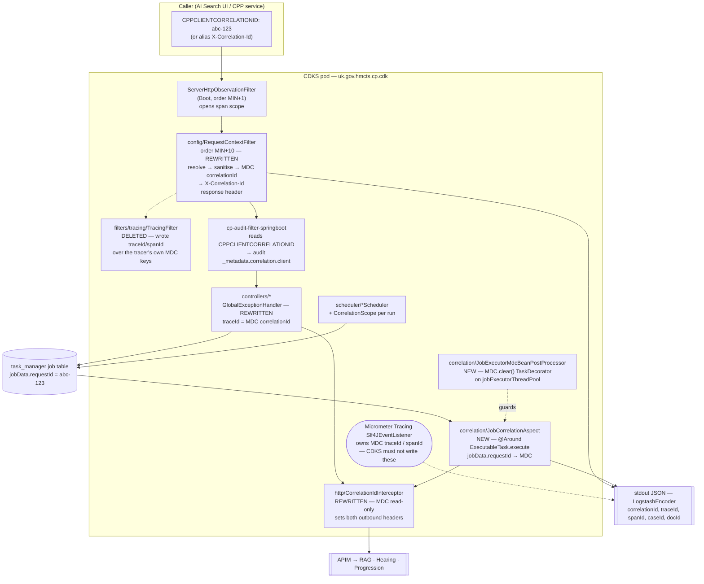
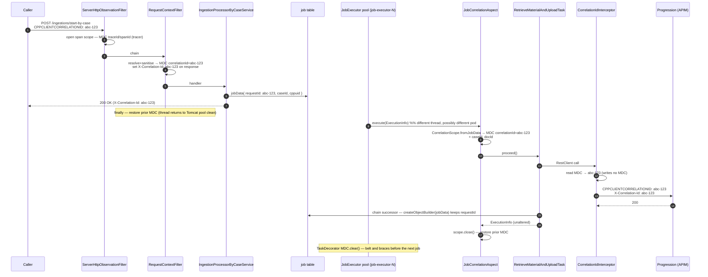

# Design: Unified Correlation-ID Handling and Trace Propagation

> **Stage 2 — Architecture & Design** · Service: `cp-case-document-knowledge-service` (CDKS)
> **Jira: DD-43183** · Requirements: [`01-requirements.md`](./01-requirements.md) ·
> ADRs: [`adrs/DD-43183-correlation-id-unification.md`](../adrs/DD-43183-correlation-id-unification.md)
>
> Make **one** identifier survive a CDKS request end-to-end: inbound header → MDC → response header
> → every outbound APIM call → every JobManager task on every pod → `ErrorResponse.traceId`. This is
> a cross-cutting logging/tracing **correctness fix** in a Modern-by-Default Spring Boot service —
> no new bounded context, no new endpoint, no schema change, no new dependency, no Flyway migration.
>
> **Net shape:** one new package (`uk.gov.hmcts.cp.cdk.correlation`, four classes), **one filter and
> its package deleted**, three existing classes rewritten, four dispatch sites reseeded, two
> scheduler entry points scoped, six lines of tracing configuration replaced, and one dead OpenAPI
> field made useful. Three MDC keys are removed; one is confirmed canonical; two are handed back to
> the library that owns them.
>
> ---
>
> ## Stage 1's tracing premise is wrong, and it changes the design
>
> Requirements note 1 states that `GlobalExceptionHandler.traceId()` returns `""` via
> `Tracer.NOOP` → `TraceContext.NOOP`, and OQ-011 treats `management.tracing.enabled: false` as a
> master switch someone must flip. **Neither is true on the resolved Spring Boot 4.0.6 classpath.**
> Design verified this three ways — configuration metadata, decompiled auto-configuration, and a
> live `SpringApplication` run (§2 has the reproduction). Summary:
>
> | Stage 1 / ticket claim | Verified reality |
> |---|---|
> | `management.tracing.enabled` is the master switch, hard-coded `false` | **The property does not exist in Boot 4.0.6.** Deprecated at level `error` → `management.tracing.export.enabled`; `TracingProperties` has no `enabled` field. Line 34 is dead config, exactly like the two `management.otlp.tracing.*` lines |
> | Tracing is off, so `Tracer.NOOP` is supplied | **A real `OtelTracer` bean always exists.** `OpenTelemetryTracingAutoConfiguration` carries only `@ConditionalOnClass`; `NoopTracerAutoConfiguration` is `@ConditionalOnMissingBean(Tracer)` and never engages. There is **no property that disables span creation** |
> | `traceId()` returns `""` | Returns a **real 32-hex OTel trace ID** whenever a span is in scope — which for every `GlobalExceptionHandler` path means always, because `WebMvcObservationAutoConfiguration` registers `ServerHttpObservationFilter` unconditionally at order `HIGHEST_PRECEDENCE + 1` and it opens the observation scope around the whole filter chain. Returns `null` only with no span in scope (unit tests) |
> | `TracingFilter` is a redundant third convention | It writes MDC `traceId` and `spanId` — **the exact keys Micrometer Tracing's `Slf4JEventListener` populates and clears on every span-scope transition.** It is not redundant, it is an active corruption of the tracer's log-correlation fields |
>
> **What the Area D defect actually is.** Not "the field is empty" — the field is a real trace ID
> that **cannot be found**: (a) it belongs to a trace that is never exported, because no OTLP
> exporter bean is created without an endpoint property; (b) it is overwritten in MDC by
> `TracingFilter` whenever a client sends a bare `traceId` header, so response and logs disagree;
> and (c) it does not exist on the JobManager, scheduler or downstream hops the same request fans
> out to — nothing serialises a span context into `jobData`, and
> `RestClientFactoryConfig:114` builds every `RestClient` from the static `RestClient.builder()`
> with no `observationRegistry`, so **no outbound CDKS call carries `traceparent`**.
>
> AC-020's goal ("search one value, get every log line for that request") is therefore unachievable
> with a trace ID *in principle*. It is achievable with a correlation ID. That is the whole design.
>
> ---
>
> **Eleven Stage-1 open questions are resolved here; eight are recorded as ADRs. All are `Proposed`
> pending the Stage-2 human gate — nothing below is agreed yet.**
>
> | OQ | Resolution | ADR |
> |---|---|---|
> | OQ-001 six-mechanism scope | All six in scope. Canonical = `CPPCLIENTCORRELATIONID`; `TracingFilter` **deleted**; `X-Request-ID` dropped | ADR-001 |
> | OQ-002 header + MDC key | Inbound `CPPCLIENTCORRELATIONID`, alias `X-Correlation-Id`; response `X-Correlation-Id`; outbound both; MDC `correlationId` | ADR-001, ADR-002 |
> | OQ-003 MDC key constraint | `correlationId` kept — published API field reads it. `traceId`/`spanId` reserved to the tracer; `applicationName` deleted | ADR-002 |
> | OQ-004 outbound value source | MDC, read-only, via `CorrelationScope` at every unit-of-work entry point | ADR-007 |
> | OQ-005 reuse `requestId`? | **Reuse.** Decisive reason: in-flight `job` rows already contain it; a new key would be absent from every one of them across the rollout | ADR-003 |
> | OQ-006 async MDC restore | **One `@Aspect`** around `ExecutableTask.execute` + an MDC-clearing `TaskDecorator` on `jobExecutorThreadPool`. A plain decorator would *silently unregister all seven tasks* | ADR-004 |
> | OQ-007 restate the null AC | Non-blank **and** equal to the response header **and** equal to the `correlationId` log field. A 32-hex-shape assertion would pass against the bug | ADR-005 |
> | OQ-008 what goes in `traceId` | **(a)** the correlation ID, unconditionally. `Tracer` dependency and the empty `catch` removed | ADR-005 |
> | OQ-010 OTLP target keys | `management.tracing.export.otlp.enabled` + `management.opentelemetry.tracing.export.otlp.endpoint`, `/v1/*` paths — **and `management.tracing.enabled` is itself dead and deleted** | ADR-006 |
> | OQ-011 who owns the master switch | **Dissolved — there is no master switch.** Tracing is already on and cannot be disabled by property; only the exporter is switchable | ADR-006 |
> | OQ-012 virtual threads | **(b)** — keep off. Leak assurance targets `job-executor-*`, the pooled executor with no hygiene today | ADR-008 |
> | OQ-009 scope of Area E | Resolved as a design decision in §9; needs requirements-owner confirmation, no ADR | — |
> | OQ-013, OQ-014 | Outside Design's control / housekeeping — §14 | — |
>
> **Five items need an explicit accept-or-reject at the gate, not silent approval.** They are
> collected in §15: **GATE-1** (header names as constants, not config — deviates from NFR-007),
> **GATE-2** (withdrawing the `traceId`/`spanId` response headers), **GATE-3** (aspect coordination
> with the in-flight DD-43182), **GATE-4** (`ErrorResponse.traceId` no longer contains a trace ID),
> **GATE-5** (default sampling probability 1.0 → 0.1). A sixth, **GATE-6**, is a security finding
> this ticket surfaces rather than creates.

---

## Detailed Design

### 1. Shape of the change



Everything in the pod box already exists except the two `correlation/*` classes and the
`CorrelationIds` / `CorrelationScope` helpers they use. `TracingFilter` and its package are removed.

### 2. What is actually true today — and how it was verified

This section exists because three of the ticket's factual claims and one of Stage 1's are wrong, and
every downstream decision rests on the corrections. All evidence is from the resolved classpath
(`build.gradle` pins Spring Boot **4.0.6**; `gradle.properties` pins `version.jobManager=1.0.11`,
not 1.0.10 as both Stage 1 and `.claude/context/tech-stack.md` state — OQ-014).

**2.1 Configuration metadata.** Extracting `META-INF/*spring-configuration-metadata.json` from
`spring-boot-micrometer-tracing-4.0.6`, `spring-boot-micrometer-tracing-opentelemetry-4.0.6`,
`spring-boot-micrometer-metrics-4.0.6` and `spring-boot-opentelemetry-4.0.6`:

| Key | Verdict |
|---|---|
| `management.tracing.enabled` | present **only** as `deprecation.level = error`, `replacement = management.tracing.export.enabled`; `TracingProperties` exposes `sampling`, `baggage`, `propagation` and **no `enabled`** |
| `management.otlp.tracing.enabled` | **absent entirely** — not even a deprecated alias (`management.otlp.tracing.export.enabled` exists as an `error`-level alias of `management.tracing.export.otlp.enabled`, which is not what line 40 says) |
| `management.otlp.tracing.endpoint` | `deprecation.level = error`, `replacement = management.opentelemetry.tracing.export.otlp.endpoint` |
| `management.tracing.export.otlp.enabled` | **real**, `Boolean`, default `true` |
| `management.opentelemetry.tracing.export.otlp.endpoint` | **real**, `String`, default *unset* |
| `management.otlp.metrics.export.{enabled,url}` | **real** — the metrics half was always fine |
| `management.tracing.sampling.probability` | **real**, `Float`, Boot default `0.1` (CDKS sets `1.0`) |

**2.2 Auto-configuration conditions**, from decompiled bytecode:

- `OpenTelemetryTracingAutoConfiguration` — `@ConditionalOnClass(OtelTracer, SdkTracerProvider, OpenTelemetry)`
  and nothing else. It creates `otelSdkTracerProvider`, `otelSampler`, `otelPropagator`,
  `micrometerOtelTracer`, **`otelSlf4JEventListener`** and `otelSlf4JBaggageEventListener`
  unconditionally.
- `NoopTracerAutoConfiguration` — `@ConditionalOnClass(Tracer)` + `@ConditionalOnMissingBean(Tracer)`.
  Never applies while the above is on the classpath.
- `OnEnabledTracingExportCondition` — reads `management.tracing.export.<exporter>.enabled`, then
  `management.tracing.export.enabled`, then matches with the message *"tracing is enabled by
  default"*. It is referenced only by `OtlpTracingConfigurations$Exporters` and the Zipkin
  auto-configuration, i.e. **it gates exporters, never the tracer**.
- `OtlpTracingConfigurations$ConnectionDetails` — `@ConditionalOnProperty("management.opentelemetry.tracing.export.otlp.endpoint")`;
  `Exporters` — `@ConditionalOnBean(OtlpTracingConnectionDetails)`.
- `WebMvcObservationAutoConfiguration` — servlet + classes + `@ConditionalOnBean(ObservationRegistry)`,
  registering the filter at `setOrder(-2147483647)` = `Ordered.HIGHEST_PRECEDENCE + 1`.
- `spring-boot-micrometer-tracing-opentelemetry`'s `META-INF/spring.factories` registers
  `OpenTelemetryEventPublisherBeansApplicationListener` as an `ApplicationListener` — which is why
  the MDC behaviour below appears in a real `SpringApplication` but not in an
  `ApplicationContextRunner`.

**2.3 Live reproduction.** A throwaway `SpringApplicationBuilder` context (deleted after
verification, not committed) with exactly the auto-configurations above and
`management.tracing.enabled=false` — CDKS's shipped value:

```
tracer            = io.micrometer.tracing.otel.bridge.OtelTracer      # not Tracer.NOOP
in span scope: MDC = {traceId=710bfbae5f8d238712599800ffd71b3a, spanId=5ca761bc9c198484}
in span scope: tracer.currentSpan().context().traceId() = 710bfbae...  (32 hex chars)
after scope:   MDC = {}
```

and, on the exporter side:

| Properties | `otlpHttpSpanExporter` bean |
|---|---|
| shipped config (no endpoint) | **absent** — spans created, recorded, discarded |
| `…export.otlp.endpoint` set | **present** |
| endpoint set **+** `management.tracing.export.otlp.enabled=false` | **absent** (connection-details bean present) |
| legacy `management.otlp.tracing.endpoint` set | **absent** — confirms the key is inert |

**2.4 The MDC collision, stated precisely.** `TracingFilter` has no `@Order`, so as a plain
`@Component` `OncePerRequestFilter` it sorts at `LOWEST_PRECEDENCE` — deep *inside* the observation
scope. Its `MDC.put(TRACE_ID, request.getHeader("traceId"))` therefore overwrites the tracer's real
value for the rest of the request; and because `Slf4JEventListener` restores the enclosing value
whenever a span scope closes — including the client span around each outbound `RestClient` call —
MDC `traceId` flip-flops between the client's string and the real trace ID mid-request. That is not
a theoretical race; it is the normal path for any caller that sends the header.

**2.5 A test that asserts a fiction.** `src/test/java/uk/gov/hmcts/cp/cdk/logging/TracingIntegrationTest`
appears to cover `TracingFilter` end-to-end. It does not: it `@Import`s `TestTracingConfig`, a
**test-only** `HandlerInterceptor` that re-implements the filter *and adds a `UUID.randomUUID()`
fallback production does not have* (`TestTracingConfig:29–34`). Its
`incoming_request_should_add_new_tracing` case asserts a generated `traceId` that no production path
produces. It must be rewritten with the filter's removal, not carried forward.

**2.6 The audit filter's header, confirmed from the jar.** `cp-audit-filter-springboot` 1.0.5's
`AuditPayloadGenerationService` calls `getHeaderMatchingKey(headers, "CPPCLIENTCORRELATIONID")` —
case-insensitive — and writes it to `_metadata.correlation.client`. This is what makes it the
platform convention rather than a candidate (ADR-001).

**2.7 `TaskRegistry` is proxy-aware, and this constrains OQ-006 hard.**
`TaskRegistry.autoRegisterTasks()` calls `AopUtils.getTargetClass(bean)` and *then*
`.getAnnotation(Task.class)`, storing the **proxy** in `taskProxyByNameMap`
(`"Registering Work Task proxy [type={}], [name={}]"`). Spring AOP proxies are supported input.
**A hand-written delegating decorator is not**: `AopUtils.getTargetClass` would return the
decorator's class, which has no `@Task`, and registration would take its
`"Skipping ExecutableTask without @Task annotation: {}"` branch at **debug** level — silently
unregistering all seven tasks. See ADR-004.

**2.8 The pooled-thread inventory** (OQ-012): `jobExecutorThreadPool` (`job-executor-*`, core 5 /
max 10 / queue 100, from `task-manager-service`'s `@Value` defaults) has **no MDC hygiene at all**;
Tomcat request threads are covered by `RequestContextFilter`'s `finally`; `discoveryTriggerExecutor`
is covered by `MdcCopyingTaskDecorator`; `ShedLockConfig.taskScheduler` (`scheduler-*`, poolSize 10)
is covered only by whatever each job does for itself — `StalledWorkMetrics` does, the two discovery
schedulers do nothing.

### 3. Inbound resolution — `config/RequestContextFilter` (FR-001 – FR-003)

Rewritten in place. The class and bean name (`correlationMdcFilter`) are kept deliberately: renaming
a filter bean changes registration ordering and touches tests for no behavioural gain (a rename is
recorded as a follow-up in §14).

```java
@Component("correlationMdcFilter")
@Order(Ordered.HIGHEST_PRECEDENCE + 10)   // NOT +1: that is ServerHttpObservationFilter's order
public class RequestContextFilter extends OncePerRequestFilter {

    private static final String CLUSTER = System.getenv().getOrDefault("CLUSTER_NAME", "local");
    private static final String REGION  = System.getenv().getOrDefault("REGION", "local");

    @Override
    protected void doFilterInternal(HttpServletRequest request, HttpServletResponse response,
                                    FilterChain chain) throws ServletException, IOException {
        final Map<String, String> prior = MDC.getCopyOfContextMap();
        try {
            final String cid = CorrelationIds.resolveInbound(request);   // §5 — canonical, alias, else generate
            MDC.put(CorrelationIds.MDC_KEY, cid);
            MDC.put("cluster", CLUSTER);
            MDC.put("region", REGION);
            MDC.put("path", request.getRequestURI());
            response.setHeader(CorrelationIds.HEADER_X_CORRELATION_ID, cid);   // before the chain: FR-003, AC-006
            chain.doFilter(request, response);
        } finally {
            if (prior == null) {
                MDC.clear();
            } else {
                MDC.setContextMap(prior);
            }
        }
    }
}
```

Four decisions in there that are not incidental:

- **`@Order(HIGHEST_PRECEDENCE + 10)`, not `+ 1`.** `WebMvcObservationAutoConfiguration` registers
  `ServerHttpObservationFilter` at exactly `+1` (§2.2), so today the two filters **tie** and their
  relative order is unspecified. Moving to `+10` makes the correlation MDC deterministically set
  *inside* the trace scope, so `correlationId`, `traceId` and `spanId` coexist on every log line
  from that point on. The only filter that now runs before it is the observation filter, which emits
  no application log lines.
- **`response.setHeader(...)` before `chain.doFilter(...)`.** Response headers cannot be set once the
  response is committed, and a streaming or early-committing handler would otherwise silently drop
  it. Setting it up front makes AC-006 hold for 2xx and 4xx/5xx alike, including responses produced
  by `GlobalExceptionHandler` and by Boot's `/error` dispatch.
- **`OncePerRequestFilter` instead of a raw `Filter`.** Gives typed request/response (needed for
  `setHeader`) and single-execution semantics per request. Consequence: `RequestContextFilterTest`
  must mock `HttpServletResponse` rather than `ServletResponse` — a construction-site edit, not an
  assertion change (AC-034's named test keeps its assertions).
- **Restore the prior MDC map rather than `MDC.clear()`.** `MDC.clear()` is correct for pooled Tomcat
  threads but is indiscriminate: it also wipes keys the tracer owns. Capturing and restoring is
  leak-proof *and* non-destructive, and on a fresh request thread `prior` is null so the behaviour —
  and AC-034's assertion — is identical to today.

`cluster`, `region` and `path` are unchanged.

### 4. Deleting `filters/tracing/TracingFilter` (ADR-001)

The whole package goes: `TracingFilter.java` and `TracingFilterTest.java`. Justification is in
ADR-001; the three keys are disposed of as follows.

| Key it wrote | Disposition |
|---|---|
| `traceId` | Handed back to Micrometer Tracing, which already populates it with a real 32-hex OTel ID (§2.3). CDKS must never write it (ADR-002) |
| `spanId` | Same |
| `applicationName` | Redundant — `logback-spring.xml` already emits `{"app":"cp-case-document-knowledge-service","service":"cp-case-document-knowledge-service"}` as static `customFields` on every line |

The `traceId` / `spanId` **response headers** are withdrawn. The argument that makes this safe rather
than merely tidy: the filter set them **only when the request already carried them** (`:33`, `:37`),
so the echo could only ever return a value the caller itself supplied. No consumer can lose
information it did not already have. **GATE-2** asks the requester to confirm; Design's position is
that a confirming answer is the only possible one.

### 5. `correlation/CorrelationIds` — one convention, one validation (NFR-002, NFR-007, NFR-008)

New `final` class, private constructor throwing `AssertionError` (the `util/TimeUtils` and
`metrics/CdkMeters` precedent). It is the single definition site NFR-007 and NFR-008 ask for; header
names are compile-time constants rather than properties for the reasons in ADR-001(6) — **GATE-1**.

```java
public final class CorrelationIds {

    /** Canonical inbound header — the CPP platform convention, already read by cp-audit-filter-springboot. */
    public static final String HEADER_CPP = "CPPCLIENTCORRELATIONID";
    /** Accepted inbound alias, response header, and second outbound header. Deprecated inbound, honoured indefinitely. */
    public static final String HEADER_X_CORRELATION_ID = "X-Correlation-Id";
    /** The one MDC key. Read into DiscoveryTriggerResponse.correlationId — do not rename (ADR-002). */
    public static final String MDC_KEY = "correlationId";

    private static final List<String> INBOUND_PRECEDENCE = List.of(HEADER_CPP, HEADER_X_CORRELATION_ID);
    private static final Pattern ALLOWED = Pattern.compile("[A-Za-z0-9._:-]{1,64}");

    public static String resolveInbound(HttpServletRequest request) { … }   // precedence, then generate
    public static String sanitise(String raw)      { … }   // null if absent/blank/rejected
    public static String generate()                { return UUID.randomUUID().toString(); }
    public static String currentOrGenerate()       { … }   // MDC.get(MDC_KEY), else generate
    public static String currentOrRandom()         { … }   // as above; never writes MDC
}
```

**Validation rules** (ADR-007), applied to every externally sourced value — inbound headers **and**
`jobData`:

| Rule | Value | Why |
|---|---|---|
| Allow-list | `A–Z a–z 0–9 - _ . :` | Excludes `\r`, `\n`, `\t`, every other ISO control character, `"`, `{`, `}`, `\` and all multi-byte characters, so no accepted value can split or forge a JSON log record, escape a JSON string, or inject ANSI escapes into a terminal |
| Max length | **64** | UUID = 36, W3C `traceparent` = 55. An unbounded accepted value is a log-amplification vector even when every character is legal |
| On violation | **reject the whole value, generate a fresh UUID** | A *sanitised* value silently differs from what the caller sent, so the caller's own search fails while looking healthy. A rejected value is obviously different the first time anyone compares |
| On violation, logging | one WARN carrying the **header name, the length and a reason code** (`illegal-character` / `too-long`) — **never the value** | Logging a rejected log-injection payload *is* the injection |
| Never | fail the request | NFR-004: every correlation path degrades to a generated value |

**Relationship to the in-repo precedent.** `RagAnswerAsyncServiceImpl` (~`:99–103`) sanitises in
place with `.replace('\n','_').replace('\r','_')` — verified still present. That stays as it is and
is the right call *there*: the value is a downstream RAG identifier CDKS is required not to lose
(CLAUDE.md's RAG-data rule), so mangling one character beats discarding it. For an inbound header
CDKS can regenerate at zero cost, rejection is strictly better. The divergence is deliberate and
documented rather than an inconsistency.

**`correlation/CorrelationScope`** — a tiny `AutoCloseable` that seeds MDC if absent and restores the
prior map on close:

```java
try (var scope = CorrelationScope.open(cid))            { … }   // explicit value
try (var scope = CorrelationScope.openIfAbsent())       { … }   // scheduler / background entry point
try (var scope = CorrelationScope.fromJobData(jobData)) { … }   // JobManager task (§7)
```

`close()` restores — never `remove`, never `clear` — so a scope is safe nested and on a pooled thread
that legitimately carries other context.

### 6. Outbound propagation — `http/CorrelationIdInterceptor` (FR-004 – FR-006)

This is the epic's highest-value fix and the one place where the current code is actively
destructive: `:24` puts a fresh UUID into MDC and `:28` **removes** the key in `finally` — so the
inbound correlation ID is deleted for the remainder of the request, and every log line after CDKS's
first outbound call carries no `correlationId` at all. `RestClientFactoryConfig:117` attaches this
interceptor to every `RestClient` unconditionally (RAG, Hearing, Progression).

The rewrite makes the interceptor **MDC-read-only**, which removes the failure class rather than
repairing the `finally`:

```java
public class CorrelationIdInterceptor implements ClientHttpRequestInterceptor {

    @Override
    public ClientHttpResponse intercept(HttpRequest request, byte[] body,
                                        ClientHttpRequestExecution execution) throws IOException {
        final String cid = CorrelationIds.currentOrRandom();          // reads MDC; never writes it
        request.getHeaders().set(CorrelationIds.HEADER_CPP, cid);
        request.getHeaders().set(CorrelationIds.HEADER_X_CORRELATION_ID, cid);
        return execution.execute(request, body);                      // no try/finally at all
    }
}
```

- `HEADER` (`X-Request-ID`) and `MDC_KEY` are **deleted from the class**. Nothing downstream can
  depend on `X-Request-ID`, because it only ever carried a fresh UUID that correlated with nothing.
- **Two outbound headers** (ADR-001(3)): `CPPCLIENTCORRELATIONID` so that Hearing's and
  Progression's own `cp-audit-filter-springboot` joins their audit events to CDKS's, and
  `X-Correlation-Id` as the generic name a non-CPP service (RAG) is more likely to log.
- **FR-006's "generated once per unit of work, not per call"** is satisfied by `CorrelationScope` at
  the entry points, not by the interceptor:

| Unit of work | Where the scope opens | Source |
|---|---|---|
| HTTP request | `RequestContextFilter` (§3) | canonical header → alias → generated |
| JobManager task | `JobCorrelationAspect` (§7) | `jobData.requestId` → generated |
| `IntradayDiscoveryScheduler.run()`, `NightlyDiscoveryScheduler.run()` | new `CorrelationScope.openIfAbsent()` wrapping the existing body | generated per run — **neither carries any MDC today** |
| `StalledWorkMetricsRefreshJob` → `StalledWorkMetrics.refresh()` | already generates its own (`:100–113`); switched onto `CorrelationScope` so there is one implementation | generated per refresh |
| Manual discovery trigger (`DiscoveryTriggerService`) | none needed — `MdcCopyingTaskDecorator` already copies the request thread's MDC | inherited |

Because every real unit of work opens a scope, `currentOrRandom()`'s fresh-UUID branch is a
defensive last resort (a startup probe, a directly-constructed client in a test), and AC-011/AC-012
hold structurally rather than by inspection.

**`DebugLoggingInterceptor` — a security finding this ticket surfaces (GATE-6).** It is the sibling
interceptor on the same `RestClient` chain and it logs `"Headers: {}"` — the **entire** outbound
header map — at DEBUG. That map contains the APIM bearer token and/or subscription key injected by
`ApimAuthHeaderService`. This is pre-existing and out of DD-43183's stated scope, but the diff
touches the adjacent line and any security reviewer will see it. Design's recommendation: fix it in
this ticket with a header-name allow-list (three lines), because "found it, adjacent, left it" is a
worse outcome than a slightly wider diff. Reject and it becomes a follow-up ticket — but it should
be a *raised* follow-up, not a note in a design document.

### 7. Asynchronous work — the JobManager MDC-restoration mechanism (FR-007 – FR-009)

**7.1 One aspect, not seven try/finally blocks** (ADR-004). Single interception point, covering all
seven `@Task` beans and any eighth:

```java
@Aspect
@Component
@Order(Ordered.HIGHEST_PRECEDENCE)   // outermost — DD-43182's metrics aspect logs inside this scope
public class JobCorrelationAspect {

    @Around("execution(* uk.gov.hmcts.cp.cdk.jobmanager..*.execute(uk.gov.hmcts.cp.taskmanager.domain.ExecutionInfo))")
    public Object aroundExecute(final ProceedingJoinPoint pjp) throws Throwable {
        final ExecutionInfo info = (ExecutionInfo) pjp.getArgs()[0];
        try (var scope = CorrelationScope.fromJobData(info.getJobData())) {
            return pjp.proceed();
        }
    }
}
```

- `CorrelationScope.fromJobData(...)` reads `JobManagerKeys.Params.REQUEST_ID`, runs it through §5's
  validation, generates a UUID if it is absent, blank or rejected (AC-016, NFR-004), and puts it in
  MDC under `CorrelationIds.MDC_KEY`. It **additionally** seeds `caseId`, `docId` and
  `transactionId` from `CTX_CASE_ID_KEY`, `CTX_DOC_ID_KEY` and `CTX_RAG_TRANSACTION_ID` when
  present — which is Area E's entire async half, for free, at one site (§9).
- **No `catch`, no swallow, no rewriting of the returned `ExecutionInfo`.** The return value and any
  thrown `Throwable` pass through untouched (NFR-004; CLAUDE.md's "no behaviour change introduced by
  the fix itself"). `close()` restores the prior map, so AC-014 holds whether the task returns or
  throws.
- **Not conditional on any property.** DD-43182 gates its aspect behind `cdk.metrics.enabled`; a
  service that can be configured to stop correlating its own logs has the bug this ticket closes.
- **Why an aspect is safe here and a decorator is not** — §2.7 and ADR-004. `TaskRegistry` resolves
  `@Task` through `AopUtils.getTargetClass`, so a Spring AOP proxy is supported input; a plain
  delegating decorator would silently unregister all seven tasks with only a `debug` line to show
  for it.
- **No new dependency.** `spring-aop` 7.0.7 and `aspectjweaver` 1.9.25.1 are already on the runtime
  classpath via `spring-aspects` ← `spring-boot-starter-data-jpa` (confirmed with
  `gradlew dependencyInsight`), and `AopAutoConfiguration` registers annotation-driven auto-proxying
  when `org.aspectj.weaver.Advice` is present. Boot's default `spring.aop.proxy-target-class=true`
  means CGLIB proxies; the task classes are non-final with a single Lombok-generated constructor, and
  **no CDKS code injects a task by concrete type** (only three Javadoc mentions in `services/`), so
  no injection site is affected.

**7.2 Defence in depth — an MDC-clearing `TaskDecorator` on the JobManager pool.**
`correlation/JobExecutorMdcBeanPostProcessor` intercepts the bean named `jobExecutorThreadPool` in
`postProcessBeforeInitialization` and calls
`setTaskDecorator(r -> () -> { try { r.run(); } finally { MDC.clear(); } })`. Verified safe:
`ThreadPoolTaskExecutor$1.execute` reads the `taskDecorator` field **at submission time**, so setting
it before `afterPropertiesSet()` — or indeed at any point before the first submission — takes effect.

The bean is `@Bean @ConditionalOnMissingBean(name = "jobExecutorThreadPool")`, so replacing it
outright is possible and deliberately **not** done: that would mean copying the library's eight
`@Value`-bound defaults (`job.executor.core-pool-size:5`, `max-pool-size:10`, `queue-capacity:100`,
`thread-name-prefix:job-executor-`, …) into CDKS with no mechanism to keep them in step across a
library bump.

This is what makes FR-019/AC-014 true *structurally* for the one pooled executor in this service
that has never had any MDC hygiene: even a future task that writes MDC outside the aspect, or a
library change that logs after `execute(...)` returns, cannot leak onto the next job on that thread.

**7.3 Seeding from the inbound correlation ID** (FR-009, ADR-003). Four dispatch sites, each
currently minting an unrelated `randomUUID()`:

| Site | Today | After |
|---|---|---|
| `DiscoveryService:153` (`toJobDataForCaseEligibility`) | `.add(REQUEST_ID, randomUUID().toString())` | `.add(REQUEST_ID, CorrelationIds.currentOrGenerate())` |
| `DiscoveryService:163` (`toJobDataForGetCaseHearings`) | same | same |
| `JobManagerService:55/:59` | `UUID.randomUUID()`, added via the **inline literal** `"requestId"` | `CorrelationIds.currentOrGenerate()`, added via `REQUEST_ID` (AC-015) |
| `IngestionProcessorByCaseService:85` | `UUID.randomUUID()` passed to `RetrieveMaterialAndUploadJobDataService.enrich(...)` | `CorrelationIds.currentOrGenerate()` |

`RetrieveMaterialAndUploadTask:79`'s inline `"requestId"` literal moves onto the constant (AC-015),
completing the "no inline literal in `src/main`" requirement. The three tasks that currently pass
`requestId` as a `log.*` parameter stop doing so: it is in MDC and therefore already a discrete JSON
field (FR-013). `errorprone.InvalidLogMessageFormat` is excluded in the PMD ruleset, so nothing
would catch a stale `{}` placeholder — the placeholders and parameters must be removed in the same
edit, and Stage 6 review should check exactly this.

**Chain propagation needs no work.** All nine successor dispatches already copy the parent map:
`GetCasesForHearingTask:101`, `RetrieveMaterialAndUploadTask:131`, `GenerateAnswerForQueryTask:101`,
`CheckStatusOfAnswerGenerationTask:164`, `CheckAllDocumentsIngestionStatusTask:69`,
`CheckIngestionStatusForAllDefendantsTask:125`/`:152`/`:173`, and
`RetrieveMaterialAndUploadJobDataService:43` — all `createObjectBuilder(jobData)`. AC-017 is already
structurally satisfied; the test simply pins it.



### 8. `GlobalExceptionHandler` (FR-010, FR-011, ADR-005)

```java
@Slf4j
@RestControllerAdvice
public class GlobalExceptionHandler {          // no @RequiredArgsConstructor, no Tracer field

    private ErrorResponse base(final String code, final String message) {
        return new ErrorResponse()
                .error(code)
                .message(message)
                .timestamp(utcNow())
                .traceId(CorrelationIds.currentOrGenerate());
    }
    …
}
```

- **The `Tracer` dependency is removed** — it has no other use in the class.
- **The `Objects.requireNonNull` and the `catch (Exception ignored) {}` block are removed**, not
  logged around: with the tracer gone there is no operation that can throw. This closes the
  swallowed-tracer-failure defect Stage 1 raised in OQ-007 by deleting the only empty catch block in
  the class, which is also why the diff introduces no new exception swallowing. (For the record:
  that block passes PMD today only because `errorprone.EmptyCatchBlock` permits a variable named
  `ignored`.)
- **Non-blank is structural.** `RequestContextFilter` runs for every HTTP request and always leaves a
  non-blank `correlationId` in MDC, so the fallback branch is unreachable in production. All six
  handlers route through `base(...)`, so AC-021 holds by construction — Stage 4 should still assert
  all six.
- **The AC-018/AC-019 oracle is restated** (OQ-007). Assert, per handler: `traceId` is **non-blank**
  *and* equals the `X-Correlation-Id` response header *and* equals the `correlationId` JSON field on
  that request's log lines. A `matches("[0-9a-f]{32}")`-shaped assertion must **not** be used — it
  would pass today, against the bug (§2.3).
- **No API change.** `ErrorResponse` keeps its field name and type; `version.cdk` stays `0.0.12`
  (AC-038). The field named `traceId` now contains a correlation ID — **GATE-4**.

### 9. Area E — business identifiers as structured fields (FR-012 – FR-015, OQ-009)

OQ-009 asked Design to bound "every operational log line". Taken literally it is a very large diff
across four packages, and some units of work legitimately have no `caseId`. Resolved as follows —
this is a **design decision that needs requirements-owner confirmation**, not an ADR:

**In scope**

| Where | Keys | Mechanism |
|---|---|---|
| All seven JobManager tasks | `caseId`, `docId`, `transactionId` where present in `jobData` | `CorrelationScope.fromJobData(...)` in the aspect — **one site, zero per-task edits** (§7.1) |
| `RagAnswerAsyncServiceImpl.answerUserQueryAsync` | `transactionId` from the returned `UserQueryAnswerRequestAccepted.getTransactionId()` | explicit scope around the completion log (FR-014, AC-024) — it carries no identifier at all today |
| `RagAnswerAsyncServiceImpl.answerUserQueryStatus` | `transactionId` | already logged as a **sanitised message parameter** (~`:99–103`); moves to a structured field (AC-025). Stage 1's OQ-009 note that only one of the two lacks an identifier is correct |
| `IdpcAvailabilityService`, `IngestionProcessorByCaseService`, `IngestionService`, `DocumentService` | `caseId`, `docId` | scope at the public entry method where the id first exists |
| `IntradayDiscoveryScheduler`, `NightlyDiscoveryScheduler` | none — they have no case | `CorrelationScope.openIfAbsent()` only (§6) |

**Out of scope, explicitly**

- Repositories, mappers, entities (Stage 1 already excluded them).
- **No sentinel for a missing `caseId`.** A unit of work with no case (`/queries` list,
  `/query-catalogue`, both discovery schedulers, `StalledWorkMetrics`) emits **no `caseId` key at
  all**. An absent JSON field is correct and queryable; a `"none"` sentinel pollutes the index and
  makes `caseId:*` searches lie.
- **`transactionId` means the RAG transaction id** — the value behind
  `JobManagerKeys.CTX_RAG_TRANSACTION_ID` (`"ragTransactionId"`) and
  `UserQueryAnswerRequestAccepted.getTransactionId()`. The MDC key is `transactionId` (the log-field
  name callers and support engineers use); the `jobData` key stays `ragTransactionId` (persisted wire
  format, ADR-003's reasoning).

**No encoder change is needed.** `logback-spring.xml`'s `LogstashEncoder` sets no
`includeMdcKeyNames`, so every MDC entry is already emitted as a top-level JSON field — verified.
FR-013 is satisfied by putting values into MDC and by *removing* the message interpolation, so AC-023
("siblings of `message`, not embedded in it") requires the placeholder removal, not just the MDC put.

**NFR-001 / FR-015 / AC-026 remain absolute.** `caseId`, `docId` and `transactionId` are opaque
UUIDs. No document content, answer text, `llm_input`, document name, court reference number or
`CJSCPPUID` enters MDC, a log field, a propagated header or an `ErrorResponse` field. `cppuid` is
already handled by `JobManagerService.sanitizeForLog(...)` and is **not** promoted to an MDC field by
this ticket. NFR-009 also holds: correlation and business identifiers are log fields only and never
become a Micrometer tag or a Prometheus label.

### 10. Configuration — `application-server-management.yml` (FR-016 – FR-018, ADR-006)

**Before** (lines 33–45 — three of these six lines are inert):

```yaml
  tracing:
    enabled: false                                              # DEAD: not a Boot 4.0.6 property
    sampling:
      probability: ${TRACING_SAMPLER_PROBABILITY:1.0}
  otlp:
    tracing:
      enabled: ${OTEL_METRICS_ENABLED:false}                    # DEAD: key does not exist at all
      endpoint: ${OTEL_TRACES_URL:http://localhost:4318/traces} # DEAD: removed at level 'error'
    metrics:
      export:
        enabled: ${OTEL_METRICS_ENABLED:false}                  # valid
        url: ${OTEL_METRICS_URL:http://localhost:4318/metrics}  # valid; wrong path
```

**After:**

```yaml
  tracing:
    # 'management.tracing.enabled' does NOT exist in Boot 4.0.6 (removed at deprecation level
    # 'error', replaced by management.tracing.export.enabled). Span creation is unconditional
    # while spring-boot-starter-opentelemetry is on the classpath -- only export is switchable.
    # Do not re-add it. See adrs/DD-43183-correlation-id-unification.md (ADR-006).
    sampling:
      probability: ${TRACING_SAMPLER_PROBABILITY:0.1}
    export:
      otlp:
        enabled: ${OTEL_TRACES_ENABLED:false}

  opentelemetry:
    tracing:
      export:
        otlp:
          endpoint: ${OTEL_TRACES_URL:http://localhost:4318/v1/traces}

  otlp:
    metrics:
      export:
        enabled: ${OTEL_METRICS_ENABLED:false}
        url: ${OTEL_METRICS_URL:http://localhost:4318/v1/metrics}
```

- **`OTEL_TRACES_ENABLED` is now independent of `OTEL_METRICS_ENABLED`** (FR-016, AC-027) and
  defaults `false`, so with neither variable set nothing is exported and today's effective behaviour
  is preserved exactly (AC-031).
- **`/v1/traces` and `/v1/metrics`** — the OTLP/HTTP spec paths (FR-017, AC-029).
- **Sampling default 1.0 → 0.1** (Boot's own default) — **GATE-5**. With no exporter, 1.0 costs only
  span recording; with an exporter it is 10× the span volume on a service whose hot path includes
  180-second RAG calls. Trace IDs are unaffected at any sampling rate: an unsampled OTel span still
  carries a valid trace ID and `Slf4JEventListener` still populates MDC, so lowering the rate does
  not weaken log correlation. `TRACING_SAMPLER_PROBABILITY=1.0` remains available for AC-030's
  demonstration environment.
- **AC-030's collector evidence needs two variables in one non-production environment**
  (`OTEL_TRACES_ENABLED=true`, `OTEL_TRACES_URL=<collector>/v1/traces`) — no code, no "master switch",
  and nothing else in this ticket depends on it (ADR-005 makes `ErrorResponse.traceId` independent of
  tracing state). Platform/SRE own the collector.
- **AC-028 gets a real oracle** (§13): a unit test walks every key in every
  `src/main/resources/application*.yml`, resolves it against the aggregated
  `META-INF/spring-configuration-metadata.json` on the test classpath, and fails on any
  `management.*` / `spring.*` key that is unknown or deprecated at level `error`. That is what
  catches the *next* dead key — the real lesson here is that three inert lines survived multiple
  releases with nothing to notice them.

No other `application-*.yml` changes. `spring.threads.virtual.enabled: ${VIRTUAL_THREADS:false}`
stays as it is (ADR-008).

### 11. Files touched

| File | Change |
|---|---|
| `correlation/CorrelationIds.java` *(new)* | Header/MDC-key constants, inbound precedence, allow-list + length validation, generation. `final`, private constructor. |
| `correlation/CorrelationScope.java` *(new)* | `AutoCloseable`; `open`, `openIfAbsent`, `fromJobData`; restores the prior MDC map on close. |
| `correlation/JobCorrelationAspect.java` *(new)* | `@Aspect` `@Around` `ExecutableTask.execute`; `@Order(HIGHEST_PRECEDENCE)`; restores `correlationId` + `caseId`/`docId`/`transactionId` from `jobData`. |
| `correlation/JobExecutorMdcBeanPostProcessor.java` *(new)* | Sets an `MDC.clear()`-in-`finally` `TaskDecorator` on the `jobExecutorThreadPool` bean. |
| `config/RequestContextFilter.java` | Becomes `OncePerRequestFilter`; `@Order(+10)`; canonical+alias resolution; sanitisation; `X-Correlation-Id` response header; restore-prior-map instead of `MDC.clear()`. |
| `filters/tracing/TracingFilter.java` | **DELETED** (package removed). |
| `http/CorrelationIdInterceptor.java` | MDC-read-only; sets `CPPCLIENTCORRELATIONID` + `X-Correlation-Id`; `X-Request-ID`, `MDC_KEY` and the `finally` removed. |
| `controllers/GlobalExceptionHandler.java` | `Tracer` dependency, `requireNonNull` and the empty `catch` removed; `traceId()` → correlation ID. |
| `jobmanager/support/JobManagerKeys.java` | Javadoc on `Params.REQUEST_ID` recording that it carries the correlation ID and is a persisted wire format. No value change. |
| `jobmanager/caseflow/RetrieveMaterialAndUploadTask.java` | Inline `"requestId"` literal (`:79`) → constant; `requestId` log parameters removed (now an MDC field). |
| `jobmanager/{caseflow,queryflow,hearing}/*Task.java` | Remove `requestId` message parameters where they duplicate the MDC field; **no MDC code in any task** (the aspect owns it). |
| `services/JobManagerService.java` | `:59` inline literal → constant; `:55` seed from `CorrelationIds.currentOrGenerate()`. |
| `services/DiscoveryService.java` | `:153`, `:163` seed from the ambient correlation ID. |
| `services/IngestionProcessorByCaseService.java` | `:85` seed from the ambient correlation ID. |
| `services/RetrieveMaterialAndUploadJobDataService.java` | No change needed (`:63` already uses the constant). |
| `scheduler/IntradayDiscoveryScheduler.java`, `NightlyDiscoveryScheduler.java` | Wrap `run()` in `CorrelationScope.openIfAbsent()`. No cron, lock-name or `@ConditionalOnProperty` change. |
| `metrics/StalledWorkMetrics.java` | `:100–113`'s hand-rolled `MDC.put`/`remove` → `CorrelationScope`; the `job` key is unchanged. |
| `clients/rag/RagAnswerAsyncServiceImpl.java` | `transactionId` as a structured field on both completion lines (FR-014, AC-024, AC-025). Existing CRLF sanitisation of the RAG value retained. |
| `services/{IdpcAvailability,Ingestion,Document,IngestionProcessorByCase}Service.java` | `caseId` / `docId` scopes at public entry methods (§9). |
| `http/DebugLoggingInterceptor.java` | **GATE-6** — header-name allow-list, if the gate accepts the in-scope fix. |
| `resources/application-server-management.yml` | §10. |

**Not changed, and confirmed so:**

- `build.gradle`, `gradle.properties` — **no new dependency**; `spring-aop` and `aspectjweaver` are
  already on the runtime classpath and `AopAutoConfiguration` ships in Boot. `version.cdk` and
  `version.aiRag` untouched (AC-038).
- Every OpenAPI model, `acl/cdks-rules.drl`, `PermissionConstants`, `controllers/accesscontrol/` —
  no endpoint, no contract, no ACL rule (`rbac-auditor` and `api-contract-check` have nothing to
  review beyond confirming this).
- `db/migration/**` — **no migration**; highest shipped version stays `V1014`.
- `logback-spring.xml` — `LogstashEncoder` already emits all MDC entries as top-level fields.
- `cp-audit-filter-springboot` and `cp-auth-rules-filter` versions and behaviour (Stage 1's
  out-of-scope list).
- Azure, Artemis, and the Managed-Identity path — this change makes no Azure call, adds no
  credential, and touches no connection string, SAS token or account key.
- `MdcCopyingTaskDecorator` and `DiscoveryTriggerConfig` — already correct for their executor.
- `spring.threads.virtual.enabled` / `VIRTUAL_THREADS` (ADR-008).

### 12. The documented convention (NFR-008)

This table is the durable artefact NFR-008 asks for. It belongs in
`.claude/context/cdks-context.md` as well as here, so it is not only in a per-ticket document.

**Headers**

| Direction | Name | Role |
|---|---|---|
| Inbound | `CPPCLIENTCORRELATIONID` | **Canonical.** CPP platform convention; also consumed by `cp-audit-filter-springboot` |
| Inbound | `X-Correlation-Id` | Accepted alias, deprecated, honoured indefinitely |
| Inbound | `traceparent` | Handled by Boot's propagator; **not** a correlation alias |
| Inbound | bare `traceId`, `spanId`, `X-Request-ID` | **Not read.** Deliberately dropped |
| Response | `X-Correlation-Id` | The resolved value, on every response |
| Outbound | `CPPCLIENTCORRELATIONID` **and** `X-Correlation-Id` | Both carry the resolved value |
| Outbound | `X-Request-ID` | **Removed** — only ever carried a meaningless fresh UUID |

**MDC keys and their owners**

| Key | Owner | Lifetime | Notes |
|---|---|---|---|
| `correlationId` | CDKS — `CorrelationIds` / `CorrelationScope` | Unit of work | The one value to search. Read into `DiscoveryTriggerResponse.correlationId`; returned as `ErrorResponse.traceId` |
| `traceId`, `spanId` | **Micrometer Tracing** | Span scope | **Reserved.** No `src/main` code may write them; a test enforces it |
| `cluster`, `region`, `path` | CDKS — `RequestContextFilter` | Request | Unchanged |
| `caseId`, `docId`, `transactionId` | CDKS — §9 | Unit of work, where applicable | Absent rather than sentinel when not applicable |
| `job`, `trigger`, `discoveryOperation` | CDKS — DD-43062/63/85 | Unit of work | Unchanged |
| `applicationName` | **Removed** | — | Duplicated `logback-spring.xml`'s static `app`/`service` fields |

**Other keys**

| Purpose | Key | Notes |
|---|---|---|
| JobManager `jobData` | `requestId` (`JobManagerKeys.Params.REQUEST_ID`) | Carries the correlation ID. Persisted wire format — **do not rename** (ADR-003) |
| RAG transaction in `jobData` | `ragTransactionId` (`CTX_RAG_TRANSACTION_ID`) | Surfaces as the MDC/log field `transactionId` |

**Value rules:** allow-list `[A-Za-z0-9._:-]`, 1–64 characters, reject-and-regenerate on violation,
never fail a request, never log a rejected value.

### 13. Testing

Scoping only — Stage 4 (Test Specs) owns the scenarios.

**Unit (`src/test/`)**

| Target | Covers |
|---|---|
| `CorrelationIdsTest` *(new)* | Precedence: canonical only → canonical; alias only → alias; both with different values → canonical, **order pinned** (AC-001 – AC-003); none/blank → generated (AC-004); allow-list and 64-character rejections each regenerate; a CRLF payload cannot reach MDC; the WARN carries no rejected value (NFR-002) |
| `CorrelationScopeTest` *(new)* | `open`/`openIfAbsent`/`fromJobData` seed MDC; `close()` restores the **prior map** (not clear, not remove), including nested scopes and when the body throws |
| `RequestContextFilterTest` *(rewrite)* | Canonical + alias resolution; `X-Correlation-Id` response header set **before** the chain; prior-map restore on normal and throwing paths — **AC-034's `clearsMdcEvenIfChainThrowsException` keeps its assertions**, only the response mock type changes |
| `CorrelationIdInterceptorTest` *(rewrite — all four current methods assert the deleted behaviour)* | In-scope value transmitted **verbatim**, no `randomUUID()` substitution (AC-009); both outbound headers set; **MDC is unchanged before, during and after** — the direct test for the destruction bug (AC-010); no `X-Request-ID` |
| `GlobalExceptionHandlerTest` *(rewrite — seven methods mock `Tracer`/`Span`/`TraceContext`)* | All six handlers return a **non-blank** `traceId` equal to the ambient `correlationId`; with MDC empty it is still non-blank; **no** `Tracer` bean is required to construct the advice (AC-018, AC-019, AC-021) |
| `JobCorrelationAspectTest` *(new)* | With a stub `ExecutableTask`: `jobData.requestId` restored to MDC for the duration (AC-013); absent/blank/rejected key → generated, no throw (AC-016); MDC restored to the prior map after normal return **and** after a throw (AC-014); the returned `ExecutionInfo` is **reference-identical** and a thrown exception is **the same instance** (NFR-004) |
| `JobCorrelationProxyingTest` *(new, Spring context)* | All seven `@Task` beans are AOP-proxied **and** still resolvable through `TaskRegistry.getTask(<TaskNames value>)` — the test that fails loudly if `AopUtils.getTargetClass` behaviour or the pointcut package ever changes (§2.7). Also asserts `JobCorrelationAspect` is ordered outside `TaskRetryMetricsAspect` if DD-43182 has landed (GATE-3) |
| `JobExecutorMdcLeakTest` *(new)* | `jobExecutorThreadPool` with pool size forced to 1: job A sets MDC and returns / throws; job B on the same thread observes **nothing** from A (FR-019, AC-014, AC-032) |
| `MdcReservedKeyTest` *(new)* | No file under `src/main/java` contains an `MDC.put` of `traceId` or `spanId` (ADR-002) |
| `ConfigurationMetadataAuditTest` *(new)* | Every key in every `src/main/resources/application*.yml` resolves against the classpath configuration metadata; fails on unknown or `error`-level-deprecated `management.*` / `spring.*` keys, with a documented allow-list of pre-existing findings elsewhere in the file (AC-028) |
| `TracingConfigurationTest` *(new)* | `OTEL_TRACES_ENABLED` alone toggles the OTLP span exporter and `OTEL_METRICS_ENABLED` does not affect it (AC-027); with both unset the context starts and neither exporter bean exists (AC-031); the endpoint defaults are `/v1/traces` and `/v1/metrics` (AC-029) |
| `MdcVirtualThreadIsolationTest` *(new)* | One context with `spring.threads.virtual.enabled=true` forced; cross-request MDC isolation (AC-033). Deliberately low-value, kept for regression (ADR-008) |
| `TracingIntegrationTest`, `TestTracingConfig`, `TracingFilterTest` | **Deleted or rewritten** — they test a deleted filter and a test-only double that adds behaviour production never had (§2.5) |

**Integration (`src/integrationTest/`)**

| Target | Covers |
|---|---|
| `CorrelationPropagationHttpLiveTest` *(new)* | Send `CPPCLIENTCORRELATIONID: <synthetic>`; assert (a) the `X-Correlation-Id` response header echoes it (AC-006), (b) the **WireMock-recorded downstream request** carries it in both outbound headers (AC-008), (c) two downstream calls in one request carry the **same** value (AC-011), (d) an error response's `ErrorResponse.traceId` equals it (AC-020) |
| `CorrelationPropagationHttpLiveTest` *(same class)* | Alias-only request honoured (AC-002); both-headers request resolves to the canonical one (AC-003); no-header request still returns a non-blank `X-Correlation-Id` (AC-004) |
| `CorrelationLogFieldHttpLiveTest` *(new)* | Parse a JSON log line from the app container's stdout and assert `correlationId`, `caseId` and `docId` are **siblings of `message`**, not embedded in it (AC-022, AC-023), and that `traceId`/`spanId` are present and are **32/16 hex** — i.e. the tracer's, not a client-supplied string |
| `DiscoverySchedulerTriggerHttpLiveTest` | **Unmodified — must pass with its existing assertion** `"correlationId":"<sent X-Correlation-Id>"` (AC-007, NFR-005) |
| Existing JobManager live tests | Unmodified. Assert additionally that a task's log lines carry the dispatching request's `correlationId` (AC-013, AC-017) |

**Contract tests:** none. No API, schema or contract change; `pactVerificationTest` is unaffected and
both consumed API artefact versions are untouched (AC-038).

**Quality gates:** `gradle clean build` (including `integration`) green; PMD and JaCoCo at existing
unmodified thresholds; CodeQL and the secrets scanner clean (AC-035). Every correlation value in
tests, WireMock stubs and Azurite seed data is synthetic — no PII, no case content, no court
reference number, no real `CJSCPPUID` (AC-037). Watch JaCoCo on `CorrelationIds` (a constants +
static-helper class; the `TimeUtils` precedent shows how this repo handles it).

### 14. Open questions: status after this design

| OQ | Status |
|---|---|
| OQ-001 (six mechanisms) | **Resolved — ADR-001.** All six in scope. Canonical `CPPCLIENTCORRELATIONID`; alias `X-Correlation-Id`; mechanism 2 (`TracingFilter`) **deleted** because it corrupts the tracer's own MDC keys, not merely duplicates them; mechanism 3's `X-Request-ID` dropped; mechanism 5 reused as transport (ADR-003); mechanism 6 already conforms and is switched onto the shared scope |
| OQ-002 (which header wins) | **Resolved — ADR-001, ADR-002.** Also settles the outbound and response names and confirms withdrawing the `traceId`/`spanId` response headers is safe on evidence (they echoed only what the caller sent). **GATE-1, GATE-2** |
| OQ-003 (MDC key) | **Resolved — ADR-002.** `correlationId` kept; `traceId`/`spanId` reserved to Micrometer Tracing (which is *why* they must not be reused, correcting the OQ's premise that they are merely redundant); `applicationName` deleted as a per-request copy of a static log field |
| OQ-004 (outbound value source) | **Resolved — ADR-007.** MDC, read-only in the interceptor, seeded by `CorrelationScope` at every unit-of-work entry point. No `ThreadLocal`/`ScopedValue` holder: `LogstashEncoder` and `DiscoverySchedulerController` both read MDC and only MDC. The OQ's noted Story 2 → Story 3 dependency is real and is why §6's entry-point table exists |
| OQ-005 (reuse `requestId`) | **Resolved — ADR-003: reuse.** The decisive argument is the rollout window, not churn: in-flight `job` rows already contain `requestId`, so a new key would be absent from every one of them and each would silently detach from its originating request |
| OQ-006 (MDC restore across 7 tasks) | **Resolved — ADR-004.** One `@Aspect` + a pool `TaskDecorator`. The OQ's "decorator/base class" option is not merely inelegant, it is **unsafe**: `TaskRegistry` resolves `@Task` via `AopUtils.getTargetClass`, so a plain decorator would silently unregister all seven tasks. No extension point exists in `task-manager-service` 1.0.11 (`TaskExecutor` is `new`-ed inside `JobExecutor`, not a bean) |
| OQ-007 (restate the null AC) | **Resolved — ADR-005, and the OQ's premise corrected.** The value is not `""` — it is a real 32-hex OTel trace ID, because there is no NOOP tracer on this classpath. The restated oracle is non-blank **and** equal to the response header **and** equal to the `correlationId` log field. The bare `catch (Exception ignored)` is removed with the code that needed it |
| OQ-008 (what value) | **Resolved — ADR-005: option (a).** The correlation ID, unconditionally. Option (b) is rejected because a trace ID provably cannot reach the async and downstream hops (no span context in `jobData`; no `traceparent` on outbound calls). **GATE-4** on the field-name mismatch |
| OQ-009 (scope of Area E) | **Resolved as a design decision — §9. Needs requirements-owner confirmation.** Seven tasks via the aspect (zero per-task edits), both `RagAnswerAsyncServiceImpl` lines, four named services; no sentinel for an absent `caseId`; `transactionId` = the RAG transaction id. Confirms Stage 1's correction that only `answerUserQueryAsync` lacks an identifier today |
| OQ-010 (OTLP target keys) | **Resolved — ADR-006, verified independently rather than taken from the requirements doc.** `management.tracing.export.otlp.enabled` and `management.opentelemetry.tracing.export.otlp.endpoint` are confirmed correct — **and the requirements doc missed that `management.tracing.enabled` is itself dead**, which is a third inert line, not a working master switch. `spring-boot-properties-migrator` is recommended as a local diagnostic only; the permanent control is `ConfigurationMetadataAuditTest` |
| OQ-011 (who owns the switch) | **Dissolved — ADR-006.** There is no master switch: span creation is unconditional and cannot be disabled by property (only by dropping the starter or excluding the auto-configuration). Nothing in this ticket "enables tracing"; AC-030 needs `OTEL_TRACES_ENABLED=true` + `OTEL_TRACES_URL` in one non-production environment, and platform/SRE own only the collector. The remaining genuine platform decision is the sampling rate — **GATE-5** |
| OQ-012 (virtual threads) | **Resolved — ADR-008: option (b).** Toggle stays off. Leak assurance targets `job-executor-*` (pool size forced to 1), the one pooled executor with no hygiene today; the virtual-thread case is one `@TestPropertySource` kept for regression value, and the design says plainly that is all it is worth |
| OQ-013 (source of truth) | **Unresolved, and outside Design's control.** No Jira/Atlassian MCP tool is available in this session either, so this design is grounded solely in `01-requirements.md` and `00-input-brief.md`. The requester must confirm the pasted brief is complete and current and post the Stage-1 and Stage-2 summaries to the ticket manually. Carry forward to Stage 3 |
| OQ-014 (context drift) | **Confirmed and extended.** `caseflow/` holds **4** tasks, not 5 → **7** total, as Stage 1 found. Additionally: `tech-stack.md` says Spring Boot 4.0.5 (`build.gradle` pins **4.0.6**) and `task-manager-service` 1.0.10 (`gradle.properties` pins **1.0.11**). Neither affects scope. Both context docs should be corrected, and §12's convention table added to `cdks-context.md` |

**Follow-ups recorded, not actioned by this ticket:**

- **`DebugLoggingInterceptor` logs the full outbound header map at DEBUG, including the APIM bearer
  token / subscription key.** Pre-existing; surfaced because this ticket edits the sibling
  interceptor. **GATE-6** — fix here (three lines) or raise a security defect ticket. Do not leave it
  as a paragraph in a design document.
- `ErrorResponse.correlationId` as an additive OpenAPI field, deprecating `traceId` in a later
  version — the honest fix for GATE-4's naming mismatch. Needs an
  `api-cp-crime-caseadmin-case-document-knowledge` bump and consumer coordination.
- Rename `config/RequestContextFilter` to `correlation/CorrelationFilter` and move it into the new
  package. Deliberately not done here (bean-name and ordering churn for no behavioural gain).
- Outbound trace propagation: build `RestClient`s from the auto-configured `RestClient.Builder` (or
  attach an `observationRegistry`) so `traceparent` reaches RAG, Hearing and Progression and traces
  span service boundaries. Explicitly out of scope (`01-requirements.md`), and a genuinely
  worthwhile follow-up once a collector exists.
- A `correlation-gap` counter (untagged, so NFR-009-safe) counting `currentOrRandom()`'s last-resort
  branch, to prove the entry-point coverage in §6 is complete in production.
- `cdk.jobmanager.retry.default` does not bind to `defaultRetry` (found and reported by DD-43182's
  design). `ConfigurationMetadataAuditTest` will surface it; it needs its own defect ticket rather
  than absorption into this one.

### 15. Gate items — explicit accept or reject required

**All six accepted as designed — 2026-09-03**, including GATE-6 (fixed within this ticket's diff,
not deferred) and GATE-3 (cross-ticket coordination with DD-43182, accepted on both sides the same
day — see DD-43182 ADR-006/§7's corrected "kill switch" note).

| # | Item | Design's recommendation | Cost of rejecting |
|---|---|---|---|
| **GATE-1** | Header names, aliases and the MDC key as **compile-time constants**, not `@ConfigurationProperties` — deviates from NFR-007's stated convention | **Accept.** A header name an environment can rename is the drift failure DD-43185 ADR-006 rejected for metric identity, and this one is a contract with the audit filter and other CPP services | Two extra properties, a binding class, and the risk that one environment's correlation header quietly differs |
| **GATE-2** | Withdrawing the `traceId` / `spanId` **response headers** with `TracingFilter` | **Accept.** The echo only ever returned a value the caller itself supplied, so no consumer can lose information | Keep a filter whose sole remaining function is handing a value back to whoever sent it — and keep the MDC collision, or split the filter to avoid it |
| **GATE-3** | Aspect coordination with the in-flight **DD-43182** at the same join point: one mechanism, `JobCorrelationAspect` outermost, and DD-43182's "`cdk.metrics.enabled=false` removes proxying entirely" claim corrected | **Accept**, and have whichever ticket lands second assert the ordering in a test | Two proxying mechanisms on one join point, and metrics WARN lines emitted without a correlation ID |
| **GATE-4** | `ErrorResponse.traceId` no longer contains a trace ID; it and `DiscoveryTriggerResponse.correlationId` carry the same value under different names | **Accept now**, raise the additive `ErrorResponse.correlationId` as a follow-up | Either keep an unfindable trace ID on error responses (AC-020 unachievable), or bring an OpenAPI change into a ticket that excludes them |
| **GATE-5** | Default `management.tracing.sampling.probability` **1.0 → 0.1** | **Accept.** 1.0 is 10× the span volume once an exporter exists, and trace IDs are unaffected by sampling | Take the production volume/cost decision explicitly with platform/SRE before `OTEL_TRACES_ENABLED` is ever set true anywhere |
| **GATE-6** | `DebugLoggingInterceptor` logs APIM credentials at DEBUG — pre-existing, adjacent to this diff | **Fix here** with a header allow-list (three lines) | Raise a security defect ticket the same day. Leaving it recorded only in a design document is not an acceptable third option |

### 16. Deployment and operations

- **No Helm or Terraform change in this repo** — there is none here; deployment infra lives
  elsewhere. `helm-config-validator` and `terraform-validate` do not apply.
- **New environment variables:** `OTEL_TRACES_ENABLED` (default `false`). Existing but re-pathed:
  `OTEL_TRACES_URL` (now `…/v1/traces`), `OTEL_METRICS_URL` (now `…/v1/metrics`),
  `TRACING_SAMPLER_PROBABILITY` (default now `0.1`). **No environment needs to set anything for this
  change to work** — with every variable unset, behaviour is identical to today (AC-031).
- **No migration, no schema change.** Highest shipped Flyway version stays `V1014`;
  `migration-reviewer` has nothing to review.
- **Rollout order:** dev → staging → live, no data-migration ordering. The one thing to watch across
  the boundary is in-flight JobManager jobs: ADR-003's reuse of `requestId` means they stay
  correlated by the value already in their persisted `jobData`, so **no job is orphaned by the
  deploy**. This is the property that would have been lost with a new job-data key.
- **Rollback** is a plain application rollback. There is no persisted state, no schema change and no
  new external dependency, so a rollback restores the previous (broken) correlation behaviour and
  nothing else. In-flight jobs keep working either way, because both versions read `requestId`.
- **Release-note items:** the canonical inbound header is now `CPPCLIENTCORRELATIONID` with
  `X-Correlation-Id` accepted; every response carries `X-Correlation-Id`; outbound calls carry the
  correlation ID and no longer carry `X-Request-ID`; the `traceId` and `spanId` **response headers
  are withdrawn** (GATE-2); `ErrorResponse.traceId` now carries the correlation ID (GATE-4).
- **Support guidance to publish with the release:** given any of the `X-Correlation-Id` response
  header, the `ErrorResponse.traceId` field, or the `DiscoveryTriggerResponse.correlationId` field,
  search the log index for `correlationId:"<value>"` — one query returns the request, its downstream
  calls, and every JobManager task it spawned, on every pod. `traceId` remains on the lines as the
  OTel trace ID for the synchronous portion, and is the value to use once a collector exists.
- **Hard rules preserved.** No Azure call, no credential, no connection string, no SAS token, no
  account key — the Managed-Identity path is untouched. JSON logging to stdout only, through the
  existing `logback-spring.xml` and `LogstashEncoder`; no `System.out`; no new appender; no document
  content, answer text, `llm_input`, `CJSCPPUID` or court reference number in any new log line, MDC
  key, MDC value, propagated header or `ErrorResponse` field. No RAG response field is dropped or
  transformed — this ticket adds an identifier to a log line and changes nothing about RAG mapping or
  persistence (AC-036). Flyway append-only: no migration. No PII in code, config, tests, fixtures or
  this document.
