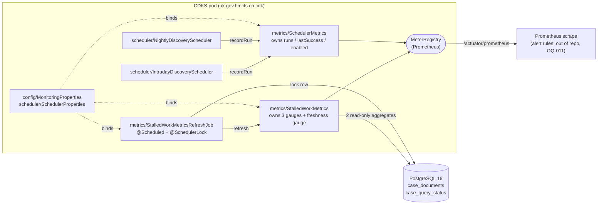
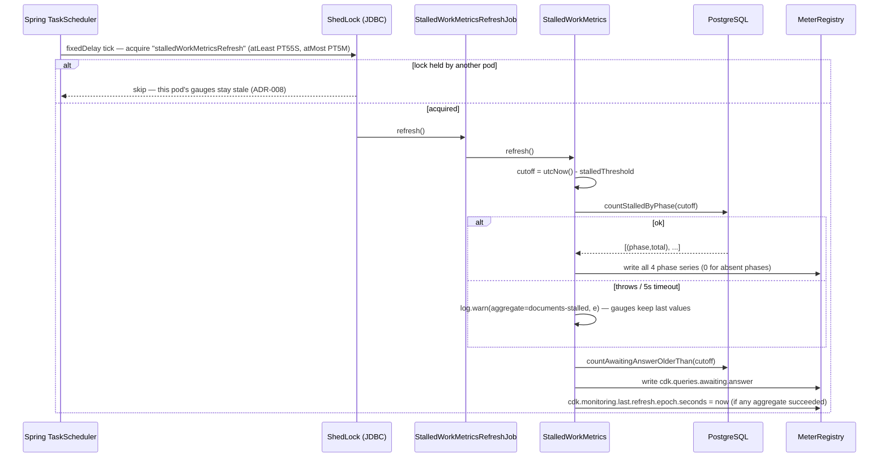

# Design: Stalled-Work Gauges and Scheduler Heartbeat Observability

> **Stage 2 — Architecture & Design** · Service: `cp-case-document-knowledge-service` (CDKS)
> **Jira: DD-43185** · Requirements: [`01-requirements.md`](./01-requirements.md) ·
> ADRs: [`adrs/DD-43185-stalled-work-scheduler-monitoring.md`](../adrs/DD-43185-stalled-work-scheduler-monitoring.md)
>
> Add the **first custom application metrics in CDKS**: two ShedLock-guarded
> stuck-work gauges over `case_documents` and `case_query_status` (Area A), and
> heartbeat / run-outcome / enabled-state meters around `IntradayDiscoveryScheduler` and
> `NightlyDiscoveryScheduler` (Area B). One new package (`uk.gov.hmcts.cp.cdk.metrics`), four new
> classes, one new properties class, two new repository methods, one append-only migration
> (`V1014`, two indexes). No API change, no new endpoint, no ACL change, no contract change, no new
> external integration.
>
> **Note — `document_verification_task` excluded.** A third stuck-work gauge over
> `document_verification_task` was considered and excluded: the table is dead — a Spring Batch-era
> leftover, superseded by the JobManager framework, with no writer at all, confirmed both by static
> analysis and by a live query against the running database. No metric is built for a dead table;
> table cleanup itself is a separate future ticket.
>
> **Eight Stage-1 open questions are resolved here; seven are recorded as ADRs. All are `Proposed`
> pending the Stage-2 human gate — nothing below is confirmed yet.**
>
> | OQ | Resolution | ADR |
> |---|---|---|
> | OQ-002 metric naming | Lowercase dotted Micrometer names; counter is `cdk.scheduler.runs` | ADR-001 |
> | OQ-003 threshold property | `Duration` on `cdk.monitoring.*`, `CP_CDK_MONITORING_*`, one shared threshold | ADR-002 |
> | OQ-004 index support | **Yes** — `V1014`, two indexes | ADR-003 |
> | OQ-005 phase set | **Recommend adding `UPLOADED`** — requirements-owner call | ADR-004 |
> | OQ-007 `cdk_scheduler_enabled` | Always-present `SchedulerMetrics` + bound `enabled` flag | ADR-006 |
> | OQ-008 `scheduler` tag | Fixed constants `intraday-discovery` / `nightly-discovery` | ADR-006 |
> | OQ-010 heartbeat semantics | In-memory, per-pod; counter is the liveness signal | ADR-007 |
> | OQ-013 refresh enablement | Own flag, default **on**, cadence `PT1M` | ADR-002 |
> | OQ-009 EXPLAIN evidence | Split into an in-repo deliverable + a manual DBA follow-up — §12 | — |
> | OQ-001, OQ-011, OQ-012 | Out of scope / follow-up — §13 | — |
>
> **Two items need an explicit accept-or-reject at the gate, not silent approval:**
> **ADR-004** (adding `UPLOADED` changes FR-001's scope) and **ADR-008** (one series beyond
> NFR-002's inventory). Both are argued from code evidence in the ADR file.

---

## Detailed Design

### 1. Shape of the change

Areas A and B share nothing but the `MeterRegistry` and the `CdkMeters` constants class. They are
delivered as independent stories and can ship in either order.



Everything inside the pod is new except the two scheduler classes, which gain a constructor
parameter and a `try`/`catch`/`finally`.

### 2. Metric inventory (OQ-002 → ADR-001)

> **Regression baseline:** [`baseline-actuator-prometheus.md`](./baseline-actuator-prometheus.md)
> captures the exact 76 metric families `/actuator/prometheus` returns today, before any DD-43185
> code exists. This ticket is purely additive (NFR-005) — every family in that baseline must still
> be present, unchanged, after implementation; the only expected difference is the 6 new families
> (14 series) in the table below being appended. Use it as the before/after diff target in code
> review and at Stage 7 (Build & Test), not just a description to take on faith.

All meters are registered with **lowercase dot-separated** names and rendered by
`PrometheusMeterRegistry`. Verified against the resolved classpath (Micrometer **1.16.5** +
Prometheus Java client 1.x) by decompiling
`io.micrometer.prometheusmetrics.PrometheusNamingConvention`,
`io.prometheus.metrics.model.snapshots.PrometheusNaming` and
`io.prometheus.metrics.expositionformats.PrometheusTextFormatWriter` — see ADR-001 for the full
finding. Two things matter and neither is what Stage 1 expected:

- **`_total` is appended by the exposition writer, not the naming convention.** Registering
  `cdk.scheduler.runs` yields `cdk_scheduler_runs_total`. (Registering `cdk.scheduler.runs.total`
  would *also* yield `cdk_scheduler_runs_total`, because `sanitizeMetricName` strips reserved
  suffixes — so the `_total_total` trap does not exist on this classpath. We still register
  `cdk.scheduler.runs`, because relying on a sanitizer's strip step is not a contract.)
- **There is no snake-casing any more.** `PrometheusNaming.prometheusName` only escapes invalid
  characters and preserves case. `cdk.documentsStalled` would render as `cdk_documentsStalled`,
  silently. Meter names must be written lowercase.

| # | Micrometer meter name | Prometheus name | Type | Tags | Series | Owner |
|---|---|---|---|---|---|---|
| 1 | `cdk.documents.stalled` | `cdk_documents_stalled` | Gauge | `phase` | 4 † | `StalledWorkMetrics` |
| 2 | `cdk.queries.awaiting.answer` | `cdk_queries_awaiting_answer` | Gauge | — | 1 | `StalledWorkMetrics` |
| 3 | `cdk.monitoring.last.refresh.epoch.seconds` | `cdk_monitoring_last_refresh_epoch_seconds` | Gauge | — | 1 ‡ | `StalledWorkMetrics` |
| 4 | `cdk.scheduler.runs` | `cdk_scheduler_runs_total` | Counter | `scheduler`, `outcome` | 4 | `SchedulerMetrics` |
| 5 | `cdk.scheduler.last.success.epoch.seconds` | `cdk_scheduler_last_success_epoch_seconds` | Gauge | `scheduler` | 2 | `SchedulerMetrics` |
| 6 | `cdk.scheduler.enabled` | `cdk_scheduler_enabled` | Gauge | `scheduler` | 2 | `SchedulerMetrics` |

† 3 if ADR-004 is rejected at the gate. ‡ Added by ADR-008.
**Total added series: 14** (see NFR-002). Every one of the global
`service` / `cluster` / `region` common tags from `application-server-management.yml` applies on
top, unchanged.

**Tag values** — fixed, closed sets, no user-supplied or unbounded value anywhere (NFR-001,
NFR-002):

| Tag key | Values | Source |
|---|---|---|
| `phase` | `WAITING_FOR_UPLOAD`, `UPLOADING`, `UPLOADED` †, `INGESTING` | `DocumentIngestionPhase` enum constants, verbatim |
| `scheduler` | `intraday-discovery`, `nightly-discovery` | `CdkMeters` constants (ADR-006) |
| `outcome` | `success`, `failure` | FR-008, literal |

**No `case_id`, `doc_id`, `defendant_id`, `material_id`, court centre/room id, court reference
number, `CJSCPPUID`, document name, blob URI or answer text appears in any metric name, tag key or
tag value** (NFR-001, AC-004, AC-025). The gauges publish counts only.

New class `uk.gov.hmcts.cp.cdk.metrics.CdkMeters` — `final`, private constructor throwing
`AssertionError` (the `util/TimeUtils` precedent) — holds every meter name, tag key and tag value
as a `public static final String`, with a Javadoc table mapping meter name to rendered Prometheus
name. Nothing in the codebase registers or asserts a metric via a string literal, so the
integration test in §14 checks the same constants production registers.

### 3. Configuration (OQ-003, OQ-013 → ADR-002)

New block appended to `src/main/resources/application-cdk.yml`, under the existing `cdk:` root
alongside `cdk.storage`, `cdk.ingestion`, `cdk.jobmanager` and `cdk.discovery-trigger`:

```yaml
  monitoring:
    enabled:           ${CP_CDK_MONITORING_ENABLED:true}
    # One threshold governs both the document and query stall gauges (ADR-002).
    stalled-threshold: ${CP_CDK_MONITORING_STALLED_THRESHOLD:PT30M}
    # FR-004 floor is 60s. Keep lock-at-least-for close to this value or more than one
    # pod will refresh per cadence (ADR-008); MonitoringConfig logs a WARN if it drifts.
    refresh-interval:  ${CP_CDK_MONITORING_REFRESH_INTERVAL:PT1M}
    initial-delay:     ${CP_CDK_MONITORING_INITIAL_DELAY:PT30S}
    lock-at-least-for: ${CP_CDK_MONITORING_LOCK_AT_LEAST_FOR:PT55S}
    # Explicitly overrides ShedLockConfig's global defaultLockAtMostFor = PT30S (FR-004).
    lock-at-most-for:  ${CP_CDK_MONITORING_LOCK_AT_MOST_FOR:PT5M}
```

New `uk.gov.hmcts.cp.cdk.config.MonitoringProperties`
(`@ConfigurationProperties(prefix = "cdk.monitoring")`), plain getters/setters in the style of
`DiscoveryTriggerProperties`:

```java
private boolean enabled = true;
@DurationUnit(ChronoUnit.MINUTES) private Duration stalledThreshold = Duration.ofMinutes(30);
@DurationUnit(ChronoUnit.SECONDS) private Duration refreshInterval  = Duration.ofSeconds(60);
@DurationUnit(ChronoUnit.SECONDS) private Duration initialDelay     = Duration.ofSeconds(30);
@DurationUnit(ChronoUnit.SECONDS) private Duration lockAtLeastFor   = Duration.ofSeconds(55);
@DurationUnit(ChronoUnit.SECONDS) private Duration lockAtMostFor    = Duration.ofMinutes(5);
```

`@DurationUnit` matters: without it Spring's `DurationStyle` parses a unit-less `30` as **30
milliseconds**, which for a property documented as "30 minutes" is a live foot-gun. ISO-8601 stays
the shipped form, matching every existing duration in this file.

New `uk.gov.hmcts.cp.cdk.config.MonitoringConfig` — `@Configuration` +
`@EnableConfigurationProperties(MonitoringProperties.class)`, a direct mirror of
`DiscoveryTriggerConfig`. Its `@PostConstruct` logs a single WARN (never throws, never fails
startup — NFR-004) if `refreshInterval < PT1M` or `lockAtLeastFor < 0.9 × refreshInterval`.

**Docker Compose (integration) additions**, mirroring the existing
`SCHEDULER_INTRADAY_DISCOVERY_CRON: "0/30 * * * * *"` pattern so integration tests do not wait a
minute per assertion:

```yaml
      CP_CDK_MONITORING_REFRESH_INTERVAL: PT10S
      CP_CDK_MONITORING_INITIAL_DELAY: PT5S
      CP_CDK_MONITORING_LOCK_AT_LEAST_FOR: PT0S
      CP_CDK_MONITORING_STALLED_THRESHOLD: PT1M
```

AC-010's "≥ 60 s" is therefore asserted against `application-cdk.yml`'s shipped default in a unit
test, **not** against the running compose container — exactly as the shipped 10-minutely intraday
cron is not what the compose stack runs.

> **Implementation note (N-3, 2026-09-01):** the shipped compose file deliberately departs from
> the sketch above in three ways, all recorded inline as YAML comments at the point of use: (1) it
> does **not** override `CP_CDK_MONITORING_STALLED_THRESHOLD` at all — the compose stack runs with
> the shipped `PT30M` default rather than a shortened `PT1M` — because a short threshold would let
> other suites' freshly-created `WAITING_FOR_UPLOAD` rows join the stalled-document count and flake
> the assertions (the exact risk OQ-015 raised); the live tests instead backdate their own seeded
> rows by 61 minutes, which works against either threshold value. (2) `lock-at-least-for` is `PT1S`,
> not `PT0S`, so `lock_until` is provably `>` `locked_at` for OQ-017's assertion rather than merely
> `>=`. (3) `lock-at-most-for` is set explicitly to `PT30S` rather than left at the shipped `PT5M`.
> All three are compose-only test-environment choices; the shipped `application-cdk.yml` defaults
> above are unchanged.

### 4. `SchedulerProperties` — bind the missing `enabled` flag (OQ-007 → ADR-006)

`scheduler.intraday-discovery.enabled` and `scheduler.nightly-discovery.enabled` are set in
`application-cdk.yml` and read by `@ConditionalOnProperty`, but **neither nested class binds them**.
Add one field to each of `SchedulerProperties.IntradayDiscovery` and
`SchedulerProperties.NightlyDiscovery` (Lombok `@Data` generates the accessors):

```java
/**
 * Mirrors @ConditionalOnProperty(..., havingValue = "true", matchIfMissing = true) on the
 * scheduler bean. The Java default is deliberately true so that "property absent" resolves the
 * same way here as it does in the conditional. application-cdk.yml always supplies a value
 * (defaulting to false via CP_CDK_SCHEDULER_*_ENABLED), so the effective default is unchanged.
 * If the conditional's matchIfMissing is ever changed, change this default with it.
 */
private boolean enabled = true;
```

Nothing else in `SchedulerProperties` changes; `ShedLockConfig`'s
`@EnableConfigurationProperties(SchedulerProperties.class)` already registers it.

### 5. Area B — scheduler instrumentation (FR-007, FR-008, FR-009)

Both `run()` methods take the same shape. `IntradayDiscoveryScheduler`:

```java
@Scheduled(cron = "${scheduler.intraday-discovery.cron:0 0/10 7-19 * * MON-FRI}")
@SchedulerLock(name = "${scheduler.intraday-discovery.name:intradayDiscoveryScheduler}",
        lockAtLeastFor = "${scheduler.intraday-discovery.lock-at-least-for:PT8M}",
        lockAtMostFor = "${scheduler.intraday-discovery.lock-at-most-for:PT9M}")
public void run() {
    log.info("Intraday discovery starting scheduler={}", INTRADAY_DISCOVERY);
    boolean success = false;
    try {
        discoveryService.runIntradayDiscovery();
        success = true;
        log.info("Intraday discovery finished scheduler={}", INTRADAY_DISCOVERY);
    } catch (final Exception e) {
        log.error("Intraday discovery failed scheduler={}", INTRADAY_DISCOVERY, e);
    } finally {
        schedulerMetrics.recordRun(INTRADAY_DISCOVERY, success);
    }
}
```

`NightlyDiscoveryScheduler` is identical with `NIGHTLY_DISCOVERY` and
`runNightlyDiscovery()`. **The cron expressions, ShedLock lock names, `lockAtLeastFor` and
`lockAtMostFor` values, and the two `@ConditionalOnProperty` annotations are untouched** (AC-024,
and the requirements' "no change to discovery behaviour").

Design points that are not incidental:

- **The counter increment lives in `finally`, driven by a `boolean success` flag**, not split
  across the `try` and `catch` blocks. That is what makes FR-008's "exactly one increment per
  invocation of `run()`" structurally true rather than true-by-inspection: there is no path through
  the method — including one where `recordRun` itself misbehaves — that increments twice or zero
  times. AC-014 and AC-017 both fall out of this.
- **The heartbeat gauge is set inside `recordRun`, on the success branch only** (FR-009: unchanged
  on failure). Taking the timestamp in `finally` rather than immediately after the delegate returns
  costs microseconds and buys single-path guarantees.
- **`catch (Exception)` — not `Throwable`.** An `Error` (`OutOfMemoryError`, `StackOverflowError`)
  must still propagate; swallowing one would hide a JVM-level fault behind a metric.
  `errorprone.AvoidCatchingThrowable` is enabled in `.github/pmd-ruleset.xml`;
  `design.AvoidCatchingGenericException` is not (the `design` category is not enabled), so
  `catch (Exception)` passes PMD. `bestpractices.PreserveStackTrace` is excluded, and the log call
  passes the exception object as the trailing argument, so the full stack trace is rendered by the
  Logstash encoder regardless.
- **`log.error(..., e)` with the exception as the final argument** satisfies FR-009 and AC-019: the
  scheduler tag is a fixed constant, the message carries no case content, no case id, no document
  id and no `CJSCPPUID`, and it is emitted as structured JSON through the existing
  `logback-spring.xml` (`LogstashEncoder` → `ASYNC_JSON` → stdout). No `System.out`, no new
  appender.
- **Recommended, small:** wrap the body in `MDC.put("scheduler", <tag>)` / `MDC.remove(...)` in the
  `finally`, matching `DiscoveryTriggerService.runWithLogging`'s `trigger` / `discoveryOperation`
  MDC pattern from DD-43063. Scheduler threads (`scheduler-*`, from `ShedLockConfig.taskScheduler`)
  carry no MDC today. Cheap and consistent; drop it if the gate considers it out of scope.
- **Deliberately not shared.** `DiscoveryTriggerService.runWithLogging(...)` already contains a
  near-identical try/catch for the manual trigger path. It is **not** refactored into a shared
  helper: it is a different code path with different logging keys, it is not instrumented by this
  ticket (ADR-007), and touching it would put a working DD-43062 path into this diff for no
  behavioural gain.

```mermaid
sequenceDiagram
    participant TS as Spring TaskScheduler
    participant SL as ShedLock (JDBC)
    participant SCH as IntradayDiscoveryScheduler
    participant DS as DiscoveryService
    participant SM as SchedulerMetrics
    participant MR as MeterRegistry

    TS->>SL: cron tick — acquire "intradayDiscoveryScheduler"
    alt lock not acquired (another pod)
        SL-->>TS: skip (run() never invoked, nothing recorded)
    else lock acquired
        SL->>SCH: run()
        SCH->>SCH: log.info "starting"
        SCH->>DS: runIntradayDiscovery()
        alt returns normally
            DS-->>SCH: ok
            SCH->>SCH: success = true; log.info "finished"
        else throws
            DS-->>SCH: Exception
            SCH->>SCH: log.error(msg, e) — not rethrown
        end
        SCH->>SM: recordRun("intraday-discovery", success)   %% finally
        SM->>MR: cdk.scheduler.runs{outcome=success|failure} +1
        opt success only
            SM->>MR: cdk.scheduler.last.success.epoch.seconds = now
        end
    end
```

### 6. `metrics/SchedulerMetrics` (FR-007, FR-008, FR-010)

`@Component`, **no `@ConditionalOnProperty`** — it must exist when the scheduler beans do not
(AC-020). Constructor takes `MeterRegistry` and `SchedulerProperties` only; it never depends on a
scheduler bean.

In the **constructor** it eagerly registers all eight series, so every one of them is present on
the very first scrape:

```java
for (var s : List.of(
        new Spec(INTRADAY_DISCOVERY, props.getIntradayDiscovery().isEnabled()),
        new Spec(NIGHTLY_DISCOVERY,  props.getNightlyDiscovery().isEnabled()))) {

    // cdk_scheduler_enabled — 1/0, fixed at startup because the bean set is fixed at startup
    Gauge.builder(CdkMeters.SCHEDULER_ENABLED, () -> s.enabled() ? 1d : 0d)
         .description("1 if this discovery scheduler is enabled in configuration, else 0")
         .tag(CdkMeters.TAG_SCHEDULER, s.tag())
         .strongReference(true)
         .register(registry);

    // cdk_scheduler_last_success_epoch_seconds — seeded to 0, never absent (ADR-007)
    final AtomicLong lastSuccess = new AtomicLong(0L);
    lastSuccessBySchedulerTag.put(s.tag(), lastSuccess);
    Gauge.builder(CdkMeters.SCHEDULER_LAST_SUCCESS, lastSuccess, AtomicLong::doubleValue)
         .description("Epoch seconds of the last run of this scheduler that completed without throwing")
         .tag(CdkMeters.TAG_SCHEDULER, s.tag())
         .strongReference(true)
         .register(registry);

    // cdk_scheduler_runs_total — all four series created at 0 so increase() has a series
    for (String outcome : List.of(CdkMeters.OUTCOME_SUCCESS, CdkMeters.OUTCOME_FAILURE)) {
        runCounters.put(key(s.tag(), outcome),
            Counter.builder(CdkMeters.SCHEDULER_RUNS)
                   .description("Discovery scheduler run outcomes")
                   .tag(CdkMeters.TAG_SCHEDULER, s.tag())
                   .tag(CdkMeters.TAG_OUTCOME, outcome)
                   .register(registry));
    }
}
```

- **Pre-registering the counters at `0` is load-bearing, not tidiness.** An un-incremented counter
  is absent from the scrape, and `increase(cdk_scheduler_runs_total[45m]) == 0` over an absent
  series returns *no data*, so the ADR-007 liveness alert would never fire — the precise failure it
  exists to catch. Same reasoning as AC-009.
- **`AtomicLong` holders are kept in a field map *and* registered with `.strongReference(true)`.**
  `Gauge.builder(name, obj, fn)` holds a **weak** reference to `obj`; a gauge whose holder is
  collected reports `NaN` for ever. Belt and braces on a metric nobody would notice breaking.
- `recordRun(String schedulerTag, boolean success)` increments
  `runCounters.get(key(tag, success ? "success" : "failure"))` and, on success only, sets the
  holder to `utcNow().toEpochSecond()` (via `TimeUtils.utcNow()`, so the clock is the one the rest
  of the service uses and is stubbable). Map lookups only — no registration on the hot path, so the
  method cannot realistically throw (NFR-004).

**Startup log and drift cross-check** — `@EventListener(ApplicationReadyEvent.class)`, once per
context (AC-022):

```java
log.info("Discovery scheduler configuration scheduler={} enabled={}", INTRADAY_DISCOVERY, intradayEnabled);
log.info("Discovery scheduler configuration scheduler={} enabled={}", NIGHTLY_DISCOVERY,  nightlyEnabled);
```

plus a WARN if `ObjectProvider<IntradayDiscoveryScheduler>.getIfAvailable() != null` disagrees with
`intradayEnabled` (and likewise for nightly). `ObjectProvider` is lazy, so it introduces no
bean-ordering dependency, and by `ApplicationReadyEvent` every `@ConditionalOnProperty` has been
evaluated. This is the guard against the single way ADR-006 can be wrong: the gauge reporting
configured *intent* while the pod's actual behaviour differs.

### 7. Area A — repository methods and SQL (FR-005, OQ-004, OQ-005)

Both aggregates are **native queries** with literal enum values. That is
the established
in-repo idiom (`CaseDocumentRepository.findSupersededDocuments` ×2 and
`CaseQueryStatusRepository.existsAnswerAvailableForLatestDoc` all use
`@Query(nativeQuery = true)` with literals such as `'INGESTED'`), it lets us write the `::text`
casts the projections need, and — critically for ADR-003 — it makes the executed statement exactly
the statement the EXPLAIN evidence is captured against.

**7.1 `CaseDocumentRepository` (new)**

```java
@Query(value = """
        SELECT cd.ingestion_phase::text AS phase, COUNT(*) AS total
          FROM case_documents cd
         WHERE cd.ingestion_phase IN ('WAITING_FOR_UPLOAD','UPLOADING','UPLOADED','INGESTING')
           AND cd.ingestion_phase_at < :cutoff
         GROUP BY cd.ingestion_phase
        """, nativeQuery = true)
@QueryHints(@QueryHint(name = "jakarta.persistence.query.timeout", value = "5000"))
List<PhaseCount> countStalledByPhase(@Param("cutoff") OffsetDateTime cutoff);
```

**7.2 `CaseQueryStatusRepository` (new)**

```java
@Query(value = """
        SELECT COUNT(*)
          FROM case_query_status cqs
         WHERE cqs.status = 'ANSWER_NOT_AVAILABLE'
           AND cqs.status_at < :cutoff
        """, nativeQuery = true)
@QueryHints(@QueryHint(name = "jakarta.persistence.query.timeout", value = "5000"))
long countAwaitingAnswerOlderThan(@Param("cutoff") OffsetDateTime cutoff);
```

The literal `'ANSWER_NOT_AVAILABLE'` is **required, not stylistic**: the `V1014` partial index
`idx_cqs_awaiting_answer_at` is only used if PostgreSQL can prove the query predicate implies the
index predicate, which is trivial for equality against a literal and unreliable for a bound enum
parameter (ADR-003). A test asserts the plan actually uses the index (§12).

**7.3 Projections** — one Spring Data interface projection in `repo/`:
`PhaseCount { String getPhase(); long getTotal(); }`. The column
alias matches the getter name.

**Why the `::text` cast.** `case_documents.ingestion_phase` is a PostgreSQL user-defined enum
(`document_ingestion_phase_enum`). pgJDBC returns a user-defined enum as a `PGobject`, which a
`String` projection getter cannot bind. `::text` yields the enum label as a plain `String`, so the
tag value is the enum constant verbatim (§2). `case_query_status` needs no cast — it returns a
scalar count.

**Cost and safety properties (FR-005, NFR-003):**

- Each query reads only the phase/status column and its timestamp. No `SELECT *`, no join, no
  document content, no `doc_name`, no `blob_uri`, no answer text, no `llm_input`, no blob payload
  (AC-006). Nothing in these two statements can carry case data into a metric.
- A **5-second JDBC statement timeout** per query (`jakarta.persistence.query.timeout`, in
  milliseconds, mapped by Hibernate to `Statement.setQueryTimeout`). Without it a pathological plan
  could pin a HikariCP connection for the pool's 300 s timeout; with it the query fails fast into
  the FR-006 degradation path. This is the "or times out" half of FR-006 made concrete.
- **No shared transaction across the two queries.** They deliberately run as two independent
  auto-commit statements rather than inside one `@Transactional(readOnly = true)`. A shared
  transaction would hold one connection for both (marginally cheaper) but would be marked
  rollback-only by the first failure, taking the other aggregate down with it — directly breaking
  FR-006's per-gauge degradation and AC-013. Two sub-second connection acquisitions per minute
  against a 20-connection pool is not a cost worth that.

**Phase-set note (ADR-004).** The `IN` list above includes `UPLOADED`. Design traced every write of
`CaseDocument.ingestionPhase` in `src/main/java`: `UPLOADING` is only a Java field initialiser and
a `V1001` column default (overwritten by `IdpcAvailabilityService` before insert), `INGESTING` is
written **nowhere** in production code, and `NOT_FOUND` is never persisted at all — it is only ever
set on a response DTO in `IngestionService`. `UPLOADED` — set by
`RetrieveMaterialAndUploadTask.saveDocumentUploaded(...)` and cleared only when
`CheckIngestionStatusForAllDefendantsTask` gets a terminal answer from RAG — is the one reachable
intermediate phase and the one that can strand a document for ever. Without it, FR-001's gauge is a
`WAITING_FOR_UPLOAD` counter with two permanently-zero companions. **If the gate rejects ADR-004,
delete `'UPLOADED'` from this one `IN` list and from the phase set the component seeds; nothing
else changes, and `V1014` is unaffected because its index is not partial.**

### 8. `metrics/StalledWorkMetrics` and `metrics/StalledWorkMetricsRefreshJob` (FR-001 – FR-006)

Two beans, deliberately split so that meter registration is unconditional while only the scheduled
refresh is gated by `cdk.monitoring.enabled` — mirroring how the repo already gates schedulers.

**`StalledWorkMetrics`** — `@Component`, always present, no `@ConditionalOnProperty`. Constructor
takes `MeterRegistry`, the two repositories (`CaseDocumentRepository`,
`CaseQueryStatusRepository`) and `MonitoringProperties`. It registers, eagerly:

- one `cdk.documents.stalled` gauge per monitored phase, `AtomicLong` holder seeded to `0`;
- one `cdk.queries.awaiting.answer` gauge, holder seeded to `0`;
- one `cdk.monitoring.last.refresh.epoch.seconds` gauge, seeded to `0` (ADR-008).

Its single public method `refresh()` runs the two aggregates **independently**:

```java
public void refresh() {
    MDC.put("job", "stalled-work-metrics-refresh");
    MDC.put("correlationId", UUID.randomUUID().toString());
    try {
        final OffsetDateTime cutoff = utcNow().minus(properties.getStalledThreshold());
        boolean anySucceeded = refreshDocumentsStalled(cutoff);
        anySucceeded |= refreshQueriesAwaitingAnswer(cutoff);
        if (anySucceeded) {
            lastRefreshEpochSeconds.set(utcNow().toEpochSecond());
        }
    } finally {
        MDC.remove("job");
        MDC.remove("correlationId");
    }
}
```

Each `refreshX(...)` is `try { query; apply; return true; } catch (Exception e) { log.warn(...); return false; }`.

Behavioural rules, all of which are design decisions rather than implementation detail:

1. **Query-then-apply, never pre-zero.** Gauge holders are written only *after* the aggregate
   returns. Zeroing everything first and then applying results would let a Prometheus scrape landing
   inside that window publish spurious zeros. (`/actuator/prometheus` reads gauge holders directly;
   there is no scrape-time query — NFR-003.)
2. **On success, write every series in the fixed set**, using `0` for keys absent from the result.
   A `GROUP BY` omits empty groups, so without this a phase that drops to zero would keep
   reporting its last non-zero value for ever (AC-009).
3. **On failure, write nothing for that aggregate.** Its gauges keep their last successfully
   computed values (FR-006, AC-013). One WARN per failed aggregate, naming the aggregate and
   carrying the exception object — no SQL, no row data, no identifiers (NFR-001). If both fail, two
   WARNs; AC-013's single-failure scenario yields exactly one.
4. **Nothing propagates.** `refresh()` cannot throw, so no exception reaches Spring's
   `TaskScheduler`, no discovery run is affected, `/actuator/health` is untouched, and a concurrent
   API request is unaffected — the refresh runs on the `scheduler-*` pool
   (`ShedLockConfig.taskScheduler`, poolSize 10), never on a request thread (NFR-003, NFR-004).
5. **The cutoff is recomputed from `properties.getStalledThreshold()` on every refresh**, never
   cached at construction, so a changed threshold takes effect on the next tick (AC-005).
6. `TimeUtils.utcNow()` is the only clock, consistent with the rest of the service and with the
   UTC-enforced JPA/JDBC configuration.

**`StalledWorkMetricsRefreshJob`** — a thin `@Component` carrying only the scheduling and locking
annotations, so `StalledWorkMetrics` stays directly unit-testable without proxies:

```java
@ConditionalOnProperty(name = "cdk.monitoring.enabled", havingValue = "true", matchIfMissing = true)
@Component
public class StalledWorkMetricsRefreshJob {

    public static final String LOCK_NAME = "stalledWorkMetricsRefresh";

    @Scheduled(fixedDelayString = "${cdk.monitoring.refresh-interval:PT1M}",
               initialDelayString = "${cdk.monitoring.initial-delay:PT30S}")
    @SchedulerLock(name = LOCK_NAME,
                   lockAtLeastFor = "${cdk.monitoring.lock-at-least-for:PT55S}",
                   lockAtMostFor  = "${cdk.monitoring.lock-at-most-for:PT5M}")
    public void refresh() {
        stalledWorkMetrics.refresh();
    }
}
```

- **`lockAtMostFor = PT5M` explicitly overrides `ShedLockConfig`'s global
  `@EnableSchedulerLock(defaultLockAtMostFor = "PT30S")`** — FR-004 requires this, because 30 s is
  shorter than the 60 s cadence and a lock expiring mid-cadence would let a second pod refresh.
  PT5M comfortably exceeds both the 60 s cadence and the worst-case run time (two aggregates with
  a 5 s timeout each ⇒ ≤ 10 s).
- **`lockAtLeastFor = PT55S`** holds the lock for essentially the whole cadence, which is what makes
  FR-004's "only one pod performs the refresh" true rather than merely likely.
- **The lock name is a literal constant, not a property placeholder** — deliberately unlike
  `scheduler.*.name` on the two existing schedulers. A runtime-overridable lock name means an
  environment can silently rename the row that AC-011's test and any operational query look for
  (ADR-006's environment-drift argument).
- `@Scheduled` + `@SchedulerLock` on the same method is exactly the existing pattern and works with
  `interceptMode = PROXY_METHOD`; `fixedDelayString` accepts ISO-8601 via `DurationStyle`.
- `initialDelay` keeps the first refresh clear of Flyway migration and context warm-up. The gauges
  read `0` until then, which is correct and visible via the freshness gauge.



### 9. Migration `V1014` (OQ-004 → ADR-003)

**File:** `src/main/resources/db/migration/V1014__add_stalled_work_monitoring_indexes.sql`.
`V1013` is consumed by DD-43083 (`add_rag_document_reference_to_case_documents`, present on disk),
so `V1014` is the next free version, as NFR-005 anticipated.

```sql
-- ----------------------------------------------------------------------------
-- DD-43185 — index support for the stalled-work monitoring aggregates.
-- Purely additive: two new indexes, no table, column, constraint, view, enum or
-- existing index is touched. See adrs/DD-43185-stalled-work-scheduler-monitoring.md (ADR-003).
-- ----------------------------------------------------------------------------

-- Supports: ingestion_phase IN (...) AND ingestion_phase_at < :cutoff, GROUP BY ingestion_phase.
-- Existing cover was idx_cd_phase (ingestion_phase) and idx_cd_case_phase (case_id, ingestion_phase);
-- neither includes ingestion_phase_at, so the age predicate was a heap recheck over every row in
-- the monitored phases -- a population that grows without bound because nothing ever cleans up a
-- document that stopped progressing.
-- Deliberately NOT a partial index: the monitored phase set is a requirements decision that may
-- change, and IN-list-implies-IN-list predicate proofs are not reliable. A plain composite serves
-- any subset of phases with literal or bound values.
CREATE INDEX IF NOT EXISTS idx_cd_phase_phase_at
    ON case_documents (ingestion_phase, ingestion_phase_at);
COMMENT ON INDEX idx_cd_phase_phase_at IS
'DD-43185: serves the stalled-document monitoring aggregate (ingestion_phase + age). Supersedes idx_cd_phase as a prefix; idx_cd_phase deliberately retained -- dropping a shipped index is out of scope for DD-43185.';

-- Supports: status = 'ANSWER_NOT_AVAILABLE' AND status_at < :cutoff.
-- Existing cover was idx_cqs_case_status (case_id, status) -- wrong leading column -- and
-- idx_cqs_status_at_desc (status_at DESC) -- no status, so the scan visited nearly the whole
-- history because ANSWER_NOT_AVAILABLE is the column default.
-- Partial is safe here: the predicate is a single equality against a literal, which PostgreSQL
-- proves trivially. The index therefore covers only the outstanding population and shrinks as
-- answers land. The application query MUST spell the status as a literal, not a bind parameter.
CREATE INDEX IF NOT EXISTS idx_cqs_awaiting_answer_at
    ON case_query_status (status_at)
    WHERE status = 'ANSWER_NOT_AVAILABLE';
COMMENT ON INDEX idx_cqs_awaiting_answer_at IS
'DD-43185: partial index serving the queries-awaiting-answer monitoring aggregate. Only used when the query filters status with the literal ''ANSWER_NOT_AVAILABLE''.';
```

- **No `CREATE INDEX CONCURRENTLY`.** Flyway wraps each migration in a transaction and
  `CONCURRENTLY` cannot run inside one; every index in `V1000`–`V1013` is created the plain way.
  **The cost is a `SHARE` lock blocking writes to each table while the index builds** — sub-second
  on a small table, an ingestion outage on a large one. This is the highest-risk line in the
  ticket, it cannot be sized from this repository, and it is the reason OQ-009's DBA follow-up is a
  blocker rather than a nicety. If the DBA reports either table as large, build the indexes
  `CONCURRENTLY` out-of-band ahead of the release and leave `V1014` as written — the
  `IF NOT EXISTS` clauses make it a no-op.
- Shipped `V1000`–`V1013` are not edited. Route through `migration-reviewer` per the CLAUDE.md
  hard rule.
- `spring.jpa.hibernate.ddl-auto: validate` is unaffected — Hibernate validates tables and columns,
  not indexes, and no entity's `@Table(indexes = ...)` metadata needs to change. (`CaseQueryStatus`
  declares `@Index` entries for the two `V1001` indexes; adding the new one there is optional
  documentation only and is **not** done, to keep the diff minimal.)

### 10. Files touched

| File | Change |
|---|---|
| `metrics/CdkMeters.java` *(new)* | Meter-name, tag-key and tag-value constants; Javadoc mapping meter name → Prometheus name. |
| `metrics/SchedulerMetrics.java` *(new)* | Registers `cdk.scheduler.{runs,last.success.epoch.seconds,enabled}`; `recordRun(tag, success)`; startup INFO + drift-WARN listener. |
| `metrics/StalledWorkMetrics.java` *(new)* | Registers the two stuck-work gauges + the freshness gauge; `refresh()` with per-aggregate degradation. |
| `metrics/StalledWorkMetricsRefreshJob.java` *(new)* | `@Scheduled` + `@SchedulerLock` wrapper, gated by `cdk.monitoring.enabled`. |
| `config/MonitoringProperties.java` *(new)* | `@ConfigurationProperties("cdk.monitoring")`, six fields. |
| `config/MonitoringConfig.java` *(new)* | `@EnableConfigurationProperties` + startup config-sanity WARN. |
| `repo/PhaseCount.java` *(new)* | Spring Data interface projection. |
| `db/migration/V1014__add_stalled_work_monitoring_indexes.sql` *(new)* | Two indexes. |
| `scheduler/SchedulerProperties.java` | `private boolean enabled = true;` on both nested classes. |
| `scheduler/IntradayDiscoveryScheduler.java` | `SchedulerMetrics` constructor param; try/catch/finally; ERROR log. |
| `scheduler/NightlyDiscoveryScheduler.java` | Same. |
| `repo/CaseDocumentRepository.java` | `countStalledByPhase(cutoff)`. |
| `repo/CaseQueryStatusRepository.java` | `countAwaitingAnswerOlderThan(cutoff)`. |
| `resources/application-cdk.yml` | New `cdk.monitoring.*` block. |
| `docker/docker-compose.integration.yml` | Four `CP_CDK_MONITORING_*` test overrides. |

**Not changed, and confirmed so:**

- `config/ShedLockConfig.java` — the global `defaultLockAtMostFor = "PT30S"` stays as-is; the new
  lock overrides it locally (FR-004). No new `LockProvider`, no `TaskScheduler` change.
- Cron expressions, ShedLock lock names, `lockAtLeastFor`/`lockAtMostFor`, `daysAhead`,
  `DiscoveryService`, `@ConditionalOnProperty` defaults (AC-024).
- `resources/application-server-management.yml` — `/actuator/prometheus` is already exposed and the
  `service`/`cluster`/`region` common tags are already configured. No exposure-list change.
- `resources/application-other.yml` — the `/actuator` auth exclusion is untouched (explicitly out of
  scope; see OQ-012 in §13).
- Every controller, mapper, OpenAPI model, `acl/cdks-rules.drl`, `PermissionConstants`, `version.cdk`
  and both consumed API artefacts. No endpoint, no contract, no ACL rule (`api-contract-check` and
  `rbac-auditor` have nothing to review here).
- `services/DiscoveryTriggerService.java` — the manual trigger path is deliberately not
  instrumented (ADR-007).
- `build.gradle` — `spring-boot-starter-actuator` and `micrometer-registry-prometheus` are already
  dependencies. **No new dependency of any kind.**
- Azure, Artemis, RAG, Hearing and Progression integrations. This change makes no outbound call,
  reads no blob, publishes no JMS message, and touches nothing on the Managed-Identity path.

### 11. Multi-pod and restart semantics (OQ-010 → ADR-007, ADR-008)

The two areas behave differently under ShedLock, and conflating them is the easiest way to write a
wrong alert.

| | Area B — scheduler meters | Area A — stalled-work gauges |
|---|---|---|
| What the value describes | **This pod's** run history — a genuinely per-pod fact | The **shared database** — identical from every pod's viewpoint |
| Effect of ShedLock | Correct by construction: only the pod that ran records a run | Only one pod's copy is fresh; the rest are stale or `0` |
| Restart | Counter resets (handled by `increase()`); gauge returns to `0` | Gauges return to `0` until this pod next wins the lock |
| Correct aggregation | `sum by (…)` on the counter; `max by (…)` on the gauge | **`max by (…)` only — never `sum`**, plus the freshness join |
| Detector for "it stopped" | `increase(cdk_scheduler_runs_total{outcome="success"}[…]) == 0` | `time() - max(cdk_monitoring_last_refresh_epoch_seconds) > 300` |

Recommended alert expressions — **documentation for the OQ-011 owning team only**. Prometheus rules
are not held in this repository and this ticket does not create any:

```promql
# Scheduler has not succeeded recently (and is supposed to be enabled).
sum by (service, cluster, scheduler) (increase(cdk_scheduler_runs_total{outcome="success"}[45m])) == 0
  and on (service, cluster, scheduler)
      max by (service, cluster, scheduler) (cdk_scheduler_enabled) == 1

# Scheduler is failing.
sum by (service, cluster, scheduler) (increase(cdk_scheduler_runs_total{outcome="failure"}[1h])) > 0

# Documents stalled -- max across pods, restricted to pods with a fresh reading.
max by (service, cluster, phase) (
  cdk_documents_stalled
    and on (instance) (time() - cdk_monitoring_last_refresh_epoch_seconds < 300)
) > <threshold>

# The monitoring refresh itself has stopped everywhere -> treat every stalled-work gauge as unknown.
time() - max by (service, cluster) (cdk_monitoring_last_refresh_epoch_seconds) > 300
```

Three obligations that must travel with the handover to OQ-011's owner, because getting any of them
wrong produces a silently useless alert:

1. **Never `sum` a stalled-work gauge across pods.** It adds one fresh reading to N−1 stale ones.
2. **Always join the freshness gauge.** A bare `max` latches onto a stale high reading and keeps
   alerting after the backlog has cleared.
3. **The intraday liveness rule needs a time-of-day guard.** The cron is
   `0 0/10 7-19 * * MON-FRI`, so "no successful run in 45 minutes" is normal every night and all
   weekend.

The `cdk_scheduler_enabled == 1` join in the first rule is what stops the liveness alert firing
against the deliberately-disabled schedulers both flags default to — and is the main reason FR-010's
gauge earns its place beyond a startup log line.

**Design note for the gate (ADR-008).** All of this alerting complexity is a direct consequence of
FR-004's ShedLock requirement, which is doing something the metric's nature does not need: these
gauges describe shared state, so every pod computing its own copy would be *more* correct, not less.
The cost of dropping the lock would be (N−1) × 3 indexed sub-second reads per minute — with three
pods, six extra cheap queries a minute against a 20-connection pool that already absorbs a
10-minutely discovery run. Design implements FR-004 as written, and recommends the gate consider
relaxing it: doing so would delete ADR-008, one metric series, and obligations 1 and 2 above.

### 12. EXPLAIN-plan evidence — what this repo can and cannot deliver (OQ-009)

**Stated plainly: production-scale EXPLAIN evidence cannot be produced from this repository.** The
compose integration stack (`docker/docker-compose.integration.yml`) runs a `postgres:16-alpine`
container seeded with a handful of synthetic rows per test. At those volumes the PostgreSQL planner
will correctly choose a sequential scan regardless of which indexes exist, so an EXPLAIN captured
there proves nothing about AC-012's 500 ms target and would fail a naive AC-006 "must show an index
scan" assertion for the right reason.

**Deliverable from the codebase (in scope, automatable, Story 3):** an *index-applicability* test,
not a performance test. `src/test/` already runs a real PostgreSQL 16 via Testcontainers
(`IngestionStatusViewRepositoryTest`), which is the right home. A new
`StalledWorkQueryPlanTest` should:

1. Start `PostgreSQLContainer("postgres:16-alpine")` with `@ServiceConnection`, migrated by
   **Flyway** so `V1014`'s indexes genuinely exist (unlike `IngestionStatusViewRepositoryTest`,
   which hand-creates its table and would not pick them up).
2. Seed a documented, synthetic volume — order 100 k rows into `case_documents` and
   `case_query_status` via `INSERT … SELECT … FROM generate_series(…)`, with a realistic phase and
   status mix, all values synthetic (`gen_random_uuid()`, no real identifiers — AC-025). Cheap
   enough for CI; large enough for the planner to prefer an index.
3. `ANALYZE` both tables.
4. Run `EXPLAIN (ANALYZE, BUFFERS, FORMAT JSON)` on each of the two exact statements from §7 and
   assert: the
   plan for the `case_documents` aggregate uses `idx_cd_phase_phase_at`; the plan for the
   `case_query_status` aggregate uses `idx_cqs_awaiting_answer_at` (**this is the test that catches a
   regression to a bound-parameter status, which would silently disable the partial index**); and no
   plan contains a `Seq Scan` on the target table.
5. Assert a **loose** upper bound on `Actual Total Time` (e.g. 500 ms) as a smoke check, explicitly
   documented as a CI-hardware smoke bound, **not** as evidence for AC-012.

**Deliverable at Stage 8 (`deploy-notes.md`):** the captured `EXPLAIN (ANALYZE, BUFFERS)` output
from step 4, together with the exact seeded row counts and the container's PostgreSQL version,
labelled unambiguously *"synthetic volume, not production scale — see the DBA follow-up"*.

**Manual follow-up, outside this repository (blocks AC-012, does not block merge):**

| Item | Owner |
|---|---|
| State expected production row counts for `case_documents`, `case_query_status` (today and 12-month projection). Without a number, "500 ms at production scale" is not a testable claim. | Requester + DBA |
| Run `EXPLAIN (ANALYZE, BUFFERS)` on the two statements from §7 in staging or a production-like restore, post-`V1014`, and attach to DD-43185. | DBA |
| Size the `CREATE INDEX` write-blocking window for both tables and decide plain vs out-of-band `CONCURRENTLY` (§9). | DBA |

**Recommendation to the gate:** re-scope AC-012 to the in-repo deliverable above and move the
production-scale number to a linked follow-up ticket. As written it cannot be closed by this
repository's test suite, and Stage 4 needs to know that before it writes a test spec against it.

### 13. Open questions: status after this design

| OQ | Status |
|---|---|
| OQ-001 (source of truth) | **Unresolved, and outside Design's control.** No Jira/Atlassian MCP tool is available in this session either, so this design is grounded solely in `01-requirements.md` and `00-input-brief.md`. The requester must confirm the pasted brief is complete and current, and post the Stage-1 and Stage-2 summaries to the epic manually. Carry forward to Stage 3. |
| OQ-002 (metric naming) | **Resolved — ADR-001.** Also corrects the OQ's premise: the `_total_total` trap does not exist on Micrometer 1.16.5; the live trap is the absence of snake-casing. Still needs platform/SRE confirmation that the `cdk_` prefix matches their scrape config. |
| OQ-003 (threshold property) | **Resolved — ADR-002.** `Duration` with `@DurationUnit`, `cdk.monitoring.*` / `CP_CDK_MONITORING_*`, one shared threshold, ISO-8601 defaults. |
| OQ-004 (index support) | **Resolved — ADR-003.** `V1014`, two indexes, DDL in §9. |
| OQ-005 (phase set) | **Design recommendation — ADR-004: add `UPLOADED`.** Requires requirements-owner accept/reject at the gate because it widens FR-001. `NOT_FOUND` confirmed non-persisted; `UPLOADING` and `INGESTING` confirmed never written by production code and retained as always-zero series. |
| OQ-007 (`cdk_scheduler_enabled`) | **Resolved — ADR-006.** Always-present `SchedulerMetrics` + `enabled` bound on `SchedulerProperties` + `ObjectProvider` drift cross-check. |
| OQ-008 (`scheduler` tag) | **Resolved — ADR-006.** Fixed constants `intraday-discovery` / `nightly-discovery`; explicitly not the runtime-configurable ShedLock name. |
| OQ-009 (EXPLAIN evidence) | **Split — §12.** In-repo: a Testcontainers plan-assertion test plus a `deploy-notes.md` artefact at documented synthetic volumes. Out-of-repo: production row counts, a production-like EXPLAIN, and index-build lock sizing — all DBA-owned. Recommend re-scoping AC-012. |
| OQ-010 (heartbeat semantics) | **Resolved — ADR-007.** In-memory, per-pod, seeded to `0`; the counter is the liveness signal; no persistence, no new table. Alerting obligations documented in §11. |
| OQ-011 (alerting ownership) | **Out of scope, confirmed — and a named handover, not a shrug.** No alert rule, recording rule, dashboard or routing is created by this ticket; none of it lives in this repository. §11 supplies the recommended expressions, the three aggregation obligations, and the threshold-calibration note from ADR-004 (`UPLOADED` has genuine normal-operation occupancy, so its threshold must exceed normal RAG ingestion latency). **A follow-up ticket owned by platform/SRE must exist before DD-43185 delivers any value** — without it this ships signals nobody is watching, which does not meet the story's stated intent. Raise it at the Stage-2 gate. |
| OQ-012 (metrics endpoint exposure) | **Out of scope to change; in scope to flag. Security-reviewer sign-off required before merge.** This design changes neither the actuator exposure list nor the `/actuator` exclusion in `application-other.yml`. Two facts for the reviewer: (a) the new series publish operational **volumes only** — counts of stalled documents and unanswered queries, with no identifier of any kind (§2, NFR-001), so not PII but arguably business-sensitive for an OFFICIAL-SENSITIVE service; (b) `MANAGEMENT_SERVER_PORT` defaults to `SERVER_PORT` (8082) in `application-server-management.yml`, so **`/actuator/prometheus` is served on the same port as the public API and is excluded from `cp-auth-rules-filter`** — its protection is entirely ingress/network policy, outside this repo. The reviewer should confirm `/actuator` is not externally reachable. If it is, that is a pre-existing finding this ticket surfaces rather than creates. |
| OQ-013 (refresh enablement) | **Resolved — ADR-002.** Own flag `cdk.monitoring.enabled`, default **`true`** (deliberately the opposite of the discovery schedulers, because the refresh is read-only and side-effect-free); cadence `PT1M`, on FR-004's floor. The default-on choice is the one part worth an explicit nod at the gate, since it changes behaviour in every environment including dev and CI. |

**Follow-ups recorded, not actioned by this ticket:**

- Alert rules, dashboards and on-call routing — platform/SRE, new ticket (OQ-011). **Blocks value
  delivery.**
- Production-scale EXPLAIN evidence and index-build lock sizing — DBA (OQ-009). **Blocks AC-012.**
- `DocumentIngestionPhase.UPLOADING` and `INGESTING` are declared, are legal database enum values,
  and are written by no production code. Either populate them (`RetrieveMaterialAndUploadTask` could
  set `UPLOADING` before the blob copy; `CheckIngestionStatusForAllDefendantsTask` could set
  `INGESTING` while polling) or remove them. A latent modelling defect that would make these gauges
  materially more informative — own ticket, changes ingestion behaviour, out of scope here.
- `idx_cd_phase (ingestion_phase)` becomes a strict prefix of `idx_cd_phase_phase_at` and is
  droppable. Own ticket, needs before/after evidence.
- `DocumentVerificationTaskRepository.countByStatus(...)` is now provably dead code. Trivially
  removable, but not in a purely additive ticket.
- Counting manual `/discovery-scheduler` triggers (`DiscoveryTriggerService`) — would be an additive
  `trigger="scheduled"|"manual"` tag on `cdk.scheduler.runs` (ADR-007).

---

## Testing

Scoping only — Stage 4 (Test Specs) owns the actual scenarios.

**Unit (`src/test/`)**

| Target | Covers |
|---|---|
| `IntradayDiscoverySchedulerTest`, `NightlyDiscoverySchedulerTest` *(extend)* | Existing construction sites must gain the `SchedulerMetrics` mock — a compile-level edit, not an assertion change. New cases: happy path → `recordRun(tag, true)` exactly once and no exception; `DiscoveryService` throws → `recordRun(tag, false)` exactly once, exception **not** rethrown, ERROR logged with the exception object (AC-014, AC-015, AC-017, AC-018). Note AC-024 names only the two *live* tests as unmodified. |
| `SchedulerMetricsTest` *(new)* | Against a `SimpleMeterRegistry`: all 8 series exist immediately after construction; `cdk.scheduler.enabled` is 1/0 per `SchedulerProperties` (AC-020, AC-021); `recordRun(tag, true)` increments only `outcome=success` and advances the heartbeat; `recordRun(tag, false)` increments only `outcome=failure` and leaves the heartbeat **unchanged** (AC-017); the two `scheduler` tag values are distinct (AC-016). |
| `StalledWorkMetricsTest` *(new)* | Mocked repositories (`CaseDocumentRepository`, `CaseQueryStatusRepository`). Cutoff is `utcNow() - stalledThreshold` and is recomputed each call (AC-005); all four phase series are written on success including `0` for absent groups (AC-009); one repository throwing leaves **its** gauges at their previous values while the other still updates, emits one WARN, and throws nothing (FR-006, AC-013); the freshness gauge advances only when at least one aggregate succeeded. |
| `MonitoringPropertiesTest` *(new)* | Defaults bind from `application-cdk.yml`; shipped `refresh-interval` ≥ 60 s (AC-010); `lock-at-most-for` > `refresh-interval` and > `ShedLockConfig`'s `PT30S` (AC-011); a unit-less integer threshold binds as minutes, not milliseconds. |
| `StalledWorkQueryPlanTest` *(new, Testcontainers)* | §12 — Flyway-migrated schema, ~100 k synthetic rows, `ANALYZE`, `EXPLAIN (ANALYZE, BUFFERS, FORMAT JSON)` on the two §7 statements; asserts the expected index is used and no `Seq Scan` on the target table (AC-006). Guards the literal-status coupling that `idx_cqs_awaiting_answer_at` depends on. |
| Repository correctness tests *(new, Testcontainers)* | Rows older than the cutoff are counted and newer ones are not (AC-001, AC-002, AC-007); terminal phases are excluded entirely (AC-003); the `::text` casts bind cleanly into the projections. |

**Integration (`src/integrationTest/`)**

| Target | Covers |
|---|---|
| `MonitoringMetricsHttpLiveTest` *(new)* | Scrape `/actuator/prometheus` and assert all **six** **rendered Prometheus** names from §2 are present, with the expected tag sets and one series per enum value — the test that actually proves ADR-001's name mapping (`cdk_scheduler_runs_total`, not `cdk_scheduler_runs`; `cdk_documents_stalled`, not `cdk_documentsStalled`). Use the `CdkMeters` constants for the meter side and string literals for the Prometheus side, so a divergence fails. |
| `MonitoringMetricsHttpLiveTest` *(same class)* | Seed synthetic `case_documents` / `case_query_status` rows with backdated timestamps via the existing raw-JDBC idiom (`IngestionProcessByCaseHttpLiveTest`, `IntradayDiscoverySchedulerLiveTest`), Awaitility past one 10 s refresh, assert the gauge values match. Clean up in `finally` — the compose DB is shared across the suite. |
| `MonitoringMetricsHttpLiveTest` *(same class)* | AC-011: a `shedlock` row named `stalledWorkMetricsRefresh` exists after the first refresh, with `lock_until > locked_at`. Reuse `IntradayDiscoverySchedulerLiveTest`'s `queryShedlockRow(...)` helper. |
| `ActuatorHttpLiveTest` | **Unmodified.** Must stay green (AC-024). |
| `IntradayDiscoverySchedulerLiveTest`, `NightlyDiscoverySchedulerLiveTest` | **Unmodified assertions.** Both schedulers are enabled in the compose stack, so `cdk_scheduler_runs_total{outcome="success"}` and the heartbeat gauge will also be observably non-zero — a natural place for an added assertion, but the existing ones must not change. |

**Contract tests:** none. No API, schema or contract change; `pactVerificationTest` is unaffected and
both consumed API artefact versions are untouched.

**Quality gates:** `gradle clean build` (including `integration`) green; PMD and JaCoCo at existing
unmodified thresholds; CodeQL and the secrets scanner clean (AC-023). Every fixture value synthetic —
no PII, no case content, no court reference number, no real `CJSCPPUID` (AC-025). Watch JaCoCo on
`CdkMeters` (a constants class with a private constructor is a known coverage sink; the `TimeUtils`
precedent shows how it is handled today).

---

## Deployment and operations

- **No Helm or Terraform change in this repo** — there is none here; deployment infra lives
  elsewhere. Six new `CP_CDK_MONITORING_*` environment variables are available but **all have
  working defaults**, so no environment configuration is required for the feature to work.
- **Migration ordering.** `V1014` must be applied before the refresh job first runs. Flyway runs at
  startup ahead of `@Scheduled` registration, and `initial-delay: PT30S` gives further headroom, so
  no manual sequencing is needed for a normal rollout. For a large-table deployment see §9's
  `CONCURRENTLY` note.
- **Rollback.** Reverting the application leaves two unused indexes behind — harmless, and they
  cost only write amplification. `CP_CDK_MONITORING_ENABLED=false` disables the refresh with a
  restart and no deployment; the gauges then freeze and `cdk_monitoring_last_refresh_epoch_seconds`
  correctly reports them as stale.
- **Rollout order.** dev → staging → live, with the DBA index-lock sizing (§12) completed before
  staging. The OQ-011 alert-rule ticket should be raised at the same time as this one is picked up,
  so the signals and the alerts land together.
- **Hard rules preserved.** No Azure call, no credential, no connection string, no SAS token, no
  account key anywhere in this change — the Managed-Identity path is untouched. JSON logging to
  stdout only, through the existing `logback-spring.xml`; no `System.out`; no document content,
  answer text or `CJSCPPUID` in any new log line. Flyway append-only: `V1014` is additive and no
  shipped migration is edited. No PII in metrics, tags, logs, fixtures or this document.
