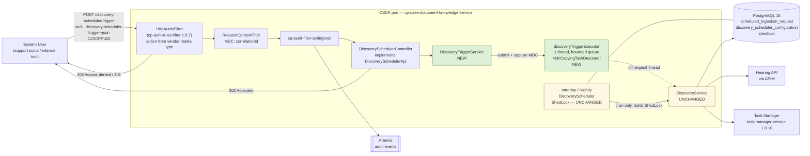
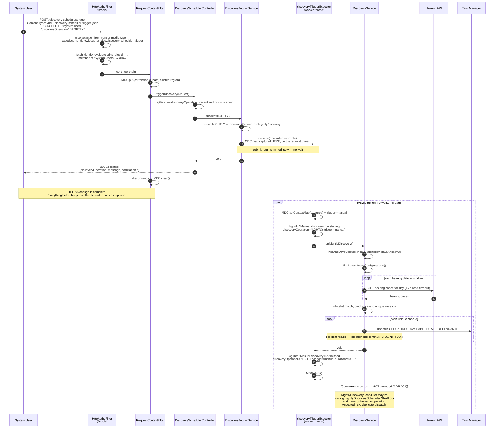

# Design: Manual Discovery Scheduler Trigger Endpoint

> **Stage 2 — Architecture & Design (low-level design)** · Service: `cp-case-document-knowledge-service` (CSDK)
> **Jira ticket: TBC** (OQ-011) · Requirements: [`01-requirements.md`](./01-requirements.md) · ADRs: [`adrs.md`](./adrs.md)
> **Status: DRAFT — awaiting human gate approval.** Do not proceed to Stage 3 (User Story) until approved.
> Planning artefact only. No production code has been written or edited by this stage.

---

## 1. Summary

Add one additive, System-User-only `POST /discovery-scheduler/trigger` operation to CSDK that takes a
single enum discriminator (`INTRADAY` / `NIGHTLY`), returns `202 Accepted` immediately, and dispatches
the corresponding existing `DiscoveryService` operation onto a dedicated bounded executor so the HTTP
thread never waits on an unbounded run.

The chosen pattern is **an additive REST endpoint on the existing Modern-by-Default Spring Boot
service** — no new service, no new bounded context, no new persistence, no new library. The only
genuinely new mechanism in the repo is an in-process asynchronous hand-off (CSDK today has **zero**
`@Async`, `ExecutorService`, `TaskExecutor` or `CompletableFuture` usages in `src/main/java` —
verified by grep), which is designed here as a single, centrally-configured, MDC-propagating
`ThreadPoolTaskExecutor` bean in `config/`.

Total repo-side surface: **1 new controller method, 2 new classes, 1 new config class, 1 new Drools
rule, 1 contract-version bump.** `DiscoveryService` is not touched.

---

## 2. Pattern & rationale

### 2.1 Which bucket

| Rubric signal | Verdict |
|---|---|
| New bounded context / CQRS context service | **No.** No new aggregate, no new state, no events. CSDK is not a `cpp-context-*` service and is not event-sourced. |
| New capability inside an existing legacy `cpp-context-*` | **No.** CSDK is Spring Boot / Modern by Default (`uk.gov.hmcts.cp.cdk`), so `context-scaffold` / `context-service-guide` do not apply (CLAUDE.md explicitly rules them out for this repo). |
| MbD event processor / integration service | **No.** No new Service Bus or Artemis topic. Artemis in CSDK is audit-publication only, via `cp-audit-filter-springboot`; there are no `@JmsListener`s in service code (B-13). |
| **New REST API over existing behaviour, lightweight, no event sourcing** | **Yes — this is the bucket.** An additive operation on the existing MbD service, delegating to an existing unchanged service bean. |
| Shared library / core-domain change | **No.** But see §2.2: the *contract* lives in a separate repo, which is the one genuinely cross-repo element. |
| UI-only | **No.** Backend-only (OQ-009 asks whether a UI will ever consume it). |

**Rationale.** Every behaviour the endpoint needs already exists and is already single-sourced in
`DiscoveryService` (B-04, B-05). The requirement is a *new entry point*, not new domain logic. FR-005
forbids duplicating or altering the discovery logic, so the correct shape is the thinnest possible
transport + dispatch layer in front of an untouched service bean. Anything heavier (a new service, a
new queue, a new run-record table) would add operational surface for zero functional gain and would
breach the "purely additive" framing of FR-010.

### 2.2 Cross-repo, contract-first (the critical constraint)

The OpenAPI spec is **not** in this repo. `api-cp-crime-caseadmin-case-document-knowledge` is consumed
as a compiled jar at `0.0.11` (B-11: `build.gradle:122`, `gradle.properties:2`). The jar ships both the
generated interfaces (`uk/gov/hmcts/cp/openapi/api/cdk/*.class`) and the source spec
(`openapi/case-admin-doc-knowledge-api.openapi.yml`).

**Nothing in this repo can be implemented until a new contract version containing the new operation is
released.** §6 specifies exactly what that external PR must contain. This is the long-lead item —
raise it first, in parallel with Stage 3.

---

## 3. Locked decisions inherited from the Stage 1 human gate

Design around these; they are not re-litigated here.

| # | Decision | Recorded in |
|---|---|---|
| 1 | **Concurrency:** the manual trigger does **not** acquire or check the `intradayDiscoveryScheduler` / `nightlyDiscoveryScheduler` ShedLock. It calls `DiscoveryService` directly, like any other caller of that bean. Duplicate dispatch when a manual trigger overlaps a live cron run is an **accepted, documented risk**, not mitigated in this change. | ADR-001 |
| 2 | **Response contract:** fire-and-forget, `202 Accepted`. The response returns once the request is validated and dispatch has been kicked off; it does not block on `runIntradayDiscovery()` / `runNightlyDiscovery()` completing. | ADR-002 |
| 3 | **Response granularity:** accept-and-log only. No new return type. `DiscoveryService.runIntradayDiscovery()` and `runNightlyDiscovery()` keep their existing `public void` signatures **unchanged** (FR-005 — zero blast radius on the cron path). | Folded into this design |
| 4 | **Endpoint path:** `POST /discovery-scheduler/trigger`, in the same namespace and controller package family as `POST /discovery-scheduler/configurations` (`uk.gov.hmcts.cp.cdk.controllers`). | Folded into this design |

Consequence of (1) that the design must carry forward: `NFR-004` / `AC-028`'s "no silent duplicate
dispatch" is **no longer guaranteed by design**. §13 R-1 and ADR-001 state the residual risk. The
mitigation that *is* in this design is per-pod serialisation of the manual path only (§8.5), which
bounds blast radius without touching the lock.

---

## 4. Additional verified evidence gathered at this stage

The requirements doc's `B-01..B-13` are reused as-is and not re-derived. The following are **new**
facts established while designing, each of which materially changes a design choice. All were read
from the working tree on branch `dev/dd-42958` or decompiled from the resolved dependency jars.

| # | Verified fact | Evidence | Design impact |
|---|---|---|---|
| **D-01** | The Drools **action name is derived mechanically from the request's vendor media type**, not from a URL map. `RequestActionResolver.resolve(...)` resolution order is: (1) vendor token in `Content-Type`, (2) first vendor token in `Accept`, (3) the `CPP-ACTION` header, (4) fallback `"<METHOD> <path>"`. The token is extracted with `(?i)\bapplication/vnd\.([a-z0-9][a-z0-9._-]*)(?:\+[^\s;,]+)?\b`. | `javap -c uk/gov/moj/cpp/authz/http/RequestActionResolver` from `cp-auth-rules-filter-1.0.7.jar`; confirmed by the existing convention where action `…discovery-scheduler-configuration` pairs exactly with media type `application/vnd.casedocumentknowledge-service.discovery-scheduler-configuration+json` (spec lines 534/557/572 of the bundled `openapi/case-admin-doc-knowledge-api.openapi.yml`) | **Refines B-02.** No change is required in `cp-auth-rules-filter` itself. The coordination point is the **vendor media type declared in the API contract**, which must equal the action name in the `.drl`. See §8.3. |
| **D-02** | Denial status codes are fixed in the filter: missing/blank `CJSCPPUID` → **401**; Drools evaluation returning no success → **403 `"Access denied"`**; missing action → **400**, but only when `action-required=true`, and CSDK sets `action-required: false`. `deny-when-no-rules: true` means an unmatched action name **fails closed**. | `javap -c uk/gov/moj/cpp/authz/http/HttpAuthzFilter` (`sipush 401`, `sipush 403` + `ldc "Access denied"`, `sipush 400`); `src/main/resources/application-other.yml:11,13` | Gives **OQ-006** a concrete, evidence-backed working assumption (401 / 403) for AC-015/AC-016, pending reviewer confirmation. Also means a wrong or absent vendor media type yields 403, not an unprotected endpoint. |
| **D-03** | The OpenAPI generator groups operations into one interface **per tag**, and generates each operation as a `default` method. `IngestionApi` carries three `default` methods for the three `Ingestion`-tagged operations; `DiscoverySchedulerApi` carries one. | `javap -p uk/gov/hmcts/cp/openapi/api/cdk/IngestionApi` and `…/DiscoverySchedulerApi` from the 0.0.11 jar | Decides §8.1: tagging the new operation `Discovery Scheduler` puts it on the **existing** `DiscoverySchedulerApi`, so no second interface and no second controller are needed. |
| **D-04** | `RequestContextFilter` populates MDC (`correlationId`, `cluster`, `region`, `path`) and calls **`MDC.clear()` in a `finally` block**. | `config/RequestContextFilter.java:35-38,40-41` | **Hard constraint on the async design.** With a 202 fire-and-forget response the filter chain unwinds — and clears MDC — before or while the worker runs. MDC must be **captured at submit time on the request thread** and re-installed on the worker. Naive off-thread dispatch loses `correlationId` and breaks NFR-007 / AC-025. See §8.6. |
| **D-05** | Virtual threads are **off by default**: `spring.threads.virtual.enabled: ${VIRTUAL_THREADS:false}`, and `VIRTUAL_THREADS` is set nowhere in the repo (no Helm/Terraform here). | `src/main/resources/application-other.yml:22`; repo-wide grep for `VIRTUAL_THREADS` returns that one line | **Corrects the premise behind B-08's note.** The `ShedLockConfig` comment ("Virtual threads (enabled in application.yml)") describes the *toggle*, which currently defaults to off. The async design must therefore behave identically with the toggle on **or** off — a design that only works under virtual threads is unsafe. See §8.5. |
| **D-06** | The integration-test compose stack runs **both** discovery crons every 30 seconds, with the hearing-for-cases flag on. | `docker/docker-compose.integration.yml:166,169,172,177,179` | Major **testability** constraint: a cron run fires every 30 s in ITs, so a manual-trigger IT cannot assert dispatch counts without confounding. Assertions must key off the `trigger=manual` / `correlationId` discriminators, or the schedulers must be switched off for the new IT. See §12 and §13 R-3. |
| **D-07** | `JobManagerConfig` declares a `@Primary ObjectMapper` built with a bare `new ObjectMapper()`, which back-off-replaces Boot's auto-configured mapper for the MVC message converters. Jackson's own default for `FAIL_ON_UNKNOWN_PROPERTIES` is `true`, whereas Spring Boot's auto-configured default is `false`. | `config/JobManagerConfig.java:48-55` | Behaviour for **unknown** JSON fields on the new request body is not obvious from the requirements. Do not assume; §12 flags it as a Stage 4 scenario to pin down empirically rather than by inspection. |
| **D-08** | `logstash-logback-encoder` is an `implementation` (not `runtimeOnly`) dependency, so `net.logstash.logback.argument.StructuredArguments` is importable from `src/main/java`. `logback-spring.xml` uses `LogstashEncoder`, which serialises MDC entries as top-level JSON fields. | `build.gradle:163`; `src/main/resources/logback-spring.xml` | Both MDC-based and `kv(...)`-based structured fields are available. §8.7 recommends MDC, matching the established `RequestContextFilter` pattern. |

---

## 5. Bounded context & data ownership

- **Owning context:** CSDK. Unambiguous — the state read and the work dispatched are already CSDK's
  (`scheduled_ingestion_request`, `discovery_scheduler_configuration`, and the Task Manager jobs
  CSDK owns). No other context's data is read or written.
- **Cross-context touch points:** none new. The triggered run reuses exactly the existing outbound
  calls — Hearing API (`hearing-query-api`), Progression API, Task Manager, RAG, Azure Blob — all
  unchanged, all still via `RestClientFactoryConfig` → `CorrelationIdInterceptor` →
  `ApimAuthHeaderService` (NFR-003).
- **New state:** **none.** No new table, no new Flyway migration, no new entity, no new repository.
  `migration-reviewer` is therefore **not** required for this change (it becomes required only if
  OQ-010 resolves to "persist a run record", which would be `V1012`).
- **Aggregates / invariants:** no aggregate is created or mutated by the endpoint itself. The
  invariants of the triggered run are entirely those already enforced inside `DiscoveryService`,
  which is unchanged.
- **Events:** none produced or consumed. The only asynchronous fan-out is Task Manager job dispatch,
  which the existing `DiscoveryService` already performs.

---

## 6. Contract change (external repo — do this first)

**Repo:** `api-cp-crime-caseadmin-case-document-knowledge` · **Spec file:**
`openapi/case-admin-doc-knowledge-api.openapi.yml` · **Current version:** `0.0.11` → **release a new
version** (e.g. `0.0.12`), then bump `version.cdk` in `gradle.properties:2`.

This repo cannot compile a controller against an operation that does not exist in the jar (B-11,
FR-009, AC-021).

### 6.1 Required operation

Add under the **existing** `Discovery Scheduler` tag (per D-03, this keeps everything on
`DiscoverySchedulerApi`):

```yaml
  /discovery-scheduler/trigger:
    post:
      tags: [Discovery Scheduler]
      summary: Trigger a discovery operation on demand
      description: |
        Triggers one of the two existing Discovery Scheduler operations immediately, without
        waiting for its cron schedule. Restricted to System Users.

        This operation is **fire-and-forget**. It returns `202 Accepted` as soon as the request has
        been validated and the run has been dispatched; it does **not** wait for the run to
        complete, and the response reports **no** per-item dispatch outcome. Progress and outcome
        are observable only in the service's structured logs, correlated by `correlationId`.

        The triggered run does **not** coordinate with the corresponding cron run's distributed
        lock. Triggering while a scheduled run of the same operation is in flight may dispatch the
        same ingestion work twice. Downstream ingestion is idempotent per case/document at the
        Task Manager and RAG layers to the extent it is today; no additional de-duplication is
        performed by this operation.
      operationId: triggerDiscovery
      requestBody:
        required: true
        content:
          application/vnd.casedocumentknowledge-service.discovery-scheduler-trigger+json:
            schema: {$ref: '#/components/schemas/DiscoveryTriggerRequest'}
            examples:
              intraday:
                summary: Trigger the intraday discovery operation
                value: {discoveryOperation: "INTRADAY"}
              nightly:
                summary: Trigger the nightly discovery operation
                value: {discoveryOperation: "NIGHTLY"}
      responses:
        '202':
          description: Trigger accepted; the discovery run has been dispatched asynchronously.
          content:
            application/vnd.casedocumentknowledge-service.discovery-scheduler-trigger+json:
              schema: {$ref: '#/components/schemas/DiscoveryTriggerResponse'}
        '400':
          description: Invalid request (missing, empty, or unrecognised discoveryOperation; malformed body).
          content:
            application/vnd.casedocumentknowledge-service.discovery-scheduler-trigger+json:
              schema: {$ref: '#/components/schemas/ErrorResponse'}
```

### 6.2 Required schemas

```yaml
    DiscoveryOperation:
      type: string
      description: Names which existing Discovery Scheduler operation to run.
      enum: [INTRADAY, NIGHTLY]

    DiscoveryTriggerRequest:
      type: object
      required: [discoveryOperation]
      properties:
        discoveryOperation:
          $ref: '#/components/schemas/DiscoveryOperation'

    DiscoveryTriggerResponse:
      type: object
      required: [discoveryOperation, message]
      properties:
        discoveryOperation:
          $ref: '#/components/schemas/DiscoveryOperation'
        message:
          type: string
          description: Human-readable confirmation that the run was dispatched.
          example: "Discovery run dispatched."
        correlationId:
          type: string
          description: >
            Correlation id under which the dispatched run logs its start and completion. Returned so
            an operator can locate the run in the logs, since the response carries no outcome.
```

### 6.3 Design notes for the contract PR

1. **The vendor media type is load-bearing, not cosmetic.** Per D-01 the Drools action name is
   extracted from it. `application/vnd.casedocumentknowledge-service.discovery-scheduler-trigger+json`
   → action `casedocumentknowledge-service.discovery-scheduler-trigger`. If the media type changes,
   the `.drl` rule in this repo must change in lockstep or the endpoint 403s (fail-closed, D-02).
2. **A single enum discriminator, not two operations and not a boolean.** One path with an enum keeps
   one ACL rule (matching FR-006 and the brief), and one contract operation. Two paths
   (`/trigger/intraday`, `/trigger/nightly`) would either need two vendor media types and two `.drl`
   rules, or share one — and the "share one" case is exactly what OQ-012 is still asking about.
   Keeping the enum keeps that option open without pre-committing.
3. **`required: [discoveryOperation]` is what produces the 400.** It generates `@NotNull` on the
   model, which is what makes the missing-field case a `MethodArgumentNotValidException` → 400 via
   the existing handler with zero new code in this repo (§8.8). Omitting `required` silently converts
   AC-017 from a 400 into a `NullPointerException` → 500.
4. **Field naming.** `discoveryOperation` mirrors the service-layer vocabulary (`runIntradayDiscovery`
   / `runNightlyDiscovery`, "intraday discovery" / "nightly discovery"). `operation` alone is too
   generic in a spec that also has ingestion operations; `scheduler` would be actively misleading,
   since what runs is the `DiscoveryService` operation, **not** the cron scheduler component (which
   is bypassed entirely — ADR-001). Final call sits with the contract repo owner.
5. **Do not add a `409` or `429` response** unless OQ-002's accepted-risk position or OQ-004a changes.
   Adding them now would imply behaviour this design deliberately does not implement.
6. **`202` body content type.** Mirror the existing convention: `/ingestions/start` returns 202 with
   the vendor type `application/vnd.casedocumentknowledge-service.ingestion-process+json`
   (`controllers/IngestionController.java:34-35,62`). The controller must set the content type
   explicitly the same way.

---

## 7. Components

### 7.1 New files (this repo)

| File | Type | ~Size | Purpose |
|---|---|---|---|
| `src/main/java/uk/gov/hmcts/cp/cdk/services/DiscoveryTriggerService.java` | `@Service` | ~40 lines | Maps the enum to the correct `DiscoveryService` method and submits it to the executor. Owns the start/finish/failure logging of the dispatched run. |
| `src/main/java/uk/gov/hmcts/cp/cdk/config/DiscoveryTriggerConfig.java` | `@Configuration` | ~35 lines | Declares the `discoveryTriggerExecutor` bean and binds `DiscoveryTriggerProperties`. |
| `src/main/java/uk/gov/hmcts/cp/cdk/config/MdcCopyingTaskDecorator.java` | `TaskDecorator` | ~25 lines | Captures the submitting thread's MDC map and installs it on the worker thread. Required by D-04. |
| `src/main/java/uk/gov/hmcts/cp/cdk/config/DiscoveryTriggerProperties.java` | `@ConfigurationProperties` | ~15 lines | `cp.cdk.discovery-trigger.*` (enabled, queue-capacity, await-termination-seconds). Optional — see §8.9. |

### 7.2 Changed files (this repo)

| File | Change |
|---|---|
| `src/main/java/uk/gov/hmcts/cp/cdk/controllers/DiscoverySchedulerController.java` | Add one `@Override` method, `triggerDiscovery(...)`; inject `DiscoveryTriggerService`. |
| `src/main/resources/acl/cdks-rules.drl` | Append one rule (file is currently 88 lines; the new rule starts at line 89). |
| `gradle.properties` | `version.cdk=0.0.11` → the new released contract version. |
| `src/main/resources/application-cdk.yml` | Add the `cp.cdk.discovery-trigger.*` block (§8.9). |
| `docker/docker-compose.integration.yml` | Set the trigger's enable flag for the app service, and see §12 on scheduler crons for the new IT. |

### 7.3 Explicitly **not** changed

`services/DiscoveryService.java` · `scheduler/IntradayDiscoveryScheduler.java` ·
`scheduler/NightlyDiscoveryScheduler.java` · `config/ShedLockConfig.java` ·
`controllers/GlobalExceptionHandler.java` · `db/migration/**` · any existing `.drl` rule ·
any existing endpoint or its contract.

This list is the concrete expression of FR-005, FR-010, AC-011, AC-012 and AC-023. A reviewer should
be able to check it by reading the diff's file list alone.

---

## 8. Detailed design

### 8.1 Controller

**Recommendation: add one method to the existing `DiscoverySchedulerController`. Do not create a
second controller.**

Because the generator groups by tag and emits `default` methods (D-03), tagging the new operation
`Discovery Scheduler` adds a second `default` method to the **existing** `DiscoverySchedulerApi`
interface. `DiscoverySchedulerController` already `implements DiscoverySchedulerApi`
(`DiscoverySchedulerController.java:18`), so the change is a single `@Override`.

Shape, following the established pattern exactly (`@Slf4j @RestController @RequiredArgsConstructor`,
constructor-injected collaborators, **no** Spring mapping annotation of its own — the path comes only
from the interface, per AC-022):

- Signature: `ResponseEntity<DiscoveryTriggerResponse> triggerDiscovery(@RequestBody @Valid DiscoveryTriggerRequest request)`
- Body: one `log.debug(...)`; one call to `discoveryTriggerService.trigger(request.getDiscoveryOperation())`;
  `return ResponseEntity.status(HttpStatus.ACCEPTED).contentType(VND_DISCOVERY_SCHEDULER_TRIGGER).body(response)`.
- A `public static final MediaType VND_DISCOVERY_SCHEDULER_TRIGGER` constant, mirroring
  `IngestionController.java:34-38`.
- Target ≤ 12 lines, comfortably inside the ≤20-line guidance in `coding-standards.md`.

**Trade-off.** The controller now serves two concerns (configuration upsert and trigger). That is
acceptable and preferable here:

- Both are **discovery-scheduler administration** operations on the same resource namespace, addressed
  to the same actor (System Users) under the same access model. They are cohesive.
- The alternative — a separate `Discovery Scheduler Trigger` tag producing a
  `DiscoverySchedulerTriggerApi` and a new `DiscoverySchedulerTriggerController` — splits one
  namespace across two controllers and adds a second generated interface to keep in step, for no
  behavioural gain.
- The cost is bounded: two short delegating methods and two injected services. No PMD class-size or
  coupling threshold is at risk.

**This choice is not load-bearing.** If the contract owner prefers a distinct tag, the only repo-side
consequence is a ~15-line new controller class; nothing else in this design changes. Record the tag
decision in the contract PR so the repo side is not guessing.

### 8.2 Request / response DTOs

Both generated from the contract (§6.2) into `uk.gov.hmcts.cp.openapi.model.cdk`. **No hand-rolled
DTO, no hand-rolled enum, no custom deserialiser, no custom parsing code in this repo** — AC-005 and
B-10 both require the enum to originate in the contract.

The generated enum type flows from the controller into `services/`. That is already the established
pattern: `DiscoverySchedulerController.java:29` passes the generated
`DiscoverySchedulerConfigurationRequest` straight into `DiscoverySchedulerConfigurationService.upsert(...)`.
No mapper is warranted for a single enum — introducing a MapStruct mapper here would be ceremony.

### 8.3 Access control

**Action name: `casedocumentknowledge-service.discovery-scheduler-trigger`.**

**Reasoning for the name — it is derived, not chosen freely.** Per D-01, `cp-auth-rules-filter`
extracts the action name from the vendor token of the request's `Content-Type` (then `Accept`, then
`CPP-ACTION`). Given the contract's media type
`application/vnd.casedocumentknowledge-service.discovery-scheduler-trigger+json`, the regex yields
exactly `casedocumentknowledge-service.discovery-scheduler-trigger`. So the "name" decision is really
the media-type decision in §6, and the two must always agree. Within that constraint, the suffix
`discovery-scheduler-trigger` was chosen because it follows the `<resource>-<qualifier>` shape already
used by `discovery-scheduler-configuration`, `ingestion-process` and `ingestion-process-by-case`,
keeps the `/discovery-scheduler/...` namespace grouping legible in the `.drl`, and reads as an action
on the scheduler resource rather than on a scheduler component.

**Rule to append to `src/main/resources/acl/cdks-rules.drl`** (currently 88 lines; append at 89),
structurally identical to the `discovery-scheduler-configuration` rule at `cdks-rules.drl:81-88` —
exactly one `eval(...isMemberOfAnyOfTheSuppliedGroups(...))` condition, **no** `hasPermission(...)`,
**no** `or` (AC-014):

```drl

rule "Allow LA – discovery-scheduler-trigger"
when
  $o: Outcome()
  $a: Action(name == "casedocumentknowledge-service.discovery-scheduler-trigger")
  eval(userAndGroupProvider.isMemberOfAnyOfTheSuppliedGroups($a, "System Users"))
then
  $o.setSuccess(true);
end
```

Notes for the reviewer:

- The `"Allow LA – …"` rule-name prefix is a misnomer for a System-Users-only rule, but it is the
  prefix used by every rule in the file including the one being copied. Consistency with the file
  wins; renaming the family is a separate tidy-up, not this change.
- The en-dash `–` in the rule name is part of the existing convention. Match it.
- `PermissionConstants` is **not** referenced by this rule. Do not import or touch
  `controllers/accesscontrol/PermissionConstants.java`.
- **Fail-closed properties, from D-02:** `deny-when-no-rules: true` means that if the caller sends the
  wrong (or no) vendor media type, the resolved action falls back to `"POST /discovery-scheduler/trigger"`,
  matches no rule, and is denied with 403. There is no window in which the endpoint is reachable but
  unprotected.

**Cross-cutting dependency — flag it, do not assume it away.** B-02 states that action-name-to-URL
wiring lives in the external `cp-auth-rules-filter`. D-01 **refines** this: for CSDK's configuration
(`action-required: false`, vendor-media-type-driven), the observable resolution is entirely
media-type-driven and **no change to `cp-auth-rules-filter` appears to be required**. That conclusion
comes from decompiled bytecode of a third-party library, so:

- Route the ACL change through the **`rbac-auditor`** agent, as CLAUDE.md's auxiliary-agent table
  requires for any change to `resources/acl/`.
- Have the `cp-auth-rules-filter` owner confirm D-01 and D-02 before Stage 5 sign-off, and confirm
  whether any environment-side action registry (APIM policy, gateway allow-list) also needs the new
  action name. That confirmation is tracked as OQ-006 / OQ-008.
- Add the reverse check to the review: an IT asserting a **403 for a non-System-User** is the only
  real proof the rule is wired to the right action name.

### 8.4 Service layer

**Recommendation: a new `DiscoveryTriggerService` in `uk.gov.hmcts.cp.cdk.services`. Do not add a
method to `DiscoveryService`.**

```
DiscoveryTriggerService
  ├── DiscoveryService discoveryService          (existing bean, untouched)
  └── TaskExecutor discoveryTriggerExecutor      (new bean, §8.5)

  public void trigger(DiscoveryOperation operation)
      → resolve Runnable:  INTRADAY -> discoveryService::runIntradayDiscovery
                           NIGHTLY  -> discoveryService::runNightlyDiscovery
      → wrap in the logging/timing decorator (§8.7)
      → discoveryTriggerExecutor.execute(wrapped)
      → return immediately
```

Implementation notes:

- Use a **switch expression over the generated enum** (`switch (operation) { case INTRADAY -> …; case NIGHTLY -> …; }`)
  with no `default` branch. On Java 25 an exhaustive switch over an enum needs no default, and adding
  a third enum value in the contract then becomes a **compile error here** rather than a silent
  no-op — a cheap, valuable guard given the enum is owned by another repo.
- The method is `void`, consistent with locked decision 3.

**Trade-off vs. adding `trigger(...)` to `DiscoveryService`:**

| | New `DiscoveryTriggerService` (recommended) | New method on `DiscoveryService` |
|---|---|---|
| FR-005 blast radius on the cron path | **Zero.** `DiscoveryService` bytecode-identical apart from nothing. | Non-zero. A `TaskExecutor` constructor parameter is added to a bean whose constructor already takes **9** dependencies (`DiscoveryService.java:49-67`), so **every** existing `DiscoveryServiceTest` construction site must change — directly against AC-012's "pass without modification". |
| Separation of concerns | Transport/async concerns stay out of the domain service. | `DiscoveryService` acquires knowledge of threading and of a contract-generated enum. |
| Testability | Inject a synchronous `TaskExecutor` (`Runnable::run`) and assert delegation deterministically. | Async behaviour tangled into the existing service's tests. |
| Class count | +1 (~40 lines). | +0. |

The only cost of the recommendation is one extra small class. It buys a literally-zero-diff
`DiscoveryService`, which is what FR-005 and AC-011/AC-012 are actually asking for.

**Naming:** `DiscoveryTriggerService` over `DiscoveryTriggerOrchestrator` / `ManualDiscoveryService` —
`services/` already uses the plain `…Service` suffix throughout (`DiscoveryService`,
`DiscoverySchedulerConfigurationService`, `IngestionService`, `JobManagerService`), and "manual" is a
property of the caller, not of the class.

### 8.5 Fire-and-forget dispatch mechanics

**Recommendation: a dedicated, bounded `ThreadPoolTaskExecutor` bean, injected as a `TaskExecutor` and
invoked explicitly (`executor.execute(runnable)`). Do not use `@Async`. Do not use a
virtual-thread-per-task executor.**

Bean, in **`config/DiscoveryTriggerConfig.java`** — a new class in `config/`, following the existing
convention that infrastructure beans live there (`ShedLockConfig` owns the `TaskScheduler` and
`LockProvider`; `JobManagerConfig` owns the `ObjectMapper` and blob client). Do **not** add it to
`ShedLockConfig`: that class is scoped to distributed locking and cron scheduling, and ADR-001 is
explicit that the manual path has nothing to do with the lock. Co-locating them would invite exactly
the confusion ADR-001 is trying to avoid.

```
@Bean("discoveryTriggerExecutor")
ThreadPoolTaskExecutor discoveryTriggerExecutor(MdcCopyingTaskDecorator decorator)
    corePoolSize                     = 1
    maxPoolSize                      = 1
    queueCapacity                    = ${cp.cdk.discovery-trigger.queue-capacity:10}
    threadNamePrefix                 = "discovery-trigger-"
    taskDecorator                    = decorator
    waitForTasksToCompleteOnShutdown = true
    awaitTerminationSeconds          = ${cp.cdk.discovery-trigger.await-termination-seconds:30}
```

**Why a dedicated executor and not virtual threads:**

1. **Virtual threads are off by default and set nowhere in this repo (D-05).** `VIRTUAL_THREADS`
   defaults to `false`. A design whose concurrency characteristics flip with an env var nobody in this
   repo controls is not a design. An explicit bean behaves identically either way.
2. **Boundedness is the only back-pressure available.** A single worker thread serialises manual runs
   **per pod**, so the manual path can add at most one concurrent nightly discovery per pod — three
   Hearing API calls at a 15 s read timeout plus N Task Manager dispatches (B-05). An unbounded
   virtual-thread executor would let a support script fire fifty concurrent nightly runs and flood the
   Task Manager. OQ-004a (rate limiting) is **unresolved**, so the design should not choose the
   unbounded option while that is open.
3. **It is deliberately not a distributed guarantee.** Serialisation is per-JVM only; with multiple
   pods (B-08) concurrent manual runs remain possible. That is consistent with ADR-001's accepted
   risk — this bounds blast radius without acquiring or checking the ShedLock, and adds no lock
   semantics of any kind.
4. **Isolation.** Manual triggers cannot starve the cron path: the crons run on `ShedLockConfig`'s
   separate `ThreadPoolTaskScheduler` (`scheduler-` prefix, pool size 10, non-daemon). Distinct thread
   name prefixes also make the two paths trivially separable in thread dumps and log fields.
5. **`daemon` is deliberately left at the default.** `ShedLockConfig.taskScheduler()` sets
   `daemon=false` specifically to keep the JVM alive when virtual threads are enabled
   (`ShedLockConfig.java:31-40`); that concern is already covered by that bean, so this executor does
   not need to re-solve it. Graceful shutdown is handled instead by
   `waitForTasksToCompleteOnShutdown` + `awaitTerminationSeconds`, so an in-flight manual run is given
   a bounded window to finish on pod termination rather than being killed mid-dispatch.

**Why explicit `executor.execute(...)` and not `@Async`:**

| | Explicit `TaskExecutor` (recommended) | `@Async("discoveryTriggerExecutor")` |
|---|---|---|
| App-wide change | None. | Requires adding `@EnableAsync`, which turns on `@Async` proxying service-wide. There are currently **zero** `@Async` usages in `src/main/java` (verified), so this introduces a global mechanism for one call site. |
| Failure modes | None hidden. | Self-invocation silently runs **synchronously** — a classic trap that would silently break ADR-002's non-blocking contract with no compile error and no test failure unless specifically asserted. |
| Interaction with existing proxying | None. | Adds `AsyncAnnotationBeanPostProcessor` alongside ShedLock's `interceptMode = PROXY_METHOD` (`ShedLockConfig.java:22`). No known conflict, but it is extra proxying to reason about. |
| Unit testing | Inject `new SyncTaskExecutor()`; assertions are deterministic, no `Awaitility`. | Needs either a real async context (flaky) or the proxy disabled (tests a different code path). |
| Idiomatic-ness | Slightly less "Spring-y". | More conventional. |

Testability and blast radius decide it. `@Async` is the reasonable alternative and is recorded as
such in §14.

**Rejection behaviour.** If the queue fills (11 pending manual triggers on one pod, default config),
`execute(...)` throws `TaskRejectedException` on the **request** thread. With no new handling that
falls through to `GlobalExceptionHandler`'s catch-all → **500 "Unexpected error"**
(`GlobalExceptionHandler.java:90-95`). That is a rough edge, and it is deliberately left rough: a 429
or 503 would be new behaviour with a new contract response code, which OQ-004a has not authorised.
Flagged as §13 R-4 and tied to OQ-004a. `queue-capacity` is externalised so an environment can raise
it without a code change.

### 8.6 Correlation and MDC propagation

This is the one place where a naive implementation silently fails NFR-007 / AC-025.

`RequestContextFilter` puts `correlationId`, `cluster`, `region`, `path` into MDC and calls
**`MDC.clear()` in `finally`** (`RequestContextFilter.java:35-38,40-41`, D-04). Under a 202
fire-and-forget response the filter chain unwinds immediately, so by the time the worker thread runs
there is no MDC to inherit — and MDC is thread-local, so it would not have been inherited anyway.

**Design:** `MdcCopyingTaskDecorator implements org.springframework.core.task.support.TaskDecorator`:

- `decorate(Runnable)` calls `MDC.getCopyOfContextMap()` **on the submitting (request) thread, at
  submit time** — this is the critical ordering, and it happens before the filter's `finally` runs.
- The returned `Runnable` calls `MDC.setContextMap(captured)` on the worker (guarding against a null
  map), runs the delegate, and `MDC.clear()`s in its own `finally` so pooled threads never leak
  context between runs.
- Registered on the executor via `setTaskDecorator(...)` so `DiscoveryTriggerService` carries no MDC
  plumbing.

Consequences and caveats:

- Both the start and completion log records of a manual run carry the **same `correlationId` as the
  HTTP request**, which is exactly what AC-025 asks for, and which is what makes the 202 response's
  `correlationId` field (§6.2) useful.
- `path` is also inherited, so a manual run's records show `path=/discovery-scheduler/trigger` —
  another free discriminator from the cron path.
- **Trace context is a separate mechanism.** `GlobalExceptionHandler` obtains `traceId` from
  Micrometer's `Tracer` (`GlobalExceptionHandler.java:33,38`), not from MDC. An MDC-copying decorator
  does **not** propagate the observation/trace scope, so a `traceId` resolved on the worker thread may
  be absent or belong to a different span. `io.micrometer:context-propagation` is present in the
  resolved dependency graph (found in the Gradle cache), so `ContextPropagatingTaskDecorator` could be
  composed with the MDC decorator if trace-context continuity on the worker is wanted. **Recommendation:**
  ship the MDC decorator only, and satisfy AC-025 via `correlationId`, which is the discriminator the
  AC actually names. Confirm the composition question at Stage 5 with
  `./gradlew dependencyInsight --dependency context-propagation` rather than assuming the artefact is
  on the compile classpath.
- Downstream HTTP calls made by the triggered run continue to pick up correlation via the existing
  `CorrelationIdInterceptor` chain, unchanged (NFR-003) — provided that interceptor reads from MDC. Verify
  this at Stage 5; if it reads from the request scope instead, downstream correlation on the worker
  thread degrades and should be recorded as a known limitation rather than papered over.

### 8.7 Logging

All new logging lives in `DiscoveryTriggerService` (and one `debug` line in the controller). Nothing
is added to `DiscoveryService` or to either scheduler.

| Where | Level | Message / fields | Serves |
|---|---|---|---|
| Controller, on accept | `debug` | `Discovery trigger accepted discoveryOperation={}` | Mirrors `DiscoverySchedulerController.java:25-28`, which also logs at `debug`. Kept at `debug` on purpose so it does **not** count against AC-025's "exactly one" INFO start record. |
| Worker, before delegating | `info` | `Manual discovery run starting discoveryOperation={} trigger=manual` | AC-025 (start), AC-026 (discriminator) |
| Worker, after delegating (success) | `info` | `Manual discovery run finished discoveryOperation={} trigger=manual durationMs={}` | AC-025 (completion), NFR-007 |
| Worker, on `Exception` escaping the delegate | `error` | `Manual discovery run failed discoveryOperation={} trigger=manual durationMs={}` + exception | See below |

Design points:

- **`trigger=manual` is the explicit discriminator required by AC-026.** The message prefix
  (`Manual discovery run …`) differs from the cron path's `"Nightly discovery starting"` /
  `"Nightly discovery finished"` (`NightlyDiscoveryScheduler.java:34,36`) and
  `IntradayDiscoveryScheduler`'s equivalents, so the two are distinguishable by **both** an explicit
  field and the message — never by timestamp inference.
- **Structured fields.** For `trigger` and `discoveryOperation` to be *queryable* JSON fields rather
  than substrings of `message`, put them in MDC inside the worker (`MDC.put("trigger","manual")`,
  `MDC.put("discoveryOperation", operation.name())`), cleared by the decorator's `finally`.
  `LogstashEncoder` promotes MDC entries to top-level JSON fields. This matches the established
  `RequestContextFilter` mechanism. `StructuredArguments.kv(...)` is also available (D-08) but is
  unused anywhere in the codebase today; MDC is the lower-surprise choice.
- **The `error` branch is not optional.** `DiscoveryService`'s methods swallow *per-item* dispatch
  failures (B-06), but a failure in the surrounding code — the repository read, the hearing-window
  calculation, `getSystemUserId(environment)`, or the Hearing API client — will propagate out of
  `runNightlyDiscovery()`. On a pooled thread an escaping exception is otherwise reported by the
  executor's default handler without the operation context, and AC-025's start/finish pair would be
  left unterminated. `try { … } catch (Exception e) { log.error(…) } finally { … }` in the worker
  wrapper is the minimum needed. Catching broadly here is correct (it is a task boundary) and mirrors
  the existing `catch (Exception e) { log.error(…) }` idiom at `DiscoveryService.java:83-85,125-127,146-148`.
- **PII (NFR-002 / AC-027).** The only value logged is the enum name. Do **not** log `CJSCPPUID`,
  `cppuid`, case ids, court centre/room ids, hearing dates, document content, or answer text.
  `correlationId` / `cluster` / `region` / `path` come from MDC and contain none of these. Note that
  `DiscoveryService`'s own existing log lines do include `jobData` and hearing dates — that is
  pre-existing behaviour on both paths and is explicitly **out of scope** to change here, but a
  reviewer should not be surprised to see it in a manually triggered run's log stream, and AC-027
  should be read as scoped to the records this change adds.
- **A `trigger=cron` counterpart is deliberately not added** to `IntradayDiscoveryScheduler` /
  `NightlyDiscoveryScheduler`. AC-026 is satisfiable from the manual side alone, and leaving the
  scheduler classes untouched keeps the cron-path diff at literally zero (§7.3). **Reviewer note:** if
  log-based alerting wants a uniform `trigger` field on both paths, that is a small, safe follow-up
  touching two log statements — raised as a follow-up in §17, not smuggled into this change.

### 8.8 Error handling

**No new exception-handling code is required for any of the 400 paths.** All three flow through the
existing `GlobalExceptionHandler` (B-12) and produce an `ErrorResponse` with `error`, `message`,
`timestamp` (UTC) and `traceId`:

| Input | Exception | Handler | Status | AC |
|---|---|---|---|---|
| `discoveryOperation` absent or `null` | `MethodArgumentNotValidException` — from the generated `@NotNull` (needs `required:` in the contract, §6.3.3) plus `@Valid` on the controller parameter | `GlobalExceptionHandler.java:60-70` | **400** | AC-017 |
| `"WEEKLY"`, `""`, or any unrecognised value | Jackson `InvalidFormatException`, wrapped by Spring as `HttpMessageNotReadableException` | `GlobalExceptionHandler.java:83-88` | **400** `"Malformed request body"` | AC-018 |
| Not valid JSON | `HttpMessageNotReadableException` | `GlobalExceptionHandler.java:83-88` | **400** `"Malformed request body"` | AC-019 |
| Wrong HTTP method | `HttpRequestMethodNotSupportedException` — Spring MVC default, **not** handled by `GlobalExceptionHandler` | Spring default error handling | **405** | AC-002 |

Two consequences worth calling out:

- **AC-018 and AC-019 return the same message** (`"Malformed request body"`), because Spring collapses
  a bad enum value and bad JSON into the same exception type. Stage 4 should assert the status and the
  `ErrorResponse` shape, not a message that distinguishes them. Producing a more specific message
  would require a new `@ExceptionHandler` and is not justified by any requirement.
- **AC-020 is satisfied by construction** for the enum case: the handler's message for
  `HttpMessageNotReadableException` is the literal constant `"Malformed request body"` — it does not
  echo the request body, so no case identifier or `CJSCPPUID` can leak. For the `@NotNull` case the
  message is built from field names and validation messages
  (`GlobalExceptionHandler.java:97-99`), i.e. `"discoveryOperation must not be null"` — also
  caller-value-free.

**New handling code is needed in exactly one place**, and it is not in the exception handler: the
worker-thread `catch (Exception)` in `DiscoveryTriggerService` (§8.7). It cannot live in
`GlobalExceptionHandler`, because by the time the worker runs the request is finished and there is no
response to write to. This is inherent to ADR-002's fire-and-forget contract: **a failure after the
202 is observable only in logs.** That is the accepted trade-off of accept-and-log-only granularity
(locked decision 3), and it should be stated plainly in the contract description (§6.1 does).

**Deliberately unhandled:** `TaskRejectedException` → 500 (§8.5, R-4, OQ-004a).

### 8.9 Configuration and feature toggle

Add to `src/main/resources/application-cdk.yml`, alongside the existing `scheduler:` block
(`application-cdk.yml:56-69`):

```yaml
cp:
  cdk:
    discovery-trigger:
      enabled: ${CP_CDK_DISCOVERY_TRIGGER_ENABLED:false}
      queue-capacity: ${CP_CDK_DISCOVERY_TRIGGER_QUEUE_CAPACITY:10}
      await-termination-seconds: ${CP_CDK_DISCOVERY_TRIGGER_AWAIT_TERMINATION_SECONDS:30}
```

**Recommendation: ship behind a toggle, default OFF.** Implement as
`@ConditionalOnProperty(name = "cp.cdk.discovery-trigger.enabled", havingValue = "true", matchIfMissing = false)`
on `DiscoveryTriggerConfig` and on the trigger path's availability, mirroring the `@ConditionalOnProperty`
convention already used on both scheduler components (B-09). With the toggle off, the endpoint is not
served and the executor bean is not created.

Reasoning: **OQ-001 is unresolved** — nobody has stated the operational driver or which environments
(prod included?) need this. A privileged endpoint that can flood the Task Manager should not be
switched on in an environment merely because the artefact was deployed there. Default-off makes the
rollout an explicit, per-environment, reversible decision.

**This is a design recommendation that adds behaviour not present in the requirements, so it is raised
as a new open question (OQ-013, §16) rather than treated as agreed.** Specifically:

- It creates a fourth "endpoint unavailable" state alongside 401/403/400 — with the toggle off, callers
  get a **404**, and Stage 4 needs a scenario for it.
- It interacts with **OQ-004b**: `scheduler.*.enabled` and `cp.cdk.discovery-trigger.enabled` are
  independent switches. This design keeps them independent (see §16, OQ-004b) — the trigger toggle
  governs the *endpoint*, the scheduler toggles govern the *crons*.
- If the requester rejects the toggle, delete the `enabled` property and make the config
  unconditional. Nothing else in the design changes. This is a deliberately reversible choice.
- `docker/docker-compose.integration.yml` must set `CP_CDK_DISCOVERY_TRIGGER_ENABLED: true` for the
  new ITs to have anything to call.

No `SchedulerProperties` change: the trigger is not a scheduler and must not accrete into the
`scheduler.*` namespace, or it will look like a third cron in every config review.

---

## 9. Diagrams

### 9.1 Container / component view



Green = new. Amber = deliberately unchanged. Note there is **no** edge between the trigger path and
`shedlock` — that absence is ADR-001.

### 9.2 Sequence — authorised `NIGHTLY` trigger



The two facts a reviewer should take from this diagram: the `202` is returned **before** any Hearing
API call, and the MDC map is captured **before** `MDC.clear()`.

---

## 10. Cross-cutting concerns

### AuthN / AuthZ
- **Rule:** one new Drools rule, `"System Users"` group membership only, no permission fallback,
  no `or` (§8.3, FR-006, AC-014).
- **Roles / scopes:** no new IDAM scope. Identity resolution is unchanged — `CJSCPPUID` header →
  `CP_CDK_BASE_URL/usersgroups-query-api/…/logged-in-user/permissions` (`application-other.yml:5-7`).
- **Denial:** 401 without `CJSCPPUID`, 403 `"Access denied"` when the rule does not fire (D-02).
- **Gap to flag:** the rule grants the *same* rights for `INTRADAY` and `NIGHTLY`, even though nightly
  is far heavier. That is what the brief asked for and what FR-006 states, but **OQ-012** is still
  open on whether they should be independently permissioned. If OQ-012 resolves to "split", the
  contract must change too — two vendor media types, hence two operations or two paths. Cheaper to
  answer now than after the contract ships.
- **Route through `rbac-auditor`** (CLAUDE.md auxiliary-agent table: any change to `resources/acl/`).

### Audit
- Handled by `cp-audit-filter-springboot` 1.0.5 as a servlet filter; no service code involved (B-13).
- **Unverified (OQ-008):** whether the filter needs the new action or media type registering to emit
  an event. This design assumes automatic pick-up from the request. If that assumption is wrong, a
  privileged operational action goes unaudited — which is exactly the kind of silent gap NFR-008
  exists to prevent. Confirm before Stage 8, and add the audit assertion to the IT (§12).

### Metrics
- No new Micrometer metric is *required* by any FR/NFR. Two are cheap and worth proposing, given the
  endpoint is fire-and-forget and logs are the only current signal:
  - `ThreadPoolTaskExecutor` is instrumented automatically by Boot's `executor` metrics when exposed
    as a bean, giving queue depth, active count and rejected count for free — directly useful for
    R-4 and OQ-004a.
  - A `Counter` tagged `discoveryOperation` and `outcome` (`accepted` / `completed` / `failed`) in
    `DiscoveryTriggerService` would make manual-run volume alertable via `/actuator/prometheus`.
- Both are additive and toggle-free. Treat as recommended, not mandated; decide at Stage 3/5.

### Feature toggle
- `cp.cdk.discovery-trigger.enabled`, default **false**, defined in `application-cdk.yml`, applied via
  `@ConditionalOnProperty` (§8.9). **Raised as OQ-013 — needs requester confirmation, not assumed.**

### Correlation
- `correlationId` propagates from the request thread to the worker via `MdcCopyingTaskDecorator`
  (§8.6). It is also returned in the 202 body so an operator can find the run's log records — the
  only outcome affordance a fire-and-forget contract can offer.

### Data protection
- No new personal data, no new persistence, no new field logged beyond an enum name (NFR-002,
  NFR-009, AC-027). No retention position needed unless OQ-010 changes.

### Azure / Managed Identity
- Untouched. The triggered run uses exactly the existing
  `RestClientFactoryConfig` → `CorrelationIdInterceptor` → `ApimAuthHeaderService` chain (NFR-003,
  AC-033). No credential of any kind is introduced.

---

## 11. Deployment & ops

**There are no Helm charts or Terraform in this repo** — CLAUDE.md is explicit that deployment infra
lives elsewhere, and `helm-config-validator` / `terraform-validate` are marked not-applicable. So the
usual Helm/Flux sections do not apply here, and this change is **not** a deployment-topology change.

| Concern | Position |
|---|---|
| Pipeline | Unchanged. CI is 100% GitHub Actions — six workflows (`ci-build-publish`, `ci-draft`, `ci-released`, `code-analysis`, `codeql`, `secrets-scanner`). `./gradlew build` already includes `integration`. No new pipeline stage. |
| Helm / Flux | No chart or Flux config in this repo. If the toggle is adopted (§8.9, OQ-013), the **only** deployment-side artefact is one new env var, `CP_CDK_DISCOVERY_TRIGGER_ENABLED`, in whichever external chart supplies CSDK's environment. Raise that with the platform team as part of the rollout, not as part of this repo's PR. |
| Ordering | Strict, and the first step is in another repo: **(1)** contract PR merged and released; **(2)** `version.cdk` bumped here; **(3)** code + `.drl`; **(4)** deploy; **(5)** enable the toggle per environment. Steps 1 and 2 cannot be parallelised with 3. |
| Data migration | **None.** No Flyway migration, so no ordering constraint and no `migration-reviewer` involvement (§5). |
| Rollout | dev → staging → live, with the toggle enabled per environment only where OQ-001 justifies it. Enabling in a lower environment first also validates the 403/401 behaviour (D-02) and OQ-008's audit assumption cheaply. |
| Rollback | Flip `CP_CDK_DISCOVERY_TRIGGER_ENABLED` to `false` — no redeploy needed if it is env-var-driven. Without the toggle, rollback is a full artefact revert. This is the strongest single argument for OQ-013. |
| Runbook note | Operators must be told that a `202` means "dispatched", not "succeeded", and that the outcome is only in the logs under the returned `correlationId`. Without this, the endpoint will be mis-read as confirmation. Belongs in `deploy-notes.md` at Stage 8. |

---

## 12. Testing impact outline

**Scoping only — Stage 4 (`04-test-specs.md`) owns the actual scenarios.** Listed here so Stage 3 can
size the stories and so the D-06 obstacle is not discovered during implementation.

### Unit tests (`src/test/`)

| Target | Additions |
|---|---|
| `DiscoveryTriggerServiceTest` (new) | `INTRADAY` → `runIntradayDiscovery()` only; `NIGHTLY` → `runNightlyDiscovery()` only; submission is delegated to the injected `TaskExecutor` and the request thread does not run the work; an exception from `DiscoveryService` is caught and logged, not rethrown. Inject a synchronous executor (`Runnable::run`) for determinism (§8.5). |
| `DiscoverySchedulerControllerTest` (existing, extend) | New method returns `202`, correct vendor content type, delegates once with the parsed enum, and does **not** touch `DiscoveryService`. Existing config-upsert tests must keep passing unmodified. |
| `MdcCopyingTaskDecoratorTest` (new) | MDC captured at decorate-time is visible inside the decorated `Runnable`; the worker's MDC is cleared afterwards (no leakage between pooled tasks); a null context map is handled. This is the test that protects AC-025 from silent regression. |
| `DiscoveryServiceTest` (existing) | **Must not change** (AC-012). If a diff appears here, the design in §8.4 has been violated. |

### Integration tests (`src/integrationTest/`)

New `DiscoverySchedulerTriggerHttpLiveTest extends AbstractHttpLiveTest`, in the `http` package
alongside `DiscoverySchedulerConfigurationHttpLiveTest`. Scenarios to scope:

1. **Authorised trigger accepted** — `CJSCPPUID: UtilConstants.USER_WITH_SYSTEM_USERS_GROUPS`
   (`UtilConstants.java:10`), vendor content type, `{"discoveryOperation":"NIGHTLY"}` → `202`, body
   carries the echoed operation. Then `Awaitility` on the *log/observable side-effect*, not on
   dispatch counts (see the confounding note below).
2. **Denied for a non-System-User** — `CJSCPPUID: UtilConstants.USER_WITH_PERMISSIONS`
   (`UtilConstants.java:11`, the `"AI search"`-only user) → expect **403** per D-02, and assert no
   trigger-attributable dispatch. This is the single most important IT: it is the only real proof that
   the `.drl` rule is bound to the action name the filter actually resolves (§8.3).
3. **Denied with no `CJSCPPUID`** → expect **401** per D-02.
4. **Invalid discriminator** — `"WEEKLY"` → `400` with a well-formed `ErrorResponse`; missing field →
   `400`; malformed JSON → `400` `"Malformed request body"`. Assert the body carries no caller-supplied
   value (AC-020).
5. **Non-blocking behaviour (ADR-002)** — the observable assertion is that the `202` is returned in
   substantially less time than one Hearing API round trip. Stub the WireMock hearing endpoint with a
   fixed delay comfortably above the response-time assertion, and assert the response arrives well
   before the stub could have. This is the only way to prove the request thread is not doing the work.
6. **Toggle off → 404** (only if OQ-013 is accepted).
7. **Audit event emitted** — depends on OQ-008; existing ITs use `BrokerUtil` for Artemis assertions.
8. **Wrong / absent vendor media type → 403** (fail-closed, D-02). Cheap, and pins down the D-01
   mechanism so a future contract change cannot silently unprotect the endpoint.

### The D-06 obstacle — resolve this before writing ITs

`docker/docker-compose.integration.yml:166,169` overrides **both** discovery crons to
`0/30 * * * * *` — every 30 seconds — with `CP_CDK_HEARING_IS_HEARING_FOR_CASES_ENABLED: true`
(`:179`). A cron run therefore fires continuously during the IT run, dispatching the *same* work the
manual trigger dispatches. **Any IT that asserts "N dispatches happened" or "the hearing API was
called" will be confounded**, and in a way that looks like flakiness rather than a design problem.

Three options for Stage 4 to choose between (recommendation: **(a)**, falling back to **(b)**):

- **(a)** Assert on the discriminators, not the counts — `trigger=manual` and the request's
  `correlationId` in the log stream, and the `202` contract itself. Aligns with AC-025/AC-026 and
  needs no compose change.
- **(b)** Give the new IT class its own compose profile or app instance with
  `CP_CDK_SCHEDULER_INTRADAY_DISCOVERY_ENABLED=false` and
  `CP_CDK_SCHEDULER_NIGHTLY_DISCOVERY_ENABLED=false`, so dispatch counts become deterministic. Cleaner
  assertions, but adds compose surface and must not weaken the existing
  `IntradayDiscoverySchedulerLiveTest` / `NightlyDiscoverySchedulerLiveTest`, which *depend* on the
  crons firing.
- **(c)** Push the cron expressions far out for the whole IT run — **rejected**: it would break the two
  existing scheduler live tests.

### Contract tests (`src/pactVerificationTest/`)

No change expected — there is no known consumer of this endpoint yet (OQ-009). Revisit if OQ-009
resolves to "a UI or another service will call it".

### Also verify at Stage 4, do not assume
- **Unknown JSON fields** (D-07): `JobManagerConfig`'s `@Primary` bare `new ObjectMapper()` may leave
  `FAIL_ON_UNKNOWN_PROPERTIES` enabled, unlike Boot's default. Determine the actual behaviour for
  `{"discoveryOperation":"NIGHTLY","unexpected":1}` empirically and write the AC to match reality.
- **Quality gates** (NFR-011, AC-032): the new classes need JaCoCo coverage at the existing threshold.
  A `@Configuration` class and a `TaskDecorator` are easy to leave uncovered and quietly drag coverage
  down — hence the explicit `MdcCopyingTaskDecoratorTest` above. Do not lower any threshold.

---

## 13. Risks & trade-offs

| # | Risk | Type | Severity | Mitigation / position |
|---|---|---|---|---|
| **R-1** | **Duplicate ingestion dispatch.** A manual trigger overlapping a live cron run of the same operation dispatches the same Task Manager work twice; two pods receiving simultaneous manual triggers do likewise. Nightly is the worst case (per-case IDPC checks across a 3-day window). | Operational | **High, accepted** | **Not mitigated — this is ADR-001's explicitly accepted risk.** Partial containment only: one worker thread per pod (§8.5) caps the manual path at one concurrent run per pod, and default-off (§8.9) caps exposure by environment. `AC-028`'s "no silent duplicate dispatch" is **withdrawn as a guarantee** and must be reworded at Stage 4 to describe the accepted behaviour. Reversal path: move `@SchedulerLock` from the scheduler methods onto a shared wrapper, or add a lock check in `DiscoveryTriggerService` — both are additive later changes, so this is a **reversible** door. |
| **R-2** | **Contract lead time.** Nothing here is implementable until the external contract repo merges, releases, and this repo bumps `version.cdk` (B-11, FR-009). A slow review in that repo blocks the whole story. | Delivery | High | Raise the contract PR **now**, in parallel with Stage 3, using §6 verbatim as its content. Agree the tag and the vendor media type explicitly (they drive §8.1 and §8.3). Track as the critical path in the story. |
| **R-3** | **Integration tests confounded by 30-second crons** (D-06). Assertions on dispatch counts will intermittently pass for the wrong reason, or fail unpredictably — and will read as flakiness rather than a design problem. | Delivery / quality | Medium-High | Decide the §12 option (a)/(b) at Stage 4, before any IT is written. Assert discriminators, not counts. |
| **R-4** | **Queue exhaustion returns 500.** 11+ pending manual triggers on one pod → `TaskRejectedException` → `GlobalExceptionHandler`'s catch-all → 500 `"Unexpected error"` — an unhelpful response to what is really back-pressure. | Technical | Low-Medium | Accepted for now: a 429/503 is new contract surface that OQ-004a has not authorised. `queue-capacity` is externalised so an environment can raise it without a code change. Executor metrics (§10) make it visible. Revisit if OQ-004a resolves to "throttle". |
| **R-5** | **Silent loss of correlation** if MDC is not captured at submit time. `RequestContextFilter` clears MDC in `finally` (D-04), so the naive implementation produces start/finish records with **no** `correlationId` — failing AC-025 in a way that compiles, passes a happy-path test, and is only visible by reading the JSON log output. | Technical | Medium | `MdcCopyingTaskDecorator` with capture-at-decorate-time (§8.6), plus a dedicated unit test asserting propagation (§12). Call this out explicitly in the Stage 6 code review. |
| **R-6** | **Async divergence from virtual threads.** If `VIRTUAL_THREADS=true` is later set in some environment (D-05), an implementation that relied on Boot's auto-configured executor would silently switch from a bounded pool to unbounded virtual threads, changing concurrency characteristics per environment. | Technical | Medium | The explicit named `discoveryTriggerExecutor` bean is unaffected by the toggle — that is a primary reason for choosing it over a virtual-thread-per-task executor (§8.5). |
| **R-7** | **Unaudited privileged action** if OQ-008's assumption is wrong and `cp-audit-filter-springboot` does not pick up the new action automatically. | Operational / compliance | Medium | Assert the audit event in the IT via `BrokerUtil` (§12.7) rather than assuming. Confirm with the filter's owner before Stage 8. NFR-008 is not satisfied until this is proven. |
| **R-8** | **Misread `202`.** Operators treat "202 Accepted" as "the run succeeded", and a failure after the response goes unnoticed because the only signal is a log line. | Operational | Medium | Explicit wording in the contract description (§6.1), the `correlationId` in the response body (§6.2), the `log.error` failure branch (§8.7), and a runbook note in `deploy-notes.md` (§11). Alerting on the failure log line is the real fix and belongs to whoever owns CSDK's alerting. |
| **R-9** | **Scope creep towards a job-management API.** A 202 with no outcome naturally invites "add a status endpoint", "add cancel", "add history" — all currently out of scope. | Delivery | Low-Medium | Out of scope is stated in the requirements and repeated in §15's non-goals. OQ-010 is the front door for a run record; make any such request re-enter at Stage 1 rather than accreting onto this design. |

### Reversibility summary

| Decision | One-way door? |
|---|---|
| Endpoint path + vendor media type | **Effectively yes** once the contract is released and consumed. Changing them later means a new contract version and a coordinated `.drl` change. Get §6 right first time. |
| `202` fire-and-forget (ADR-002) | Effectively yes. Moving to a synchronous `200` with per-item counts would change `DiscoveryService` signatures and the response schema — a breaking change to both the contract and the cron path. |
| No ShedLock coordination (ADR-001) | **No — reversible.** Adding a lock check later is additive. |
| One controller vs two (§8.1) | **No — reversible**, and cheap; a ~15-line refactor if the tag changes. |
| Explicit `TaskExecutor` vs `@Async` (§8.5) | **No — reversible**, internal only. |
| Feature toggle default (§8.9) | **No — reversible**, config only. |
| No persistence (§5) | **No — reversible**; would become `V1012` plus `migration-reviewer` if OQ-010 changes. |

---

## 14. Alternatives considered and rejected

1. **Synchronous `200 OK` with per-item counts.** Rejected — locked at the Stage 1 gate (ADR-002).
   Independently: nightly is unbounded (3+ Hearing API calls at 15 s read timeout, then N dispatches,
   B-05) and would risk the gateway timeout whose value is still unknown (OQ-007); and per-item counts
   would force `DiscoveryService`'s `void` signatures to change, hitting the cron path and breaching
   FR-005 / AC-012.

2. **Share the existing ShedLock, or reject with `409` while a cron run holds it.** Rejected —
   locked at the gate (ADR-001), where the accepted-risk position was chosen deliberately. On merit:
   the nightly lock is held for up to **PT2H** (B-07), so a 409 policy would make manual triggering
   unavailable for hours precisely when an operator most needs it, and "share the lock" would make the
   manual trigger *silently do nothing* — the worst possible outcome for a recovery tool.

3. **`@Async` + `@EnableAsync`.** Rejected as primary (§8.5). It is the more idiomatic Spring choice
   and a perfectly defensible alternative, but it turns on proxy-based async service-wide for one call
   site (there are currently zero `@Async` usages), carries the self-invocation trap that would
   silently make the endpoint synchronous again, and is materially harder to unit-test deterministically
   than injecting a synchronous `TaskExecutor`.

4. **Virtual-thread-per-task executor** (`Executors.newVirtualThreadPerTaskExecutor()`, or relying on
   Boot's `SimpleAsyncTaskExecutor` under `spring.threads.virtual.enabled`). Rejected — virtual threads
   are **off by default** and set nowhere in this repo (D-05), so behaviour would differ per
   environment; and unbounded concurrency is the wrong default while OQ-004a (rate limiting) is open.
   A single manual `NIGHTLY` fans out to N Task Manager dispatches; fifty concurrent ones would be a
   self-inflicted denial of service.

5. **Two endpoints — `POST /discovery-scheduler/trigger/intraday` and `…/nightly`.** Rejected. The
   brief and FR-002 specify a single enum discriminator; two paths would need either two vendor media
   types (hence two `.drl` rules, pre-empting OQ-012) or one shared media type (making the ACL unable
   to distinguish them anyway). The enum keeps both options open behind one contract operation.

6. **A separate `DiscoverySchedulerTriggerController` + its own OpenAPI tag.** Rejected as the
   recommendation (§8.1) — it splits one resource namespace across two controllers and adds a second
   generated interface to keep in sync, for no behavioural gain. Explicitly noted as low-cost to adopt
   if the contract owner prefers a distinct tag.

7. **A generic "trigger any scheduled job" endpoint** taking a job name, driven by a registry of
   `Runnable`s. Rejected — speculative generality. There are exactly two operations, a third is
   explicitly out of scope, and a name-keyed registry would replace a compile-time-exhaustive switch
   (§8.4) with a runtime lookup that fails at request time instead of at build time.

8. **Persisting a trigger run record (`V1012`) with status transitions.** Rejected for now — OQ-010
   has not asked for it, it is listed out of scope, and it would pull in a Flyway migration,
   `migration-reviewer`, a retention position (NFR-009), and pressure towards the status/history
   endpoints that R-9 warns about. Audit (Artemis) plus structured logs are the agreed trail
   (NFR-008).

9. **A new MbD service or scheduled-job component to own manual triggering.** Rejected as
   disproportionate — it would need its own deployment, chart, pipeline and cross-service auth, and
   would have to reach into CSDK's database or call CSDK anyway. The capability belongs where the data
   and the logic already are (§5).

10. **Adding `trigger=cron` to both schedulers for log symmetry.** Rejected *in this change* — AC-026
    is satisfiable from the manual side alone, and leaving the scheduler classes untouched keeps the
    cron-path diff at zero (§7.3, FR-010). Recorded as a follow-up (§17), not silently dropped.

---

## 15. Implementation outline

Ordered; steps 1–2 are blocking and live in another repo.

**Phase 1 — contract (external repo, start immediately)**
- [ ] 1. Raise a PR on `api-cp-crime-caseadmin-case-document-knowledge` adding the operation and
      schemas from §6.1–§6.2. Agree explicitly with the repo owner: the **tag** (`Discovery Scheduler`
      — drives §8.1), the **vendor media type** (drives the action name, §8.3), the **field name**
      `discoveryOperation`, and that `required: [discoveryOperation]` is present (§6.3.3).
- [ ] 2. Release the new contract version; bump `version.cdk` in `gradle.properties:2` from `0.0.11`.
      Confirm the generated `DiscoverySchedulerApi` now exposes `triggerDiscovery` and that
      `DiscoveryOperation` / `DiscoveryTriggerRequest` / `DiscoveryTriggerResponse` are on the
      classpath (AC-021).

**Phase 2 — access control**
- [ ] 3. Append the rule from §8.3 to `src/main/resources/acl/cdks-rules.drl` (after line 88).
- [ ] 4. Run the **`rbac-auditor`** agent on the ACL change (CLAUDE.md requirement for
      `resources/acl/`). Confirm D-01/D-02 with the `cp-auth-rules-filter` owner and close OQ-006 /
      OQ-008.

**Phase 3 — code**
- [ ] 5. `config/MdcCopyingTaskDecorator.java` — capture MDC at decorate time, install on the worker,
      clear in `finally` (§8.6). This is the AC-025-critical piece; write its unit test alongside it.
- [ ] 6. `config/DiscoveryTriggerProperties.java` + `config/DiscoveryTriggerConfig.java` — the
      `discoveryTriggerExecutor` bean per §8.5, with `@ConditionalOnProperty` if OQ-013 is accepted.
- [ ] 7. `services/DiscoveryTriggerService.java` — exhaustive switch on the enum, submit to the
      executor, start/finish/failure logging with `trigger=manual` (§8.4, §8.7).
- [ ] 8. Add `triggerDiscovery(...)` to `controllers/DiscoverySchedulerController.java` plus the
      `VND_DISCOVERY_SCHEDULER_TRIGGER` constant; return `202` (§8.1). **No mapping annotation**
      (AC-022).
- [ ] 9. `application-cdk.yml` — add the `cp.cdk.discovery-trigger.*` block (§8.9).
- [ ] 10. `docker/docker-compose.integration.yml` — enable the trigger for the app service; apply the
      §12 D-06 decision.
- [ ] 11. Confirm the diff touches **none** of the §7.3 files. This is the FR-005 / FR-010 check and
      should be verifiable from the PR's file list alone.

**Phase 4 — tests and gates** *(scoped in §12; specified at Stage 4)*
- [ ] 12. Unit tests per §12.
- [ ] 13. `DiscoverySchedulerTriggerHttpLiveTest` per §12, including the 403 and 401 cases.
- [ ] 14. `./gradlew clean build` green — including `integration`, PMD and JaCoCo at existing
      thresholds; CodeQL and secrets-scanner clean (AC-032).
- [ ] 15. Run the **`api-contract-check`** skill (controller/DTO consistency with the consumed
      contract) and the **`review-pr`** / **`review-checklist`** skills at Stage 6.

**Non-goals for this implementation** — do not add while in here: a status/history endpoint; cancel or
abort; a run-record table; rate limiting; a `409`/`429`/`503` response; any change to
`DiscoveryService`, either scheduler, cron expressions, lock names or lock durations; a third enum
value.

---

## 16. Carried-forward open questions

Not resolved by this stage. Each carries the **working assumption** the design used to stay coherent —
these are assumptions, not decisions, and a reviewer still needs to answer them.

| ID | Still needs answering | Design's working assumption |
|---|---|---|
| **OQ-001** | What is the operational driver (recovery from a missed run? smoke testing? support-led reprocessing?), and which environments — production included — must have this enabled? | Assumed system-to-system operational use, not routine. This is why §8.9 recommends default-off with per-environment opt-in. If prod is in scope, R-1's accepted duplicate-dispatch risk deserves a second look before go-live. |
| **OQ-004a** | Is rate limiting / throttling / a minimum interval between manual triggers required? | No explicit throttle. The one-thread-per-pod executor (§8.5) is incidental per-pod serialisation, **not** a rate limit, and is not a distributed guarantee. Queue exhaustion currently surfaces as 500 (R-4). |
| **OQ-004b** | Should the endpoint still trigger an operation whose cron is disabled via `scheduler.*.enabled=false`? | **Assumed yes — the endpoint works regardless of `scheduler.*.enabled`**, per B-09 (`DiscoveryService` is an unconditional `@Service` and stays available even when a scheduler component is not registered). §8.9 keeps the two toggles deliberately independent. If a disabled scheduler is meant to mean "this operation must not run here", this assumption is **wrong** and the trigger must check the scheduler flag — a small change, but it needs the answer. AC-024 remains unfinalised. |
| **OQ-006** | What status and body does `cp-auth-rules-filter` 1.0.7 return for a denied action? | **Evidence-based assumption, needs confirmation:** 401 when `CJSCPPUID` is missing/blank, 403 `"Access denied"` when Drools does not allow (D-02, from decompiled `HttpAuthzFilter` bytecode). Derived from a third-party jar, not from documentation or an existing test — confirm with the library owner and pin it with the §12.2/§12.3 ITs. |
| **OQ-007** | What is the actual ingress/APIM request timeout in front of CSDK? | Assumed **irrelevant to correctness** here, because ADR-002's `202` returns before any downstream call. Still needed to give AC-029 a concrete number, and needed if ADR-002 is ever revisited. |
| **OQ-008** | Does the new action need registering or configuring in `cp-audit-filter-springboot` 1.0.5? | Assumed **picked up automatically** from the request. If wrong, NFR-008 is unmet and a privileged action is unaudited (R-7). Prove it with the §12.7 IT rather than assuming. |
| **OQ-009** | Is any user-facing surface (support console, admin UI) intended to call this, now or later? | Assumed system-to-system only. Hence no Pact consumer test and no WCAG 2.1 AA workstream (NFR-013). A UI consumer would need its own accessibility assessment and might change the response shape. |
| **OQ-010** | Must each manual trigger be persisted (who / what / when / outcome) beyond logs and Artemis audit events? | Assumed **no** — no new table, no Flyway migration, no `migration-reviewer`. If yes: `V1012` plus a retention position (NFR-009), and R-9's scope pressure becomes real. |
| **OQ-011** | **No Jira ticket exists.** One must be raised and linked before Stage 4, and `docs/pipeline/TBC-manual-scheduler-trigger/` renamed to `<JIRA-TICKET>-manual-scheduler-trigger`. Is there a parent epic? | **Hard-rule blocker for Stage 4** (CLAUDE.md). No assumption possible. Unblock before test specs. |
| **OQ-012** | Should `INTRADAY` and `NIGHTLY` be independently permissioned, given nightly is far heavier? | Assumed **one rule covers both**, per the brief and FR-006. Worth answering **before** the contract ships (R-1, §10): splitting them later means two vendor media types, hence a second contract operation — one of the few genuinely expensive reversals here. |
| **OQ-013** *(new, raised by this stage)* | Should the endpoint ship behind a feature toggle, default off (§8.9)? | Assumed **yes**, because OQ-001 is unresolved and default-off makes rollout and rollback per-environment, config-only decisions (§11). This adds a 404 state that Stage 4 must cover. If rejected, make the config unconditional and drop scenario §12.6 — nothing else changes. |

---

## 17. Follow-ups

- **C4 / architecture model** — CSDK's own C4 model is not in this repo. If the platform model
  (`cp-c4-architecture`) represents CSDK's internals, add: the container-internal component
  `DiscoveryTriggerService`, its relationship to the existing `DiscoveryService`, and the new
  System-User→CSDK relationship labelled `POST /discovery-scheduler/trigger (202, async)`. No new
  container, no new external system, no new integration edge — the outbound edges to Hearing API and
  Task Manager already exist via the cron path.
- **ADRs recorded for this requirement** — two, in [`adrs.md`](./adrs.md):
  - `ADR-001: Manual discovery trigger does not coordinate with the scheduler's distributed lock`
  - `ADR-002: Manual discovery trigger is fire-and-forget, returning 202 Accepted`
- **Further ADR candidate (not written — decide at Stage 3/5):** if the requester rejects the
  §8.9/OQ-013 toggle, or if OQ-004a resolves to "throttle", the resulting concurrency-control position
  is architecturally significant enough to warrant `ADR-003: Back-pressure policy for manual discovery
  triggers`. Not written now — it would be speculative.
- **Log symmetry (from §14.10):** consider adding `trigger=cron` to `IntradayDiscoveryScheduler` and
  `NightlyDiscoveryScheduler` so log-based alerting can filter uniformly on one field across both
  paths. Two log statements, no behaviour change — but out of this change's zero-diff-on-cron-path
  scope.
- **`AC-028` must be reworded at Stage 4.** Its "under no outcome is the same ingestion work dispatched
  twice" clause is contradicted by ADR-001 and must be restated as the accepted behaviour, or the
  requirements and the ADR will disagree in the audit trail.
- **`AC-024` remains unfinalised** pending OQ-004b.
- **Raise the contract PR before Stage 3 completes** — it is the critical path (R-2).

---

## 18. Traceability

| Requirement | Where satisfied in this design |
|---|---|
| FR-001 | §6.1 (path/operation), §8.1 (controller) |
| FR-002 | §6.2 (`DiscoveryOperation` enum), §8.2 |
| FR-003 / FR-004 | §8.4 (exhaustive switch → existing methods) |
| FR-005 | §7.3 (not-changed list), §8.4 (trade-off table) |
| FR-006 / FR-007 | §8.3 (Drools rule), §10 (AuthZ), D-01/D-02 |
| FR-008 | §8.8 (all 400s via existing `GlobalExceptionHandler`, zero new code) |
| FR-009 | §2.2, §6, §15 Phase 1 |
| FR-010 | §7.3, §8.9 (independent toggles), §14.10 |
| FR-011 | §8.6 (correlation), §8.7 (log lines) |
| NFR-001 | §8.3, §12.2 |
| NFR-002 | §8.7 (PII position), §8.8 (AC-020 by construction) |
| NFR-003 | §5, §10 (Azure/MI untouched) |
| NFR-004 | **Withdrawn as a guarantee** — ADR-001, §13 R-1 |
| NFR-005 | §8.5, ADR-002, §9.2 (202 before any Hearing API call) |
| NFR-006 | Unchanged `DiscoveryService` continue-on-error (B-06); §8.7 error branch covers the outer failure |
| NFR-007 | §8.6, §8.7 (`trigger=manual` + `correlationId`) |
| NFR-008 | §10 (Audit) — **unproven**, OQ-008, R-7 |
| NFR-009 | §5 (no new persistence) |
| NFR-010 | §12 |
| NFR-011 | §12 (quality gates), §15 step 14 |
| NFR-012 | §8.1 (`@Slf4j @RestController implements …Api`), §7 (no template files touched) |
| NFR-013 | §10, OQ-009 (backend-only) |
